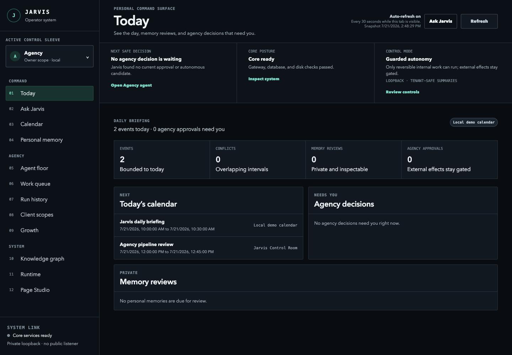
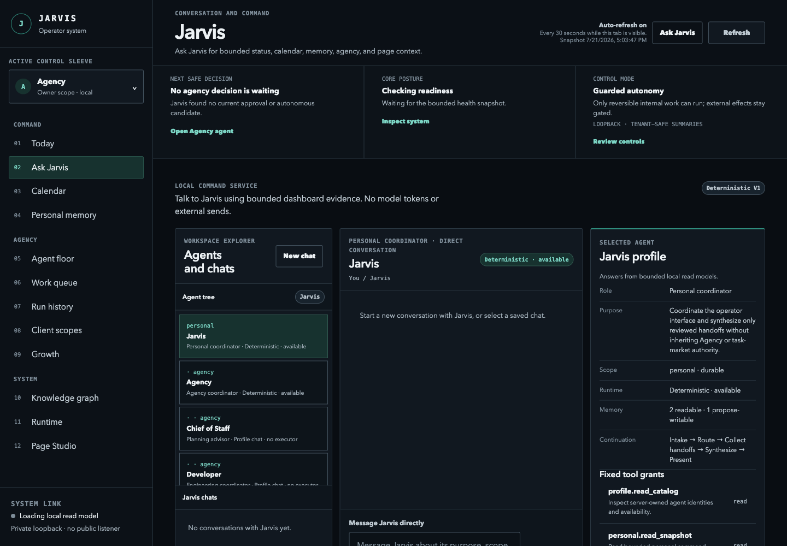
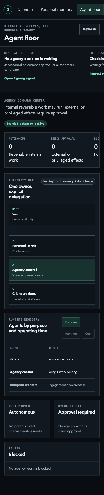

# MyEmployee AI — Jarvis Control Plane

A fail-closed control plane for a multi-tenant AI automation agency: a durable priority queue,
tenant-isolated memory, cost-aware model routing, and a 45-profile agent catalog — with every
outward-facing action gated behind an explicit, typed authorization record.

**TypeScript · Node 22 · SQLite · 134k lines · 2,238 tests across 209 files, all passing**

---

## The idea

Most agent frameworks are permissive by default: the agent can act, and guardrails are bolted on to
stop it. This one inverts that. Authority is a **typed record that must exist before an action is
possible** — not a prompt instruction, and not a policy check the agent can talk its way past.

Concretely: model execution is off until an operator writes a durable enablement record; the web
process refuses to bind a non-loopback host; a client agent cannot name another client's scope
because scope is server-resolved, not agent-supplied; x402 mainnet settlement is structurally
blocked rather than merely discouraged. When a required fact is missing, the system returns an
explicit refusal instead of a plausible guess.

That constraint is what the test suite is mostly about. It is easy to make an agent do things. The
engineering is in making it provably *not* do things.

## Architecture

| Concern | Implementation | Where |
| --- | --- | --- |
| **Retrieval (RAG)** | SQLite FTS5 BM25 over scoped Markdown fragments, versioned as `sqlite_fts5_bm25_v1`, with abstention when nothing clears the bar | [`src/knowledge/lexical-retrieval-service.ts`](src/knowledge/lexical-retrieval-service.ts) |
| **Context engineering** | Pre-turn compiler: reserves safety capacity, hash-dedupes candidate fragments, ranks by marginal utility-per-token | [`src/knowledge/context-compiler.ts`](src/knowledge/context-compiler.ts) |
| **Token budgeting** | Allocator with reserved partitions, so safety and system context cannot be crowded out by evidence | [`src/economics/context-budget.ts`](src/economics/context-budget.ts) |
| **Cost-aware routing** | Selects the cheapest model tier that satisfies the task's declared policy, not the strongest available | [`src/economics/model-router.ts`](src/economics/model-router.ts) |
| **Multi-provider abstraction** | Claude, Codex/ChatGPT, Gemini, and Ollama behind one interface, plus rate-limit circuit breaking and recovery scheduling | [`src/models/`](src/models/) |
| **Deny-by-default execution** | Durable operator-owned enablement record; absent or malformed ⇒ no model call | [`src/economics/model-execution-enablement.ts`](src/economics/model-execution-enablement.ts) |
| **Interchangeable memory** | Five swappable backends (flat, typed hybrid, typed temporal, ledger, untyped control) behind one `MemorySystem` seam | [`src/memory/system/`](src/memory/system/) |
| **Evaluation harness** | Frozen 8-arm experiment table with a fairness budget that refuses inadmissible comparisons | [`src/memory/experiment/`](src/memory/experiment/) |
| **Agent catalog** | 45 capability-scoped profiles over 9 archetypes; tree containment grants no tool, memory, tenant, or wallet authority | [`src/agents/`](src/agents/) |
| **Skill routing** | One always-loaded router dispatching to 7 on-demand lane references — only the matching lane enters the context window | [`skills/jarvis-workflows/`](skills/jarvis-workflows/) |

### The memory experiment

[`src/memory/experiment/`](src/memory/experiment/) ranks eight memory architectures — `FlatTag`,
`TypedBasic`, `TypedTemporal`, `Hierarchical`, `GraphAssist`, `EpisodeOnly`, `FactOnly`,
`HybridLedger` — under enforced-equal token budgets. Exactly one axis varies per arm (storage
representation, retrieval policy, consolidation policy, scope policy, forgetting policy); weights,
seeds, prompts, tools, the simulated clock, and replay traces are frozen across all arms, so an
effect can be attributed to the representation rather than to an opaque bundle.

The harness will **refuse to report a comparison it cannot make fairly**. Seeded PRNG, synthetic
workload generation, bootstrap confidence intervals, and FDR control live in
[`statistics.ts`](src/memory/experiment/statistics.ts) and
[`workload-generator.ts`](src/memory/experiment/workload-generator.ts).

### Typed memory and scope isolation

Memory records carry `scope`, `sensitivity`, provenance, confidence, and validity windows. The typed
backends use these to suppress superseded and expired facts and to refuse cross-scope reads. The
`flat_untyped` arm exists **only** as an experiment control — it returns superseded and expired facts
by design, which is how the leak-rate comparison gets an honest baseline.

## Screenshots

| | |
| --- | --- |
|  |  |
|  |  |

## Run it

Requires Node.js 22+ and npm. No API keys needed — model execution is off by default and the
dashboard runs on deterministic local data.

```bash
npm ci && npm run build && npm test && npm start
```

Then open <http://127.0.0.1:3000/dashboard>. `HOST` must remain loopback; the gateway refuses to
start otherwise.

The suite is the specification — authority boundaries, refusal paths, and tenant isolation are
covered as behavior, not as documentation:

```bash
npm test
```

## Documentation

- [`SPEC.md`](SPEC.md) — system specification
- [`DESIGN.md`](DESIGN.md) — visual and interaction rules
- [`docs/ARCHITECTURE.md`](docs/ARCHITECTURE.md) — subsystem map
- [`docs/DECISIONS.md`](docs/DECISIONS.md) — decision log, including the decisions that were reversed
- [`docs/VULNERABILITIES.md`](docs/VULNERABILITIES.md) — known weaknesses, kept current
- [`docs/superpowers/specs/`](docs/superpowers/specs/) — the specs written before each subsystem

## Honest notes

**On how this was built.** Written fast, with heavy use of AI coding tools (Claude Code and Codex) —
which the commit history makes obvious. The architecture, the authority model, and the decision to
make refusal a first-class result are mine; the tests are the contract that keeps generated code
honest. I would rather state that plainly than have a reviewer infer it from the commit graph.

**On what this is.** A curated public snapshot of a private working repository. Operational config,
machine-local runtime scripts, and vendored third-party skill libraries are not included. Everything
here builds, typechecks, and passes its full suite as committed.

**On what it isn't.** Not a deployed product, and not revenue-generating. The commercial documents
under `docs/revenue/` are explicitly labeled as hypotheses with zero buyer interviews behind them,
and the outreach drafts are bracketed templates behind a mandatory human review gate — no channel is
approved for use. Model execution requires an operator to turn it on. x402 settlement is
simulation-only.

## License

MIT — see [`LICENSE`](LICENSE).
