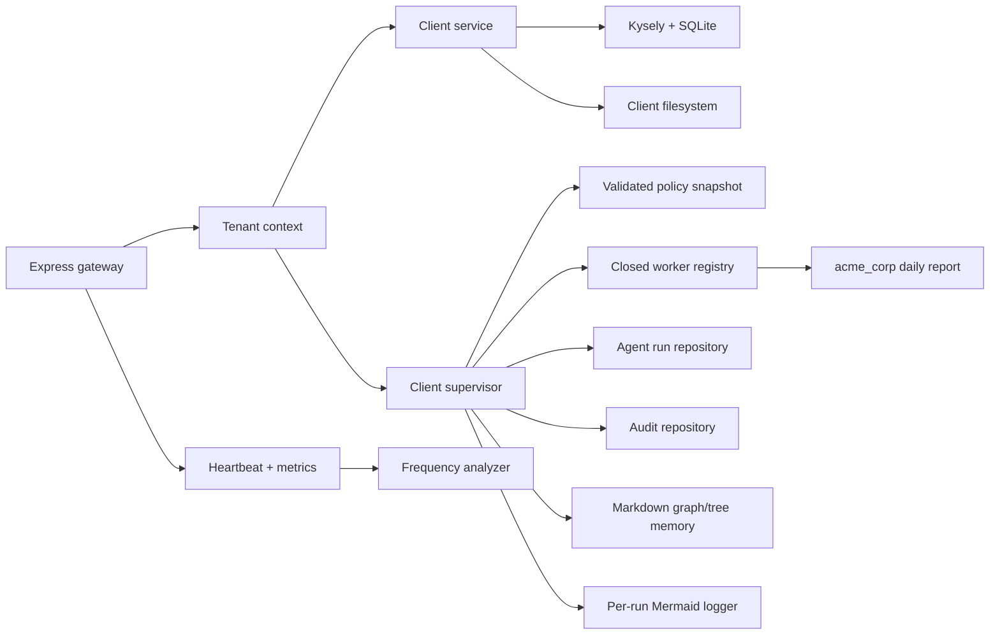

# Jarvis MVP Technical Specification

## 1. Overview

This specification implements [PLAN.md](./PLAN.md) as a locally runnable agency control plane. The system onboards validated clients, records them in SQLite, executes only registered client automations through a supervisor, emits a Mermaid trace for every run, exposes structured health and metrics, and proves the path with `acme_corp/daily-report`.

## 2. Architecture



### Components

- `src/config`: project paths and Zod-validated policy loaders.
- `src/db`: connection lifecycle, exact blueprint schema execution, additive migrations, and repositories.
- `src/clients`: safe client scaffolding and lifecycle orchestration.
- `src/agents`: closed worker registry, supervisor, escalation, and ToolSmith.
- `src/gateway`: app factory, routes, tenant context, request logging, metrics, and error translation.
- `src/monitoring`: pure/injectable infrastructure checks and non-overlapping scheduler.
- `src/memory`: Obsidian-compatible Markdown notes, wiki-link graph indexing, and tenant-scoped run memory.
- `src/utils`: typed errors and per-run Mermaid logging.
- `clients/acme_corp`: deterministic automation, ten fake leads, and generated output.

`createApp(dependencies)` never listens. `src/gateway/server.ts` is the composition root and owns listening, scheduling, database shutdown, and signals.

## 3. Data Model

The contents of `memory/core/schema.sql` and `memory/clients/_template/schema.sql` are executed unchanged. Therefore:

- The conceptual client table is canonical `client_registry`.
- The conceptual audit table is canonical `audit_logs`.
- Each client receives its own SQLite database initialized from the exact client template.

An additive migration creates:

```sql
CREATE TABLE IF NOT EXISTS agent_runs (
  id TEXT PRIMARY KEY,
  client_id TEXT NOT NULL,
  automation TEXT NOT NULL,
  status TEXT NOT NULL,
  input_json TEXT,
  output_json TEXT,
  error_message TEXT,
  parent_run_id TEXT,
  worker_id TEXT,
  started_at DATETIME DEFAULT CURRENT_TIMESTAMP,
  completed_at DATETIME,
  FOREIGN KEY (client_id) REFERENCES client_registry(id)
);
```

Request counters are process-local for the MVP; `lastRunAt` is derived from completed runs. `task_frequency_log` remains canonical for ToolSmith analysis.

## 4. Validation Contracts

### `ClientConfig`

- `id`: `^[a-z][a-z0-9_]{2,62}$`
- `name`: 1–120 characters
- `profile`: `email_only | data_processing | full_automation`
- `status`: `active | suspended`, default `active`
- `createdAt`: ISO datetime
- `workspacePath`, `clientDirectory`, `databasePath`: absolute strings written by the scaffold service

Unknown input keys are rejected. `full_automation` is rejected unless its policy points to a non-symlink regular JSON file inside the canonical project root. The strict approval record is `{ "profile": "full_automation", "approved": true, "approver": "...", "timestamp": "ISO-8601" }`; missing records deny authorization, while malformed or mismatched records fail configuration loading.

### `AgentRun`

- IDs, client ID, automation, worker ID, status (`pending | running | succeeded | failed`)
- JSON-compatible input/output, nullable error, ISO timestamps

### `EscalationEvent`

- severity `P0 | P1 | P2 | P3`, client/run IDs, event description, actions, resolved flag, timestamp

### `ToolPolicy`

- description, allow/deny lists, optional execution scope, elevated approval flag/record

## 5. HTTP Contracts

### `GET /health`

Always returns JSON. HTTP 200 means the gateway can respond; `overall` may be `healthy` or `degraded`.

```json
{
  "timestamp": "ISO-8601",
  "overall": "healthy",
  "severity": "none",
  "checks": {
    "gateway": "ok",
    "database": "ok",
    "ollama": "ok",
    "docker": "ok",
    "disk": "ok:42%_free"
  },
  "failures": [],
  "action": "none",
  "metrics": { "totalRequests": 1, "errors": 0, "lastRunAtByClient": {} }
}
```

### `GET /api/v1/clients`

Returns `{ "clients": ClientSummary[] }`, ordered by creation time then ID.

### `POST /api/v1/clients`

Input: `{ "id", "name", "profile" }`. Returns 201 with a persisted/scaffolded client. Duplicate ID returns 409. Invalid or unapproved profiles return 400/403. Filesystem work is rolled back if database persistence fails.

### `POST /api/v1/clients/:id/run`

Input: `{ "automation": "daily-report", "input"?: JSON }`. The optional `x-tenant-id` header must equal `:id` when present. Returns 200 with `{ run, result, diagramPath, warnings? }`; unknown client/automation returns 404; validation errors return 400; worker failure returns 500 after recording run/audit/trace state. A post-success frequency-accounting or worker-release failure leaves the run succeeded, creates a P2 audit, and returns a safe warning.

All errors have `{ "error": { "code", "message", "details"? } }`.

## 6. Client Lifecycle and Boundaries

Scaffolding creates `clients/<id>/{automations,data,memory/notes,output}`, copies the exact client schema and SOP template, initializes `memory/client.sqlite`, and writes validated `client-config.json` plus an OpenClaw-compatible two-agent stub. Versioned `clients/<id>/data` assets are copied into distinct custom client roots with bounded depth/count/bytes and exclusive no-clobber publication; existing or concurrently created tenant files are preserved. Paths are derived from injected absolute roots. IDs are validated before any path is built; existing trees are checked recursively for symlinks and special files before mutation. Managed policy files are replaced atomically and restored on rollback. Per-client onboarding and global graph mutations are serialized in process to prevent lost or cross-request state.

Tool and network policy files are loaded once, validated, and resolved by explicit profile/client key. `acme_corp` inherits `network.mode = none` and the `data_processing` tool policy.

## 7. Supervisor and Trace Lifecycle

1. Validate tenant/client/automation and resolve policies.
2. Start a per-run diagram and persist a `running` run with parent/worker provenance.
3. Log Gateway → Supervisor → Worker.
4. Invoke the registered worker with the trusted client root/directory and logger. Transactional workers must implement prepare, commit, rollback, and release as one complete hook set.
5. Commit the prepared worker artifact, capture completion time, build the success record, write tenant-safe run memory, and save the complete diagram while the database run remains `running`.
6. Mark the database run `succeeded` only after all required success evidence exists. Frequency accounting and worker-state release then run as post-success cleanup; either failure creates a P2 audit and a safe response warning without rolling back durable success. Failure to persist that P2 audit adds a second safe warning.
7. On any worker or evidence error before the durable `succeeded` transition, roll back the worker artifact, classify the event as P1, persist the failed run plus `audit_logs`, overwrite any partial diagram with a fresh failure trace, write failure memory, and rethrow a safe application error.

The worker registry is an allowlist; request values never become module paths.

## 8. Demo Automation

`daily-report` parses a bounded, non-symlink CSV with an exact header, exactly ten validated rows, unique safe IDs, and validated email/status values. The checked-in fixture contains five qualified rows, so it returns `{ generatedAt, sourceRows: 10, qualifiedCount: 5, qualifiedLeads }`; the parsed `output/report.json` exactly equals that result.

Publication is serialized per canonical report from preparation through release/rollback. The worker stages a mode-`0600` candidate and durable journal containing candidate/prior hashes and byte counts, snapshots any bounded prior report, then atomically renames and synchronizes the output directory. Rollback only restores/removes a canonical report whose fingerprint is recognized; conflicts preserve evidence and fail closed. Before binding the HTTP listener, startup reconciles journals against `agent_runs`: succeeded rows keep a matching candidate, while non-succeeded journals restore the matching prior state or absence; rows currently `running` are marked failed. Pending, already-failed, or missing rows retain their database state. The `running → failed` change and a recovery-outbox marker share one SQLite transaction; startup idempotently rewrites memory/trace evidence, records one linked audit, and clears the marker last. Journal/symlink/size/hash/evidence mismatches stop startup rather than guessing. V1 enforces one live gateway per file-backed database by holding a kernel-backed exclusive transaction on a dedicated mode-`0600` SQLite lock database. The existing parent is canonicalized before deriving the lock; final-path symlinks, multiple hard links, malformed files, and non-file paths fail closed. Process death releases the kernel lock automatically. Every gateway sharing a client root must also share that database path.

## 9. Markdown Graph/Tree Memory

The repository includes an Obsidian-compatible memory graph that requires no Obsidian application or IDE:

- Notes are ordinary UTF-8 Markdown with YAML frontmatter (`id`, `type`, `title`, `created_at`, `updated_at`, `tags`).
- Relationships use portable `[[wiki-links]]`; a generated `memory/graph/graph.json` stores node/edge adjacency for scripts and agents.
- `memory/graph/index.md` links to agency and client indexes, giving a browsable tree in any editor or terminal.
- The global graph stores only client/run metadata and links. Client-private content stays under `clients/<id>/memory/notes/` with its own `index.md`.
- Client scaffolding creates/links client nodes. The supervisor writes a run note on both success and failure and links it to the client and automation without copying CSV rows or report contents into global memory.
- `npm run memory:graph` rebuilds and validates the adjacency index; broken wiki-links fail with a non-zero exit code.

Note paths and frontmatter IDs are derived only from already-validated IDs. Writes use staging files plus rename so a failed update does not leave a partial note.

## 10. Monitoring and ToolSmith

Heartbeat checks are individually injectable, share a five-second per-probe deadline, and begin concurrently so independent timeouts do not accumulate. Production adapters check gateway/database directly, Ollama with `AbortSignal.timeout()`, Docker with shell-free `execFile`, and available disk percentage with `fs.promises.statfs()` (`bavail / blocks`). Exactly 10% disk free is healthy; lower, timed-out, or unavailable capacity fails closed. Missing optional services produce fixed failure codes and P1 degraded state without exposing adapter errors.

A 15-minute scheduler is `unref()`'d, runs once immediately after the HTTP listener binds, rejects overlap, catches reporting failures, and applies a 30-second whole-cycle deadline. It can be stopped and drained before database shutdown; timed-out work cannot cross from heartbeat into ToolSmith after stop. Each cycle runs heartbeat plus ToolSmith. ToolSmith selects frequency rows at or above five executions and returns a proposal-only simulated PR request with `skill: "5-d-build"`; it performs no external mutation.

## 11. Domain and Quadrant Bridge

| Business/user need     | Technical implementation                                              |
| ---------------------- | --------------------------------------------------------------------- |
| Fast client onboarding | Transactional registry + safe idempotent filesystem scaffold          |
| Tenant trust           | Validated IDs, isolated roots/DBs, optional header mismatch rejection |
| Operator visibility    | Health JSON, metrics, runs, audits, Mermaid traces                    |
| Durable agent context  | Linked Markdown notes plus machine-readable graph index               |
| Low-risk demo          | Deterministic local CSV worker without LLM/network access             |
| Future autonomy        | Frequency log and simulated ToolSmith payload boundary                |

Implementation requires current API knowledge, security review of filesystem boundaries, and verification review before completion. The main alignment artifact is the attached definition of done.

## 12. Testability Criteria

| Spec item           | Verification                                                              |
| ------------------- | ------------------------------------------------------------------------- |
| Schemas             | Red/green Zod unit tests and SQLite table introspection                   |
| Registry/routes     | Supertest against a real app and temporary SQLite                         |
| Scaffold/policies   | Temporary-root integration tests with real files                          |
| Supervisor          | Real repositories/worker plus injected failing worker                     |
| Mermaid             | Parse saved Markdown and assert ordered handoffs                          |
| Markdown memory     | Scaffold/run note tests, broken-link validation, graph adjacency snapshot |
| Demo                | Direct automation test plus API end-to-end test                           |
| Heartbeat/ToolSmith | Pure-check and scheduler tests with complete injected adapters            |
| Runtime             | `npm run build`, coverage, `npm run dev`, and fresh curl checks           |

All coverage thresholds are 85% for lines, statements, functions, and branches on core modules.

## 13. Transcend and Include

- Kept: policy JSON, escalation definitions, exact memory SQL, hierarchy, shell scripts as fallback/reference.
- Extended: executable TypeScript runtime, tests, live demo, structured traces and decisions.
- Replaced: nothing in V1; shell scripts remain but TypeScript services become the API path.

## 14. Operator Dashboard and Page Studio

The loopback-first gateway serves a same-origin dashboard at `/dashboard`. A narrow dashboard read model returns health, current-process request metrics, client counts, bounded safe run/audit summaries, bounded ToolSmith proposals, and validated global Markdown graph metadata. It never returns run inputs/outputs/errors, audit descriptions/actions, revenue/token estimates without real writers, or tenant-private notes.

Typed input is always available. Browser speech recognition is a progressive enhancement that starts only on a user gesture, displays editable transcript text, never auto-submits, and never sends or stores audio in Jarvis. The UI discloses that a browser may use its own remote recognition service.

Page Studio maps a natural-language request through a deterministic allowlisted capability catalog. Preview returns reused code/data mappings, gaps, checks, a declarative widget list, and a SHA-256 fingerprint. Create accepts only the original request plus that fingerprint, re-plans on the server, requires explicit confirmation, and is loopback-only until operator authentication exists. Supported plans become idempotent Markdown graph pages; requests requiring code are routed to the repository page-builder skill. Runtime requests can never publish executable HTML, JavaScript, filesystem paths, or arbitrary endpoints.

## 15. Model Routing, Context Budgets, and Economics

Jarvis uses a deterministic logical router before any future model executor. Tier 0 is ordinary code with no model call; Tiers 1–3 are logical `local`, `economy`, and `frontier` capability classes. Risk, required capabilities, and prior validation failures determine the cheapest eligible tier, and every non-default escalation has an explicit reason code. Provider names and volatile price claims are not embedded in routing logic.

A pure context budgeter validates bounded fragments, de-duplicates exact content, preserves provenance, and selects whole fragments by priority within a hard estimated-token ceiling. Its conservative character-based token estimate is labeled as a capacity estimate and never treated as provider billing.

Actual model calls may write bounded metadata to `model_usage_log`: operation, logical tier, provider/model labels, status, observed token counts, cache tokens, latency, optional client/run attribution, and optional integer micro-USD cost with a declared basis and pricing reference. Prompts, completions, secrets, and error bodies are forbidden. Unknown cost remains SQL `NULL`; dashboard summaries state whether cost coverage is none, partial, or complete and never convert missing cost to zero.

The dashboard exposes an Economics view and a data-only `model-economics` Page Studio widget. With no records it reports that telemetry is unavailable. With records it shows observed usage, known spend, unknown-cost calls, routing mix, and bounded recent metadata. Tier 0 work is described by policy rather than miscounted as a model request.

## 16. Personal Jarvis Domain

Personal Jarvis is a separate trust domain from the agency graph and every client tenant. Its durable root is `memory/personal`; agency workers receive no filesystem or service capability that can read it. Personal memory records are data-only Markdown documents with a strict front matter contract: stable ID, branch (`identity`, `preferences`, `people`, `projects`, `decisions`, `routines`, or `learning`), title, summary, provenance, confidence, sensitivity, scope, creation/update timestamps, optional review/expiry timestamps, and correction history. Reads return bounded summaries and never silently promote unverified memories.

Calendar support is provider-neutral. A `PersonalCalendarReader` supplies bounded events and a `CalendarActionPolicy` classifies proposed changes before any provider write. Reading, conflict detection, schedule proposals, private holds, and reminders are representable in V1. Invitations, attendee changes, cancellations, external messages, and any provider write without an explicit standing policy remain `approval_required`. The initial local adapter is an inspectable projection for development and demos; an authenticated provider adapter may replace it without changing the dashboard contract.

A deterministic daily briefing combines today's bounded calendar events, conflicts, review-due personal memories, and agency approval counts. It cites source IDs, distinguishes empty from unavailable data, and makes no model call. Personal dashboard reads are loopback-only, no-store, and redacted to the fields defined by the read model.

## 17. Agency Agent Control Plane

The agency agent coordinates existing tenant-safe queue, run, revenue, and audit capabilities through a bounded command-center projection. Each candidate action carries a stable ID, category, reversible flag, external-effect flag, approval state, reason, and source reference. Preapproved autonomous work is limited to reversible internal research, deterministic reconciliation, drafts, verification, scheduling of existing tenant workers, and evidence collection. Contracts, pricing commitments, payments, client-data disclosure, outbound communication, production release, destructive operations, and policy changes always require operator approval.

The command center exposes the live durable posture, autonomous candidates, approval-required candidates, blocked candidates, and recent evidence. It never returns draft bodies, contact references, tenant-private payloads, credentials, or raw errors. Queue pre-claim and supervisor pre-run/pre-commit gates read the same SQLite posture; the supervisor also fences commits to the active posture version observed at run start. Packaged installs bootstrap paused by default (or active only through an explicit installer choice), and later restarts never overwrite the durable row. Telegram `/pause` remains proposal-only until the loopback desktop operator approves its exact current version and fingerprint; that approval atomically records bounded audit evidence and engages the pause, while rejection has no posture effect.

## 18. Jarvis Home and Extensible Pages

The dashboard adds canonical `today`, `calendar`, `personal-memory`, and `agency` views. `today` is the default personal command surface and combines the daily briefing, next events, conflicts, and agency approval count. The existing operational views remain available.

Page Studio keeps its preview, fingerprint, confirmation, loopback, and widget-allowlist guarantees. Its catalog adds `daily-briefing`, `personal-calendar`, `personal-memory`, and `agency-control`. Quick-start recipes only prefill ordinary natural-language requests; they do not bypass planning or confirmation. A published page remains a versioned data-only manifest and may render only same-origin dashboard read models. Unknown capabilities, executable content, external URLs, and requests exceeding the widget limit are rejected and routed to repository work.

Acceptance requires focused contract/service/route/frontend tests, an 85% coverage release gate, a successful production build and graph validation, and live desktop/mobile checks with no browser console errors.

## 19. Shared Command and Channel Boundary

Web chat, Telegram, and future voice adapters call one strict command service. A channel authenticates a principal and supplies intent; it cannot choose tenant, scope, memory sleeve, policy, or authority from message text. Commands are idempotent and bind actor, channel, scope, payload digest, expected version, risk, expiry, and confirmation fingerprint.

Telegram V1 uses outbound long polling in a private chat with exact user/chat allowlists, durable update cursor, transactional deduplication, bounded validation, and redacted storage. Reads may execute directly. Work creates existing queue items or exact action proposals. Free text never authorizes external messaging, invitations/cancellations, releases, client disclosure, contracts, pricing, payment, credentials, destructive operations, or policy changes.

The existing local dashboard remains loopback-only. A reverse proxy must not inherit loopback mutation authority. Any future remote browser process is a separate authenticated listener with TLS, CSRF/origin/session controls and route-level authorization; the first remote listener is GET-only until the remote-access security gate passes.

## 20. Hierarchical Control Plane

The human operator is the root. Jarvis is the coordinating profile over a private personal sleeve. Agency and MCP/x402 are separate child coordination domains below Jarvis. Company, client, project, and agent containment expresses navigation and ownership only. Delegation, tool authority, wallet authority, and memory access are separate explicit edges and are never transitively inherited.

Durable contracts cover scopes, agents, conversations, messages, delegations, run spans, grants, memory sleeves, shared-approved bundles, approvals, and blueprints. Every privileged transition is deterministic, idempotent, version-checked, auditable, and deny-first. Agent/run reads expose observable state, evidence, artifacts, policy reasons, elapsed time, tokens, cost coverage, and reliability window; hidden reasoning is never exposed.

The site adds Jarvis chat, Agents, Hierarchy, Conversations, Approvals, Memory Center, and Blueprints. Desktop uses a scope rail, workspace, and inspector; mobile uses Today/Jarvis/Work/Agents/More with safe review screens. Stop prevents future steps and does not claim to undo committed effects. Kill-switch and quarantine posture are enforced both at queue claim and before privileged commits.

## 21. Memory Sleeves and Token-Aware Retrieval

Memory sleeves are personal, agency, company, client, project, agent scratch, and shared approved. Grants bind one agent to explicit sleeve permissions, purpose, sensitivity cap, expiry, and version. Cross-scope sharing materializes reviewed sanitized fragments with provenance and expiry; it is never a live pointer across indexes.

Typed Markdown is the versioned source of truth. SQLite holds rebuildable FTS5/BM25 indexes, temporal metadata, and retrieval telemetry. Retrieval authorizes scope before search, then performs deterministic metadata extraction, lexical candidates, optional shadow-tested embedding candidates and rank fusion, bounded reranking, and query-routed graph/summary expansion. Every result includes source IDs and selection reasons.

The context compiler reserves output, policy, tool-schema, working-state, and safety capacity before evidence. It selects whole required fragments first, then maximizes relevance, confidence, freshness, provenance, uncovered-query value, and diversity per token. It excludes expired/superseded facts, caps fragments per source, never crosses scope, and records selected/omitted manifests.

Promotion of retrieval changes requires a frozen Jarvis-specific golden set measuring recall/rank, citation accuracy, temporal correctness, abstention, answer correctness, useful evidence per token, latency/cost, stale-index rate, and zero scope leakage.

## 22. Agent Blueprints and Governed Improvement

An agent blueprint is immutable, declarative, versioned configuration resolving only to a statically registered worker implementation. It pins scope, objective, contracts, workflow pattern, implementation digest, tool and sleeve grants, network/side-effect policy, time/turn/tool/token/cost/depth/fanout budgets, eval suite, provenance, rollout state, and rollback revision.

Improvement lifecycle is observed → proposed → sandboxed → evaluated → awaiting approval → shadow → canary → active, with rejected, rolled back, and retired terminals. A model may propose but never approve itself, alter its graders/holdouts, register code, broaden authority, fund itself, change tenant/security/kill-switch policy, or deploy external/irreversible work.

Candidate execution uses disposable environments, synthetic/redacted fixtures, no production credentials, deny-by-default networking, multiple trials where stochastic, hidden holdouts, complete observable trajectories, and strict budgets. Shadow cannot write. Canary is a fixed number of low-risk reversible internal tasks. Policy/scope/budget violations, quality regression, unexplained cost increase, or intervention regression roll back automatically.

## 23. Operator Control Site Refactor

The control site is an operator instrument, not a generic KPI dashboard. Its persistent scope rail exposes the active personal, agency, company, client, project, or agent sleeve. Desktop uses rail → workbench → contextual inspector; mobile preserves deep links without implying that browser location grants authority. The home view prioritizes decisions, time, and agency movement. Jarvis conversation is a first-class workbench. Agents are organized by purpose and scope, then sortable by elapsed time, observed tokens, known cost coverage, lifecycle, reliability denominator, and attention state once those projections exist.

Frontend architecture separates a typed view registry, source store, widget registry, common lifecycle shell, named workspace manifests, and per-view render modules. Widgets declare required sources, permissions, placement bounds, loading/empty/stale/error policy, evidence/freshness behavior, and cleanup. Chat/run drilldowns use Answer, Evidence, Trace, Artifacts, and Approval panes; hidden reasoning is never exposed.

World Monitor, WrenAI, and Edict are design references only. AGPL code is not copied. Reimplemented patterns include freshness-aware panels, semantic result tabs, execution stage rails, joined control/evidence drilldowns, truthful agent telemetry, and blueprint galleries. Planned telemetry is disabled and labeled rather than populated with invented values.

## 24. Agent Workbench V1

### Server-owned profile catalog

The catalog is immutable application configuration validated at startup. Only Jarvis has a wired
deterministic conversation adapter in V1; every other profile is `profile_only` until its exact
runtime binding is independently verified. A profile contains:

- stable `id`, `revision`, display name, role, purpose, parent ID, relation, trust domain, lifecycle, and runtime mode;
- fixed tool grants with `read`, `propose`, or `execute` access;
- a primary scratch sleeve plus explicitly readable and propose-writable sleeve IDs;
- one server-resolved knowledge scope/partition descriptor that grants no filesystem path;
- ordered continuation stages, checkpoint trigger, resume requirements, output contract, completion criteria, escalation target, and budgets;
- evidence-backed availability. Runtime mode is `deterministic`, `profile_only`, or `disabled`; the frontend never infers availability.

The seeded tree is:

```text
Jarvis
├─ Agency
│  ├─ Chief of Staff
│  ├─ Developer → Architect, Code Blue, Code Red, Release Verifier
│  ├─ Idea Generator → Idea Blue, Idea Red, Opportunity Judge
│  ├─ Growth → Prospect Scout, Offer Writer, Outreach Reviewer
│  ├─ Delivery → Workflow Mapper, Automation Worker Template, Delivery Verifier
│  └─ Knowledge & Improvement → Memory Curator, ToolSmith, Evaluation Runner
└─ MCP/x402
   ├─ MCP Publisher → Contract Red Team
   ├─ Seller Operator → Deployment/Security Gate
   ├─ Task-Market Scout → Candidate Analyst, Submission Verifier
   └─ Settlement Auditor → Chain Reconciler
```

Only Jarvis, Agency, their five durable specialists, and MCP/x402 are durable coordinators. Lower nodes are addressable profile templates whose executions are ephemeral, bounded runs. Registered client workers are projected dynamically later and are never invented from profile data.

### Trust domains and continuation

Jarvis may read `personal:jarvis` and reviewed `shared:jarvis_handoffs`. Agency profiles read only `agency:*`, their own `agent:<id>:scratch`, and exact temporary client grants. MCP/x402 profiles read only `task_market:*`, their own scratch, and reviewed task-market handoffs. No x402 profile receives `execute` access, wallet material, signing, withdrawal, payment-policy mutation, or Agency/client/personal access. Tool namespaces are allowlisted per trust domain.

Every run checkpoint binds profile revision, scope, stage, next safe action, immutable input/output artifact digests, evidence references, grant versions, queue/run IDs, remaining budgets, expiry, and last confirmed side effect. Resume reloads the pinned profile, reauthorizes grants, verifies digests, reconciles durable state, and stops on uncertainty. Whole transcripts, external raw text, secrets, and hidden reasoning are never checkpointed.

### Conversation storage and routing

SQLite stores `agent_conversations` and append-only `agent_messages`. A conversation is bound to exactly one catalog agent and its server-owned trust domain. Messages store bounded text, author kind, responding agent ID when applicable, response mode, evidence references, and time. Each operator/agent exchange is one optimistic-CAS transaction; a failed second append rolls back the whole turn. Browser text, agent IDs, or query parameters cannot select a tenant, memory partition, wallet, or tool grant.

V1 endpoints are:

- `GET /api/v1/dashboard/agents` — complete bounded hierarchy and manifests;
- `GET /api/v1/dashboard/agents/:agentId/conversations`;
- `POST /api/v1/dashboard/agents/:agentId/conversations` with a strict optional title;
- `GET /api/v1/dashboard/agents/:agentId/conversations/:conversationId/messages`;
- `POST /api/v1/dashboard/agents/:agentId/conversations/:conversationId/messages` with bounded message and expected conversation version.

All mutations remain no-store and require a loopback socket, exact loopback `Host`, and matching browser `Origin`/fetch-site evidence when supplied. Unknown agents, conversations bound to another agent, stale versions, and unknown fields fail closed. A reply must state `respondingAgentId`. Jarvis reuses the existing bounded deterministic command service. Every other profile has a real profile handler for identity, purpose, tools, memory, continuation, and availability questions; profile replies say that no tool ran, and work requests return typed `runtime_not_configured`.

### Workbench UI

The chat view becomes one reusable workbench: recursive agent explorer and scoped conversation list on the left, transcript/composer in the center, and profile/scope/tool/continuation inspector on the right. Agent and conversation IDs persist in the URL. The Agent Floor uses the same hierarchy read model and links to the workbench. At 390px the chat, explorer, and inspector become anchor-controlled stacked surfaces; content never relies on nested horizontal carousels.

The tree supports keyboard selection and announces depth/expansion. The composer names the exact target and distinguishes deterministic profile chat from unavailable execution. Loading, empty, stale, permission-denied, runtime-not-configured, and error states remain distinct.

### MCP/x402 boundary

The existing paid MCP and task-market runtime stays `simulation`. MCP Publisher may inspect contracts and discovery metadata; Scout may read admitted fixed-origin signals; Seller Operator may inspect readiness and simulation; Settlement Auditor may read bounded ledger summaries. Mainnet, wallet signing, external submission, and recognized revenue remain blocked.

Before testnet, paid MCP tool annotations must stop claiming read-only/idempotent behavior, Streamable HTTP must reject invalid `Origin`, structured content needs an output schema, deployment documentation must match the proxy topology, price precision must respect asset decimals, and independent settlement reconciliation must exist.

### Testability and domain bridge

| Need                         | Verification                                                       |
| ---------------------------- | ------------------------------------------------------------------ |
| See the real hierarchy       | Catalog schema/tree tests and dynamic browser rendering            |
| Talk to the selected profile | Exact responding-agent assertion and persisted reload              |
| Prevent scope leakage        | Sibling-domain, guessed-ID, and prompt-selected-scope denial tests |
| Resume safely                | Stale profile/grant/digest/side-effect checkpoint tests            |
| Keep x402 separate           | No wallet tools, simulation mode, and cross-domain denial tests    |
| Use mobile                   | 390px no-overflow, drawer, focus, and console checks               |

Kept: current dashboard shell, Jarvis deterministic summaries, queue/run evidence, task-market simulation, and deny-first policies. Extended: agent contracts, SQLite, dashboard APIs, navigation, and chat. Replaced: hardcoded topology, static registry rows, and browser-only conversation state.
