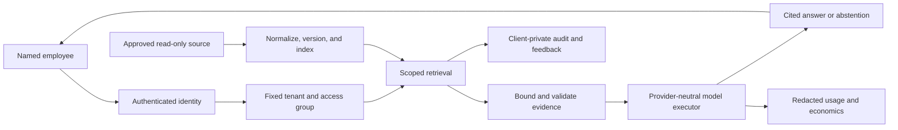

# Company Intelligence Assistant Pilot

## Honest promise

> We build a private company intelligence layer that answers employee questions from approved
> company knowledge, with citations and permission boundaries, without forcing a migration to a new
> knowledge platform.

Do not sell this as “a model with access to all company data.” The safer and more accurate initial
product is a governed retrieval and answer system. Fine-tuning or LoRA may later specialize tone,
classification, or task behavior; it is not the source of truth for changing company facts.

## Why now

Cerebras published [How We Built Our Knowledge
Base](https://www.cerebras.ai/blog/how-we-built-our-knowledge-base) on July 15, 2026. Cerebras
describes an internal system used by humans, automations, and agents across Slack, repositories,
documents, Jira, and custom sources. Its reported architecture normalizes source data, combines
retrieval methods, scopes searches, reranks evidence, and synthesizes cited answers. Its reported
usage of more than 15,000 questions per day is a vendor-reported adoption signal, not an independent
quality benchmark.

[Multi-LoRA on Cerebras
Inference](https://www.cerebras.ai/blog/introducing-multi-lora-on-cerebras-inference) is relevant to
later customer- or task-specific behavior, but it is a private preview for dedicated endpoint users.
The pilot must remain provider-neutral.

## Offer ladder

### 1. Paid knowledge audit

Deliver:

- one repeated-question/workflow map;
- source and owner inventory;
- data classification and permissions map;
- 30–50 representative questions with expected evidence or abstention;
- proposed source boundary, refresh target, deployment model, support boundary, and cost model;
- go/no-go implementation recommendation.

The audit handles metadata and synthetic examples unless a signed data-handling boundary already
exists. Price is set only after estimating discovery labor and liability; the existing lead-triage
price is not a benchmark for this offer.

### 2. Department pilot

V1 includes:

- one client and one department;
- named users in one uniform visibility group;
- one approved Markdown, plain-text, or controlled-export corpus;
- read-only Q&A with exact source/version citations;
- an explicit insufficient-evidence response;
- scheduled or operator-triggered reindexing;
- client-private feedback and bounded operator metrics;
- signed retention, deletion, escalation, and offboarding rules.

V1 excludes:

- HR, legal privilege, secrets, financial records, customer PII, and mixed document ACLs;
- arbitrary Slack, Drive, SharePoint, email, CRM, or database connectors;
- workflow actions, outbound messages, browsing, or tool execution from retrieved content;
- custom model training, 24/7 guarantees, and unrestricted company-wide access.

### 3. Production rollout

Add only after pilot evidence: SSO, source ACL propagation, incremental connectors, backup/restore,
alerting, support targets, higher availability, and security review.

### 4. Managed improvement

Review unanswered questions, stale sources, retrieval failures, latency, cost, and user feedback.
Expand connectors or test fine-tuning only when a measured failure mode justifies it.

## Proposed V1 experience

Jarvis remains the loopback operator control plane. The employee-facing data plane must be a
separately authenticated, single-tenant deployment, preferably in the client environment or VPC.

## Acceptance contract

The buyer signs a frozen gold set covering answerable, ambiguous, missing, stale/conflicting,
prohibited, and adversarial questions. Thresholds are agreed before real data.

Hard gates:

- zero observed cross-tenant or out-of-scope disclosure across the full negative test set;
- every substantive answer is supported by citations to the exact approved version and location;
- unsupported, prohibited, and hidden-scope questions abstain without confirming hidden data;
- deleted documents disappear after the agreed refresh window;
- invalid or interrupted ingestion preserves the last recognized complete index;
- no raw source, question, answer, or excerpt reaches global memory, dashboard, request logs, or
  model telemetry;
- provider timeout or failure returns a safe unavailable response, never an uncited answer.

Measured acceptance:

- reviewer-scored answer correctness on the signed gold set;
- citation validity, coverage, and entailment;
- appropriate-abstention and false-answer rates;
- retrieval recall on known-answer questions;
- p50/p95 latency and source freshness against signed targets;
- successful-query rate, provider failures, and cost per accepted answer;
- observed change in time-to-answer or escalation count, without an unverified ROI claim.

## Discovery questions

1. Which employee questions repeat, and who answers them today?
2. Which department owns the pain and the source material?
3. Where does the current evidence live, and who may see each source?
4. Which wrong answers would be merely annoying versus consequential?
5. What should the assistant refuse to answer?
6. How are documents updated, deleted, and declared authoritative?
7. Which identity provider and groups represent employee access?
8. What latency, freshness, support, residency, and retention constraints apply?
9. Who approves security, the pilot budget, and the final gold set?
10. What observable result would justify continuing after the pilot?

## Pricing inputs

Do not publish a price until these are measured:

- source inventory, cleanup, connector/parser work, identity, deployment, and evaluation labor;
- documents, bytes, change rate, chunks, embeddings, storage, encryption, backup, and retention;
- users, query volume, concurrency, context, model route mix, current provider rates, and retries;
- monitoring, review cadence, incident response, support hours, and source-owner coordination;
- premiums for restricted data, mixed ACLs, custom connectors, private cloud, residency, or HA.

Commercial shape: fixed audit + one-time implementation + recurring hosting/support + metered
provider/index costs + explicit contingency and margin.

## Stop conditions

Stop or narrow the pilot if there is no accountable source owner, no bounded corpus, no testable
question set, no secure identity path, mixed sensitive ACLs in V1, unclear provider data terms, or a
request for autonomous action. Any authorization or data-exposure failure stops live use
immediately.
