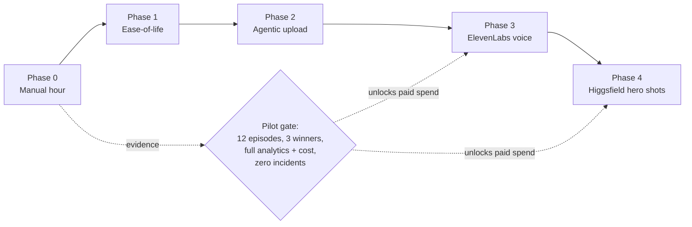

# Faceless Content — Staged Scale-Up

> Each phase has an **entry gate**, a **build**, a **what stays human** line, and an **exit signal**.
> A phase does not start because the previous one felt slow. It starts because its gate passed.

The order is deliberate: prove the loop by hand, remove friction from the hand-run loop, automate the
upload, then buy quality where the evidence says quality is the constraint.

## Phase 0 — The manual hour (current)

**Entry gate:** none. This starts now.

**Build:** shipped. `plan_upload_session` turns approved renders into an ordered
`sign in → upload → verify → sign out` sheet with per-platform checklists, a hard time budget, and
deterministic deferral. See [RUNBOOK.md](./RUNBOOK.md).

**Stays human:** everything outward-facing. Sign-in, upload, disclosure toggles, publish, sign-out.
Jarvis holds no platform password and performs no upload.

**Cost:** $0 recurring. Local render, free Pexels B-roll, placeholder narration.

**Exit signal:** ten consecutive scheduled sessions completed inside the hour with a complete
completion log and zero wrong-account incidents. That proves the procedure is stable enough to be
worth automating — and produces most of the pilot-gate evidence as a side effect.

**Why not skip it:** an automated pipeline over an unproven procedure automates the mistakes. It also
produces no answer to the only question that matters early — whether the content is any good.

## Phase 1 — Ease-of-life (still hand-uploaded)

**Entry gate:** three completed sessions, and at least one concrete friction note per session in
`incidentNotes`. Build against measured friction, not imagined friction.

**Build, in expected value order:**

1. **Session sheet export** — _shipped._ `npm run content:session` renders the `plan_upload_session`
   output as a single checkbox Markdown sheet, one section per account block, and prints a bounded
   JSON summary. See [RUNBOOK.md](./RUNBOOK.md) §3. Removes JSON reading from the hour.
2. **Staged asset folder** — one folder per session, files named
   `<block>-<accountId>-<itemId>.mp4`, digests computed and matched against the queue before the hour
   starts. Removes "which file was this again?" from the hour.
3. **Clipboard metadata pack** — per item, a plain-text block in exact paste order (title, then
   description, then hashtags, then pinned comment). Removes retyping, which is where approved text
   drifts from published text.
4. **Completion-log CLI** — `itemId` plus a pasted URL writes the log entry and schedules the 24h/7d/
   30d checkpoints. Removes the spreadsheet.
5. **Pre-flight check** — one command that verifies every queued item's five preconditions and prints
   what would be rejected, run the evening before.

**Stays human:** the entire upload. Phase 1 changes nothing about who touches the platform.

**Cost:** $0 recurring.

**Exit signal:** median session under 45 minutes with zero mid-hour lookups.

## Phase 2 — Agentic upload

**Entry gate, all required:**

- Phase 0 exit signal met (ten clean sessions).
- Twelve or more published episodes with complete seven-day analytics.
- Zero rights incidents and zero platform-policy incidents in the pilot window.
- Explicit operator approval for programmatic publishing, recorded as a decision.

**Build — two independent tracks, cheapest first:**

**2a. Unified adapter (Zernio).** First two connected accounts are free; accounts 3–10 are
$6/account/month. One email group with YouTube, TikTok, Instagram, and Facebook is roughly $12/month.
`plan_account_links` already emits the exact OAuth handoffs; the missing piece is the adapter that
turns one variant's `publishIntent` into an approved API call.

**2b. Direct platform OAuth.** No subscription, but separate app review per platform, token refresh,
and per-platform maintenance. YouTube and TikTok API projects stay **private-publish only** until
each passes its platform audit. Worth it only after 2a proves the publish path is the bottleneck.

[Ayrshare](https://www.ayrshare.com/pricing/) at $149/month for one social profile is not justifiable
for an unproven internal network. Revisit only if the account count crosses where Zernio's per-account
pricing loses.

**Stays human, permanently:** the exact publish approval. The variant, the rendered-asset digest, the
caption digest, the disclosure flags, and the target account are fingerprinted, and a human approves
that exact fingerprint before anything leaves the machine. Automation removes the typing, not the
decision.

**Cost:** $0–12/month.

**Exit signal:** twenty consecutive automated publishes with zero wrong-target and zero
wrong-metadata incidents.

**Rollback:** the manual sheet keeps working. If the adapter breaks, tomorrow's hour runs by hand.
Phase 2 never becomes a single point of failure for publishing.

## Phase 3 — ElevenLabs narration

**Entry gate:**

- The pilot gate has passed (12 episodes, 3 winners, complete analytics and cost coverage, zero
  incidents, operator approval for paid generation).
- **And** the evidence points at narration specifically: early-second drop-off concentrated in the
  narrated opening, voice-quality comments, or a measured retention gap between a human-recorded test
  episode and the placeholder-voice episodes.

Voice comes before cinematics because narration affects **every second** of a faceless episode, while
premium visuals affect selected beats. Spend where the defect is, not where the demo is impressive.

**Build:** ElevenLabs as a `VoiceComponent` provider — already modeled in the workflow contract, with
`licenseRef` required and `consentRef` required for any cloned voice. The API reports character cost
and request IDs, so every generation lands in the actual cost ledger. No estimated per-video cost
ever enters the record. **The adapter is already wired** (`src/content/providers/elevenlabs-voice-provider.ts`),
inert until an `ELEVENLABS_API_KEY` is connected — see [content-connections.md](../../operations/content-connections.md).
Enabling it is plugging in the key, not writing code.

**Cost (checked 2026-07-23, planning input only):** free tier for evaluation; the
commercial-license/instant-cloning Starter tier was shown around $5–$6/month by locale; Creator around
$22/month.

**Stays human:** voice selection, consent evidence for any cloned voice, and QC on the rendered
narration.

**Exit signal:** a measured retention improvement on matched episodes — same story core, same visual
pack, different voice. If the metric does not move, the subscription stops.

## Phase 4 — Higgsfield hero shots

**Entry gate:** the pilot gate has passed **and** Phase 3's answer is in. Do not start two paid
variables at once; you will not learn which one worked.

**Build:** the passed gate selects a **manual Higgsfield Cinema production manifest** — a reviewable
artifact, not a reverse-engineered API. A programmatic adapter requires separate verification against
official documentation and is out of scope until that exists. **The connection is already wired**
(`src/content/providers/higgsfield-visual-provider.ts`): once a `HIGGSFIELD_API_KEY` is connected it
emits the manual manifest, and when an official API is verified only the adapter's internal body
changes — see [content-connections.md](../../operations/content-connections.md).

**Usage rule:** hero shots only. `broll_short` and `longform` lanes keep their efficient primary edit
and add Higgsfield for selected beats; only `cinematic_short` and `short_story` route their primary
treatment through it. Generating every second is how a $9–29/month plan becomes an unbounded credit
bill, since credits vary by model, duration, and resolution.

**Cost (checked 2026-07-23, planning input only):** plans shown from roughly $9/month, broader model
access around $29+, higher video tiers above that. A plan price is not a per-video cost.

**Stays human:** shot selection, the generation decision, and final QC.

**Exit signal:** a measured lift on matched episodes with the cost per published variant recorded. If
cinematic beats do not move retention or shares, the spend stops and the proof treatment returns.

## Standing rules across every phase

1. **No phase removes the exact publish approval.** Automation removes typing, never the decision.
2. **No estimated economics, ever.** Actual platform analytics and actual known costs, or the field
   stays unknown.
3. **One paid variable at a time.** Otherwise the evidence gate cannot attribute the result.
4. **Every phase keeps the previous phase runnable.** The manual hour is the permanent fallback.
5. **Rights and disclosure controls never relax.** They tighten as volume grows.
