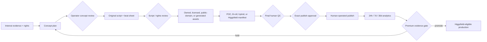

# Faceless Content Studio — Technical Specification

> **Status: `built_unverified`.** Read [README.md](./README.md) first. This specification authorizes local
> planning artifacts only. It does not authorize publishing, paid generation, account access, or a
> revenue claim.

## 1. Objective

Add a deterministic Jarvis planning workflow that converts an original, rights-safe concept into a
mode-specific production plan for:

- short AI stories;
- B-roll-led short explainers;
- Higgsfield-ready cinematic shorts after proof; and
- longer faceless YouTube videos.

The same worker also evaluates the evidence gate for promoting a proven production line to paid
visual generation.

## 2. Boundaries

- The V1 planning worker itself makes no model or media-provider call.
- Media-provider **connections** now exist as a separate, dependency-injected adapter layer
  (`src/content/providers/`, see [operations/content-connections.md](../../operations/content-connections.md)).
  They are fail-closed and free-first: local providers are always on, and no adapter is invoked by a
  worker until the render/orchestration step is built. Building a connection is not the same as calling it.
- No platform account connection, upload, scheduling, or publishing.
- No paid provider selection without a passed evidence gate and explicit operator approval. The
  premium adapters (ElevenLabs, Higgsfield) stay inert until their credential is connected and are
  never auto-selected, but connecting a key does not by itself satisfy the pilot gate.
- No concept without a creative thesis, audience promise, original contribution, interest
  evidence, and confirmed rights.
- No unconsented real-person likeness or voice impersonation.
- No inferred or estimated revenue. Monetization fields describe format fit only.

## 3. Jarvis integration

`createFacelessContentWorker(clientId)` constructs a worker bound to exactly one registered client
and the `faceless-content` automation ID. The existing supervisor supplies the run record, audit
path, Mermaid trace, frequency evidence, and scoped memory note. The worker is side-effect free and
returns a bounded JSON plan; it cannot register itself or select a tenant from request text.

The worker supports five strict commands:

1. `plan`: validate the creative brief, evaluate any supplied premium-provider gate, and return the
   production workflow.
2. `plan_account_links`: produce exact OAuth, reauthorization, health-check, or manual-export
   handoffs for every account without opening a browser or receiving a token.
3. `compose_variants`: combine one original story core with licensed voice and visual components
   across an email-group portfolio, returning per-account render and publish manifests.
4. `plan_upload_session`: turn approved, rendered variants into one time-bounded, human-executed
   `sign in → upload → verify → sign out` session sheet.
5. `evaluate_pilot`: return a deterministic promote/hold decision and all reasons.

No command links an account, retrieves a token, renders media, spends provider credits, signs in, or
publishes.

## 4. Input contract

A planning command includes:

- `requestId`;
- series identity: ID, title, target audience, audience promise, creative thesis, recurring device;
- concept identity: title, premise, viewer payoff, original contribution;
- source kind and confirmed rights, with references for non-original sources;
- at least one current interest-evidence reference;
- lane: `short_story`, `broll_short`, `cinematic_short`, or `longform`;
- production tier: `poc` or `premium`;
- whether generative media, realistic synthetic media, or a real-person likeness is used; and
- optional pilot policy and observations for premium promotion.

All arrays and strings are bounded. Unknown fields are rejected.

### 4.1 Email-group portfolio

Account onboarding accepts the raw email only inside `deriveSocialAccountGroupId`. It normalizes the
email, then derives a tenant-bound HMAC digest. The function returns only the opaque group ID. The
planning contract accepts:

- the opaque email-group ID;
- a provider profile reference;
- one or more exact platform account records;
- public handle/channel labels;
- a scoped connection ID and provider key;
- an opaque `secretref:` credential reference;
- connection state and version; and
- account role, audience, and allowed content lanes.

Plain email addresses and credential values are invalid in the portfolio contract.

### 4.2 Reusable production components

A variant command references one immutable story core by SHA-256 script digest, then supplies:

- commercial voice components with provider and license evidence;
- explicit consent evidence for cloned voices;
- visual packs with provider, strategy, and rights/provenance evidence;
- a bounded variant count and stagger policy; and
- the email-group portfolio.

The composer allocates unique `(voice, visual pack)` combinations deterministically. It fails closed
when there are not enough unique combinations for the selected accounts.

### 4.3 Manual upload session

An upload-session command supplies a session ID, an ISO session start, the email-group portfolio, a
bounded queue of approved items, and a time policy. Each queue item carries:

- `itemId`, `variantId`, `accountId`, and `storyId`;
- `assetRef` and the `sha256` `assetDigest` of the exact rendered file;
- the `renderManifestDigest` produced by `compose_variants`;
- a `metadataRef` for the platform-native metadata pack;
- `finalQcApproved` and `rightsCleared`; and
- truthful `containsGenerativeMedia` / `realisticSyntheticMedia` disclosure flags.

The policy declares `sessionMinutes`, per-step minutes for sign-in, upload, verify, and sign-out,
`requireSignOut: true`, and caps for accounts per session and uploads per account. A policy whose
single minimum account block exceeds the session budget is rejected at parse time.

Item IDs, variant IDs, and asset digests must be unique within a session: the same rendered file
cannot be posted twice in one sitting.

## 5. Output contract

The plan returns:

- platform-native target profiles;
- a timed beat sheet;
- selected provider route and any gated enhancement;
- the ordered Jarvis stages and human approvals;
- expected production artifacts;
- rights, audio, likeness, AI-label, and publishing controls;
- a platform-specific analytics scorecard; and
- an explicit monetization disclaimer.

All publish states are `blocked_pending_operator_review`.

Variant output also includes:

- a deterministic variant ID;
- the exact account and connection target;
- selected voice and visual component IDs;
- a render-manifest digest;
- a platform-native metadata checklist;
- an external-effect publish intent and payload digest; and
- a `secretref:` only—never a credential value.

Session output returns account blocks ordered `primary`, `experiment`, then `archive`, each with:

- an exact start offset and scheduled clock time per step;
- one `sign_in` step naming `credentialSource: 'operator_password_manager'`;
- one `upload` step per item carrying the asset digest, metadata reference, disclosure flags, and a
  platform-native checklist;
- one `verify` step and one `sign_out` step;
- `jarvisPerforms: false` on every step; and
- `connectionIndependent: true`, because a hand-run session does not require an active API
  connection.

The session also returns totals against the time budget, `deferred` items with
`session_minutes_exhausted` / `account_upload_cap_reached` / `session_account_cap_reached`,
`rejected` items with `final_qc_not_approved` / `rights_not_cleared` / `account_not_in_portfolio` /
`invalid_disclosure_declaration`, a completion-log contract, and
`sessionState: 'ready_for_operator_execution'`. Scheduling is greedy in block order and never exceeds
`sessionMinutes`; overflow is deferred, never truncated silently.

## 6. Routing

| Lane              | POC route                                 | Premium route after gate                       |
| ----------------- | ----------------------------------------- | ---------------------------------------------- |
| `short_story`     | storyboard stills + restrained motion     | Higgsfield Cinema manual manifest              |
| `broll_short`     | owned/licensed/public-domain B-roll       | B-roll plus selected Higgsfield hero shots     |
| `cinematic_short` | storyboard proof treatment                | Higgsfield Cinema manual manifest              |
| `longform`        | hybrid B-roll, stills, diagrams, captions | hybrid edit plus selected Higgsfield sequences |

Premium requests that do not pass the gate fall back to the POC route and report
`blocked_pending_proof`; the content plan itself remains usable.

## 7. Proof gate

The operator supplies a preregistered `winnerDefinition` and minimums for published episodes,
winners, analytics coverage, and known-cost coverage. Promotion fails closed when:

- episode or winner counts are insufficient;
- analytics or cost coverage is incomplete;
- any platform-policy or rights incident occurred;
- operator paid-generation approval is absent; or
- evidence references are missing.

No revenue threshold is evaluated because the pilot precedes reliable channel revenue.

## 8. Connection and publish handoff

The secondary workflow does not change the active Jarvis connection or command harness. Its output
is shaped for a later adapter:

1. register/activate the OAuth connection under the exact client scope;
2. store credentials in the macOS Keychain or another secrets-plane implementation;
3. resolve account health before preparing a publish;
4. turn one variant's publish intent into an action proposal with `externalEffect: true`;
5. bind approval to the target account, rendered-asset digest, caption/metadata digest, disclosure
   flags, and requested time; and
6. execute only after a human approves the exact fingerprint.

Direct YouTube and TikTok clients must remain private-only until their respective API projects pass
platform audit. TikTok creator-info must be queried before posting. A unified publisher does not
remove Jarvis's own exact approval boundary.

## 9. Workflow

## 10. Definition of done

- All four lanes produce valid, bounded plans.
- Short plans use a 75-second 9:16 master compatible with TikTok's one-minute format rule and
  YouTube Shorts.
- Long-form plans use a 10-minute 16:9 master and include short derivatives.
- Rights, likeness, and strict-input failures are tested.
- Premium generation fails closed without complete proof and operator approval.
- A passed gate selects only a manual Higgsfield manifest—never an unverified API.
- A tenant-bound worker rejects a different client or automation.
- Raw emails deterministically map to tenant-bound opaque group IDs and never appear in plan output.
- A portfolio can hold YouTube, TikTok, Instagram, and Facebook connections under one email group.
- One story can produce bounded, unique voice/visual variants with exact account attribution.
- Cloned voices require consent evidence and all B-roll/generated packs require rights provenance.
- Every account-specific publish intent is externally effective, digest-bound, and blocked pending
  operator review.
- A daily upload session fits its declared budget, sequences sign-in/upload/verify/sign-out per
  account, defers overflow, rejects unapproved or uncleared items, and contains no credential.
- Focused tests, format, lint, typecheck, full coverage tests, build, graph rebuild, and
  `git diff --check` pass.
