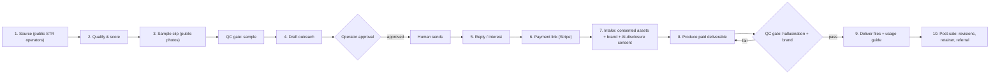

# Version A — STR Video Pipeline (Operate) — Technical Specification

> **Status: `spec_only`.** Read [README.md](./README.md) first for positioning and guardrails. This
> spec inherits Jarvis's operator-approval gate: nothing here authorizes a send, a charge, or
> scraping hidden contact data.

## 1. Overview

Jarvis operates a done-for-you AI video service for reachable short-term-rental operators. The
system sources operators who have a **public** contact channel and an **owned** marketing channel
(direct-booking site, Vrbo, active social), produces a short **sample** clip from their public
listing photos, drafts a compliant outreach message for **human approval**, collects payment and
**consented, operator-owned assets** on acceptance, generates the paid deliverable, passes it through
a mandatory **QC gate**, and delivers files plus a channel-by-channel usage guide.

The deliverable is **marketing content for the operator's owned channels** — never an "Airbnb
listing conversion" promise.

## 2. Where it lives in Jarvis

The pipeline is implemented as a **new client-style automation** inside the existing control plane,
reusing rather than reinventing infrastructure:

- Runs as a registered worker set under `src/agents` supervisor, so every run emits the standard
  Mermaid trace, `agent_runs` record, and audit entry.
- Outreach and payment requests route through the **same no-send boundary** the supervisor already
  enforces (`blocked_pending_operator_review`). Jarvis produces a reviewable artifact; a human
  performs the actual send/charge.
- Prospect and buyer data live in a **client-scoped compartment** (isolated SQLite, per the client
  template) — never in the core DB.
- Config/policy is Zod-validated like existing clients.

## 3. Components

### 3.1 Sourcing (`source`)

- **Inputs:** target market(s), "upscale" thresholds (ADR, bedroom count, amenity flags).
- **Sources (public only):** Vrbo public listings; direct-booking sites found via search
  (`"book direct" + <city> + vacation rental`); Instagram STR accounts; public property-manager
  directories; AirDNA/AirROI market data for upscale filtering. **Explicitly excluded:** any tool
  that harvests Airbnb host emails/phones (ToS breach, ~0% for individuals).
- **Output:** `lead` records — business/operator label, public channel(s) (website form, public
  email, IG handle), source URL, upscale signal, owned-channel signal. **No** personal names,
  homeowner data, or private contact scraping.

### 3.2 Qualification & scoring (`qualify`)

- Score each lead on: upscale signal, has an owned channel that accepts video, has a reachable public
  contact, jurisdiction (US-first for cold-email legality; UK/EU require consent — flag, don't cold).
- Output: ranked shortlist with a machine-readable `reachable` and `owned_channel` boolean; drop
  anything failing either.

### 3.3 Sample generation (`sample`)

- Pull the operator's **public** listing photos. Generate a short (≤15s) vertical social clip via a
  real-estate photo-to-video API (Pedra / Luma / VideoTour.ai). Optional social punch-up (music,
  captions) via a generative tool.
- **AI-motion disclosure** label rendered on the sample.
- **QC gate (sample):** human/automated check for obvious hallucination artifacts. A failed sample
  is regenerated or the lead is skipped — a bad demo is worse than no demo.
- **Use limit:** the sample is a 1:1 outreach demo only. It is **not** published and carries a "made
  for you as a free sample — you own nothing until you buy" note. This bounds the copyright exposure
  of using photos the operator may not own.

### 3.4 Outreach drafting (`outreach`) — GATED

- Draft a short, personalized message per lead: references one true, public fact about the property;
  links/attaches the sample; states the offer and price; CAN-SPAM elements (accurate header/subject,
  identification, physical postal address, one-click opt-out). No fabricated claims, no booking-lift
  promise.
- **Operator-approval gate:** Jarvis writes recipient + channel + subject + body + sender identity
  into a review record. A human approves **one** message at a time and performs the send. This is the
  existing `blocked_pending_operator_review` flow — reused, not rebuilt.
- Jurisdiction rule enforced here: US public-business contacts are workable cold if CAN-SPAM
  compliant; UK/EU individual/sole-trader operators require prior consent — the drafter must refuse
  to queue a cold send to them.

### 3.5 Sale & intake (`intake`)

- On interest, issue a Stripe payment link (human-approved). **Make-after-payment**: production
  starts only after payment clears.
- Intake form collects: operator-**owned** photos/short clips, brand preferences (colors, logo,
  music vibe), target channel(s), and an explicit **AI-disclosure + asset-ownership + usage consent**
  checkbox. Consent record is stored in the client compartment.
- Clear written scope: number of clips, length, one included revision round, delivery SLA, and an
  explicit "AI-generated motion from your photos" description to pre-empt "not as described"
  disputes.

### 3.6 Production (`produce`)

- Generate from **consented assets**: (a) 1–3 vertical social cuts (IG/FB/TikTok), (b) one longer
  walkthrough sized for Vrbo native video (mp4, <2 min, 9:16, ≥1080×1920) and direct-booking
  embedding.
- AI-motion disclosure label baked in. Deterministic pan/zoom preferred over heavy generative
  motion for the walkthrough (accuracy matters — the property is physically inspected).

### 3.7 QC gate (`qc`) — mandatory human sign-off

- Frame-review checklist: warped walls/mirrors/floors, morphing edges, impossible geometry, text
  legibility, brand correctness, disclosure label present, correct aspect/length per channel.
- **No delivery without a recorded human pass.** A fail loops back to production.

### 3.8 Delivery (`deliver`)

- Deliver files + a **usage guide** mapping each asset to a channel: post to IG/FB host groups, embed
  on the direct-booking site, upload to Vrbo/Booking.com native video, and (optional) a
  guidebook/description **link** with the explicit scam-safety caveat and the note that external
  links in Airbnb listings are gray-area. Never instruct a ToS violation.

### 3.9 Post-sale (`postsale`)

- One included revision round; a bounded revision policy beyond that.
- Upsell path: monthly **content retainer** (recurring social cuts) — the real margin engine.
- Referral ask; case-study consent capture (feeds Version B's proof pack).

### 3.10 Compliance & accounting (`ledger`)

- Records: consent artifacts, AI-disclosure, outreach approvals, CAN-SPAM opt-outs, disputes.
- Unit-economics ledger per order (tool credits spent, gateway fees, refunds) to validate margin.

## 4. Tech stack

- **Orchestration:** Jarvis supervisor/worker (TypeScript), reusing audit + Mermaid + no-send gate.
- **Video:** Pedra (REST API + official MCP) as primary; Luma (image-to-video REST) as fallback;
  VideoTour.ai for the Airbnb-shaped social template. Abstract behind a `VideoProvider` interface so
  the engine is swappable.
- **Social punch-up (optional):** ViewMAX MCP or ffmpeg for captions/music/format.
- **Payments:** Stripe (payment links first; no stored card handling by Jarvis).
- **Data:** client-scoped SQLite compartment (existing client template).
- **Outreach transport:** human-operated mailbox / IG; Jarvis only drafts and stages.

## 5. Unit economics (targets, validate in pilot)

- Tool cost per deliverable: ~$3–$8 (credits) + Stripe ~3%.
- Price: **$149–$299** one-time per property (3 social cuts + 1 walkthrough), or **$199–$499/mo**
  retainer. Positioned below a real shoot ($300–$5,000), above self-serve ($29/mo) — sold as a
  managed service, not raw tool output.
- Target contribution margin ≥ 80% before labor; labor (close + QC + support) is the real cost —
  keep per-order human time under ~30 min to stay viable.

## 6. Non-goals / explicit exclusions

- No "boost your Airbnb bookings/conversion" claim or guarantee.
- No scraping of Airbnb hidden contact data; no messaging hosts via Airbnb to solicit (ToS breach).
- No speculative pre-production; no publishing of samples built from non-consented photos.
- No unattended sending or charging — human gate always.
- No UK/EU cold outreach to individual/sole-trader operators without consent.

## 7. Risks & mitigations (carried from research)

| Risk                                        | Mitigation                                                                 |
| ------------------------------------------- | -------------------------------------------------------------------------- |
| AI hallucination misrepresents a real space | Mandatory QC gate; deterministic motion for walkthrough; disclosure label  |
| Copyright of listing photos                 | Paid work uses consented owned assets; samples unpublished, 1:1 only       |
| "Not as described" chargebacks              | Explicit AI-motion scope, one revision, make-after-payment, dispute log    |
| Low cold-outreach conversion                | Reachable-buyer targeting; sample-led hook; retainer upsell; kill criteria |
| Airbnb ToS / platform strikes               | Compliant sourcing; no listing-video claims; no ToS-violating instructions |
| Overstated automation burning credits       | Per-order QC before spend where possible; credit ledger; failure caps      |

## 8. Definition of done (pipeline built, pre-pilot)

- Sourcing → sample → gated-draft runs end-to-end on **synthetic/self-owned** data, emitting the
  standard Jarvis run trace, with **zero** real sends or charges.
- QC gate and consent/intake flow implemented and tested.
- `VideoProvider` integrated against one real API using a **self-owned** test property.
- Unit-economics ledger produces a per-order cost/margin figure.
- Operator runbook exists; the pilot (real outreach) remains a separate, human-approved go decision.
