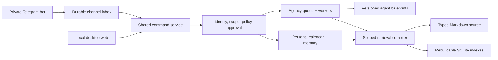

# Jarvis Connections, Context, and Governed Improvement

## Decision summary

Jarvis should be one conversational experience over multiple deny-first domains, not one all-access process. The V1 architecture is:



The web and Telegram adapters must call the same command service. Channel text may express intent but never establish identity, tenant, memory scope, or authority.

## 5D orientation

- **Domains:** interaction design, identity/security, calendar and messaging APIs, personal privacy, tenant isolation, retrieval, orchestration, evaluation, deployment, recovery, and agency economics.
- **Assumptions to validate:** Telegram is acceptable for steering but not sensitive document storage; one calendar provider is enough for V1; the local Mac is available often enough for outbound polling; repeated workflows can be judged by deterministic tests and business evidence.
- **Existing constraints:** loopback-only gateway, local-only mutation guard, static worker registry, Markdown graph, SQLite repositories, bounded queue, proposal-only ToolSmith, and no live model-provider execution.
- **Attachment risk:** “Iron Man Jarvis” can bias the product toward visible autonomy, too many agents, or self-modification instead of reliable completed work.
- **Synthesis:** one identity in the UI; separate principals, sleeves, budgets, and capabilities underneath.

## Desktop and remote web

The current loopback dashboard is the correct desktop V1. Do not proxy the existing gateway wholesale. Its mutation guard trusts `request.socket.remoteAddress`; a reverse proxy such as Tailscale Serve can make a remote request appear loopback-local.

If off-device browser access becomes necessary, add a second process that registers only static assets and GET projections. Put that read-only listener behind private [Tailscale Serve](https://tailscale.com/docs/features/tailscale-serve), require an exact tailnet identity allowlist, and activate it only after the repository remote-access audit is `GO`. Do not use public Funnel. Mutations, OAuth callbacks, Page Studio publication, approvals, and queue writes stay on the local gateway until real application authentication and CSRF protection exist.

## Telegram mobile steering

Use a private one-to-one bot conversation and outbound `getUpdates` long polling. Telegram webhooks add a public ingress and do not improve the single-owner V1. Telegram retains updates for at most 24 hours, and the durable cursor must advance past each handled `update_id`. [Telegram `getUpdates`](https://core.telegram.org/bots/api#getupdates)

Authorize only exact allowlisted `user.id` and `chat.id` values with `chat.type === private`. Persist deduplication and cursor state atomically. Store redacted command summaries and hashes, not raw chat transcripts. Callback buttons carry only a short opaque nonce; Telegram limits callback payloads to 1–64 bytes. [Telegram callback data](https://core.telegram.org/bots/api#inlinekeyboardbutton)

Initial commands:

- `/today`, `/status`, `/queue`, `/projects`, `/help` are reads.
- `/pause` engages a bounded runtime kill switch.
- Research, reconciliation, drafts, and verification may create existing safe queue work.
- Memory changes and private holds show a normalized preview and require confirmation unless covered by standing policy.
- Invitations, cancellations, attendee changes, outreach, releases, payments, contracts, pricing, credentials, client disclosure, destructive operations, and policy changes cannot be authorized through free text. The highest-risk actions remain desktop-only.

Durable tables should cover external connections, channel cursors/inbox, action proposals/decisions, and provider-write receipts. Every approval is bound to principal, payload digest, risk, expiry, expected version, and opaque server-created scope.

## Calendar connection

Implement only the provider the operator actually uses. Preserve the current provider-neutral reader/planner/policy. If Google is selected, start with the narrowest read scope, use OAuth authorization code with PKCE/state and a loopback callback, store refresh tokens in macOS Keychain, and keep only a credential handle in SQLite. Google incremental sync uses a `syncToken`; `410` requires a provider-scoped full resync. Push notifications are not guaranteed and still require reconciliation. [Google scopes](https://developers.google.com/workspace/calendar/api/auth), [incremental sync](https://developers.google.com/workspace/calendar/api/guides/sync), [push notifications](https://developers.google.com/workspace/calendar/api/guides/push)

If the real provider is Outlook, use delegated Microsoft Graph permissions and PKCE instead. [Microsoft event API](https://learn.microsoft.com/en-us/graph/api/calendar-post-events), [authorization-code flow](https://learn.microsoft.com/en-us/entra/identity-platform/v2-oauth2-auth-code-flow)

## Memory sleeves and retrieval

Typed Markdown remains the human-readable, versioned source of truth. SQLite holds rebuildable indexes, versions, temporal metadata, and retrieval telemetry. Agents share bounded artifacts and context manifests, not entire chat histories.

Memory tiers:

1. immutable policy, identity, and authority;
2. recent conversation/task working set;
3. curated facts, decisions, preferences, procedures, and blueprints;
4. raw episodes and source artifacts;
5. rebuildable summaries, links, embeddings, and indexes.

Every durable memory needs a scope key, source ID/hash, extraction version, valid time, recorded time, confidence, sensitivity, supersession/correction links, review/expiry, and retrieval eligibility.

Start retrieval with scoped SQLite FTS5/BM25. BM25 remains a robust heterogeneous baseline in [BEIR](https://arxiv.org/abs/2104.08663). Build a 120–200 question Jarvis golden set before choosing a vector or graph framework. Test exact lookup, paraphrase, temporal change, correction, multi-note reasoning, whole-project themes, procedures, abstention, freshness, and cross-tenant traps. Scope leakage must be zero.

Only after the baseline, shadow-test embeddings plus reciprocal-rank fusion and bounded reranking. Anthropic reports cumulative gains from contextualized chunks, hybrid search, and reranking, but Jarvis must reproduce them locally. [Contextual Retrieval](https://www.anthropic.com/engineering/contextual-retrieval)

Graph expansion and hierarchical summaries are query routes for multi-hop or global questions, not default overhead. This follows the strengths and costs documented by [GraphRAG](https://arxiv.org/abs/2404.16130), [RAPTOR](https://arxiv.org/abs/2401.18059), and the failure of long context to reliably surface middle evidence in [Lost in the Middle](https://arxiv.org/abs/2307.03172). Letta/MemGPT, Mem0, LightRAG, and Graphiti are experiment candidates behind the same interface, not V1 platform dependencies.

The context compiler must reserve output, policy, tool-schema, working-state, and safety tokens before evidence. It selects required fragments first, then maximizes relevance, confidence, freshness, provenance, and uncovered-query value per token while penalizing redundancy. It preserves a manifest of selected and omitted source IDs and never truncates policies, numbers, contracts, or citations mid-fragment.

## Reusable agents and governed improvement

An agent blueprint is immutable, declarative, versioned configuration that resolves only to code already registered in the static worker registry. It defines objective, trigger, input/output schemas, workflow pattern, pinned implementation digest, tool and memory-sleeve grants, network/side-effect policy, time/turn/tool/token/cost budgets, verification suite, rollout, provenance, and rollback revision.

The useful “RSI” loop is:

```text
observe repeated work
→ propose blueprint revision
→ derive tests and holdout evals
→ sandbox without production credentials
→ compare to pinned baseline
→ human approval
→ shadow
→ fixed-task canary
→ promote or automatically roll back
```

This matches eval-driven guidance from [Anthropic](https://www.anthropic.com/engineering/demystifying-evals-for-ai-agents), reproducible trajectories in [SWE-agent](https://github.com/SWE-agent/SWE-agent/blob/main/docs/usage/trajectories.md), and the sandboxed empirical archive used by the [Darwin Gödel Machine](https://arxiv.org/html/2505.22954v2). It does not grant self-approval, self-funding, runtime code registration, authority changes, or permission to alter graders, security policy, tenant boundaries, deployment, or the kill switch.

Promotion gates require zero policy violations, no tenant-scope error, bounded success/regression, cost per successful task, p95 latency, intervention rate, full trajectories, repository/environment digests, multiple trials for stochastic work, and hidden holdouts. Shadow cannot write; canary covers only a fixed number of reversible internal tasks. Policy violation, budget breach, scope error, quality regression, or unexplained cost spike rolls back automatically.

## Research/news monitor

Maintain a versioned source registry:

- Tier A: papers, official docs, official repositories/releases.
- Tier B: author talks and interviews.
- Tier C: practitioner demos and YouTube creators, used to discover claims.
- Tier D: social discussion, used only to discover leads.

Monitor releases from GraphRAG, LightRAG, Mem0, Letta, Graphiti, ColBERT, LLMLingua, and Anthropic cookbooks through the [GitHub Releases API](https://docs.github.com/en/rest/releases). Monitor author-led YouTube uploads through channel upload playlists. [YouTube channels API](https://developers.google.com/youtube/v3/docs/channels)

Fetched material is untrusted, content-addressed, deduplicated, and incapable of invoking tools. A claim becomes verified only with a primary source. Produce a small daily alert, weekly landscape, and monthly benchmark/adoption review. News may propose a local experiment; only repeatable benchmark evidence may change Jarvis.

## Delivery order

1. Keep the completed local Today/calendar/personal-memory/agency/Page Studio vertical slice green.
2. Specify shared command, principal, action-proposal, memory-sleeve, agent-blueprint, and evaluation contracts.
3. Add local web chat through the shared command service.
4. Add Telegram long polling, identity binding, dedupe, read commands, and safe proposals.
5. Connect the actual calendar provider read-only, then approved private writes.
6. Add FTS5 retrieval and the golden evaluation set; shadow-test hybrid retrieval later.
7. Add hierarchy/run/economics/memory-sleeve views.
8. Add blueprint proposal/eval/shadow/canary/rollback infrastructure.
9. Add the evidence monitor.
10. Consider GET-only Tailscale web access only after the security gate.
