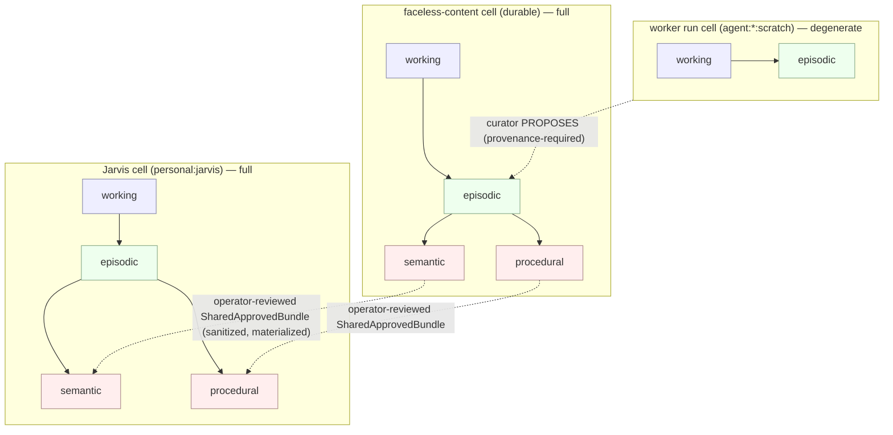

# Fractalizing Typed Memory Across the Jarvis Hierarchy

**Date:** 2026-07-25
**Status:** Investigation + eval-gated adoption plan. Phase B resolver fix complete in the demo;
live per-node binding, stage compaction, and consolidation scheduling remain unwired.
**Prompted by:** operator saw a video on splitting memory into types (working / semantic / episodic / procedural) and asked to (a) pick a split and (b) fractalize it across Jarvis and its sleeves (faceless content, MCPs, individual agents).

## Headline finding: the typed split is already built

The "memory types" the video described are **already implemented** in this repo, dated
2026-07-24, default-off. See [`2026-07-24-typed-hybrid-memory-framework.md`](../specs/2026-07-24-typed-hybrid-memory-framework.md)
and [`2026-07-24-memory-architecture-experiment.md`](../specs/2026-07-24-memory-architecture-experiment.md).

Concretely, in `src/memory/system/`:

- **The canonical CoALA type set exists** — `MemoryStoreClass = 'working' | 'episodic' | 'semantic' | 'procedural'` (`store-classes.ts:13`). This is exactly the split from the video, and it is the academically-anchored one (CoALA: _Cognitive Architectures for Language Agents_).
- **Your 10 existing `kind` tags already route into those 4 types** (`store-classes.ts:23`):

  | Store class    | Kinds routed to it                                    | Write rule            | Retention       | Consolidation role |
  | -------------- | ----------------------------------------------------- | --------------------- | --------------- | ------------------ |
  | **working**    | _(none — run-local only, never a fragment)_           | `run_local_scratch`   | `run_local`     | none               |
  | **episodic**   | `episode`, `artifact`, `decision`                     | `append_only_ledger`  | `local_durable` | **source**         |
  | **semantic**   | `fact`, `identity`, `preference`, `policy`, `summary` | `curated_supersede`   | `promotable`    | target             |
  | **procedural** | `procedure`, `blueprint`                              | `validated_supersede` | `promotable`    | target             |

- **Five interchangeable backends** behind one `MemorySystem` seam (`contracts.ts:288`), mirroring the model-provider seam: `flat_untyped` (experimental control), `flat` (production default), `typed_hybrid` (CoALA stores), `typed_temporal` (+ validity-window reasoning), `ledger` (event-sourced bitemporal).
- **Working memory is real** — `working_memory` store bound to `(owner_scope_id, sleeve_id, run_id)`, append-only, expiry-bound, never promoted (`working-memory-repository.ts`, migration `023`).
- **Consolidation exists as a propose-only storage channel** —
  `memory_consolidation_candidates` and `memory_procedure_candidates`, plus a deterministic
  planner. Source IDs are mandatory in the schema, but the repository does not yet verify that
  those sources exist, are live, are episodic, or belong to the same sleeve.
- **Per-store retrieval is wired** — `typed_hybrid.retrieve()` applies the declared store policy
  as a deterministic re-rank over the already-authorized candidate set. It reorders only; it
  cannot admit evidence the substrate withheld.
- **An eval harness + 8-arm experiment program** already measure backends against each other (`eval-harness.ts`, `src/memory/experiment/`), with a runnable demo (`npm run memory:demo`).

**So we are not at "should we split memory into types?" — that decision was made and built.**
We are at three real, unfinished questions:

1. **Live integration** — no gateway, chat, agent, or worker path consumes `MemorySystem`; the seam
   is used by the demo, bench scaffolding, and tests only.
2. **Fractal instantiation** — backend selection is not server-resolved per node. Faceless content
   is not an agent profile or a default registered worker, and it never reads or writes typed memory.
3. **Governance and continuation** — candidate authorization/materialization and stage checkpoint
   runtime do not exist yet, so auto-approval and per-stage compaction would be inert or unsafe.

## The fractal structure is latent, not yet expressed

`createMemorySystem({ sqlite, access, backend })` (`factory.ts:24`) binds **retrieval** to one
authorized agent principal. Durable writes and typed candidate stores still receive raw SQLite and
are not yet principal-bound; that must be fixed before a live pilot. The intended fractal unit is
**a memory cell bound to one server-selected principal and exact sleeve.** Agent profiles declare an
`AgentMemoryDescriptor { scratchSleeveId, readableSleeveIds, proposeWritableSleeveIds, retention:'run_bounded', transcriptPromotion:'forbidden' }` (`src/agents/profile-catalog.ts`).
Those descriptors are currently catalog metadata, not a running attachment point.

Backend selection falls back to one global `JARVIS_MEMORY_BACKEND`, default `flat`. Because no live
runtime consumes the factory, that variable currently changes demo/explicit seam consumers rather
than “all Jarvis agents.” Fractalization means wiring the seam into a real runtime, deriving the
node/sleeve binding server-side, and then selecting the cell per node tier.

### The one repeating cell, instantiated by node tier

Not every node needs all four stores. Forcing a uniform cell everywhere is the anti-pattern the
cognitive-fidelity lens warns about. Two tiers:

- **Durable coordinators** — Jarvis, the five Agency specialists, the MCP/x402 durable
  coordinators, and durable sub-domain sleeves like **faceless-content**: **full cell**
  (working + episodic + semantic + procedural). These accumulate knowledge over many runs.
- **Ephemeral worker runs** — bounded executions under templates: **degenerate cell**
  (working + episodic **only**). A worker's episodic log _is_ its output; it holds no durable
  semantic/procedural of its own. This is exactly what `retention:'run_bounded'` +
  `transcriptPromotion:'forbidden'` already encode. Its learnings become durable only by being
  consolidated **at its parent coordinator**, operator-gated.

The diagram is the target architecture. Its contracts are partly present, but its runtime arrows
are not both wired:

1. **Within a node** (worker episodic → parent episodic → semantic/procedural candidates):
   the planner and candidate store exist, but `agency-memory-curator` is `profile_only`, no
   end-of-run scheduler invokes it, and candidate source IDs are not repository-verified.
2. **Across sleeves / up a level** (faceless-content semantic → Jarvis semantic): the **only**
   legal path is `shared_approved_bundles` — operator-reviewed, sanitized, materialized fragments
   with provenance + expiry, never a live cross-index pointer. No candidate-to-bundle
   materialization bridge exists yet.

This is why the fractal design needs **no new cross-sleeve mechanism** and preserves every
invariant: deny-first, no transitive inheritance, propose-never-approve, deterministic, no-delete.

## Honest gaps (what "turn it on" actually requires)

From the code and the two existing specs — stated plainly, not faked:

1. **No production consumer.** `createMemorySystem` is not called by the gateway, chat, supervisor,
   or faceless worker. A swappable seam exists; Jarvis runtime memory is not yet swappable.
2. **Write/proposal authorization is incomplete.** Retrieval is principal-bound, but durable
   `write`, working-memory, consolidation, and procedure stores are raw repositories. Candidate
   provenance, source liveness/sleeve, proposer grants, and sensitivity caps are not all verified.
3. **Consolidation lifecycle is incomplete.** There is no scheduler/outbox, approval/rejection/apply
   receipt, atomic candidate-to-fragment materialization, or safe later-clock rerun behavior.
4. **Context continuation is declarative only.** Profiles describe stages and checkpoint fields,
   but no stage runner persists or resumes checkpoints. Jarvis chat truncates older history to a
   bounded suffix; it does not create a provenance-linked summary.
5. **The measured resolver bottleneck is fixed in the demo, not production.** Before the fix, safe
   backends had **5/5 memory, 0 leaks, 2/5 answers**: two weak-match over-answers plus one wrong
   citation caused by treating compiler utility order as answer rank. The versioned deterministic
   resolver now requires at least two meaningful query terms, 600/1000 meaningful-query coverage,
   and 600/1000 confidence; considers only compiled survivors; and yields **5/5 answers with 2/2
   correct abstentions and 0 leaks** on the five-question demo. That corpus proves behavior, not
   generalization.

## Forward plan (eval-gated, value-ordered)

The reports' own rule is _test instead of guessing_ — no backend is flipped on faith.

**Phase B — Fix the measured resolver bottleneck: COMPLETE for the demo.**
The versioned evidence resolver re-ranks only compiled survivors, declines below fixed match and
confidence floors, and exposes its score/reason in every trace.
_Evidence:_ safe backends moved **2/5 → 5/5 answers**, expected abstention is **2/2**, memory remains
**5/5**, and leakage remains **0**. A larger frozen golden set is still required before reuse outside
the demo.

**Phase C — Per-store retrieval reweighting: IMPLEMENTED, NOT PROMOTED.**
`typed_hybrid.retrieve` applies the store policy over the authorized candidate set and rebuilds the
audited selected manifest. Typed and flat behavior fingerprints now differ.
_Remaining gate:_ do not promote from a five-question demo; require the Jarvis/faceless golden set,
zero leakage, non-regressed recall/temporal/abstention, and measured useful evidence per token.

**Phase A — Faceless-content shadow pilot: NEXT, offline first.**
Faceless content remains the chosen pilot, but it is currently a deterministic client-bound
`BasicWorker`, not a profile or live typed-memory consumer. Build a dependency-injected offline
shadow harness with an exact faceless principal/sleeve, flat control, typed treatment, run-scoped
working state, and no durable production writes.
_Done when:_ the fixture proves zero cross-run/sleeve leakage and non-regressed recall/temporal/
abstention; the shadow path cannot materialize or promote memory.

**Safety prerequisite before any live Phase A write or end-of-run cadence.**
Bind every write/propose/list operation to a server-issued exact principal/sleeve capability; verify
all sources and source liveness; derive/enforce sensitivity; fix later-clock/concurrent idempotency;
and schedule post-terminal work through a durable outbox so a curator failure cannot roll back a
successful worker run.

**Phase D — Per-node cell selection.**
Replace the single global `JARVIS_MEMORY_BACKEND` switch with per-node selection sourced from each
profile's `AgentMemoryDescriptor`: durable coordinators get full cells, workers get degenerate
(working+episodic) cells. Wire the `agency-memory-curator` to run per durable node.
_Done when:_ each node instantiates its own cell; workers cannot hold durable semantic/procedural;
cross-sleeve promotion still routes only through `shared_approved_bundles`.

**Phase E — LLM-backed consolidation planner** remains deferred until deterministic proposal
generation, review/materialization, provenance validation, and promotion-precision gates are live.
Schema-declared source IDs are not yet an anti-hallucination guarantee.

### DEFER — do not build yet

- `ledger` / `typed_temporal` as a production default (keep them as experiment arms; the `flat`
  substrate already does temporal filtering, so the marginal value is unproven).
- A graph / A-MEM temporal overlay — only if the eval harness shows the typed baseline failing on
  multi-hop or deep-temporal recall.
- Embeddings / vector store — BM25 is sufficient at solo-operator scale; shadow-test before adopting.
- Fractalizing full cells down to every ephemeral worker — workers stay working+episodic by design.

## Reconciling the two memory systems

There is a second, simpler memory system: the Claude Code auto-memory
(`~/.claude/projects/.../memory/*.md`, one-fact-per-file + `MEMORY.md` index, frontmatter
`type: user|feedback|project|reference`). That is the **operator↔builder** cell — knowledge about how
to help Jack _build Jarvis_, a different trust domain from Jarvis's _runtime_ client memory. Keep the
stores physically separate (merging would cross a trust boundary), but note its `type` axis is already
a semantic/procedural split — it is one more node in the same fractal, at the meta level.

## Decisions locked (2026-07-25)

1. **Pilot node = faceless-content.** Confirmed.
2. **Priority = abstention first** (Phase B) before retrieval typing (Phase C). Confirmed.
3. **Target cadence = propose consolidation after every terminal run**, accepting higher future
   cost for fresh candidates. This is not wired yet and must be a post-terminal outbox job: curator
   failure must never turn a successfully committed worker run into a failed run.
4. **Builder-memory = kept physically separate but treated as a meta-node** in the fractal (its
   `type: user|feedback|project|reference` frontmatter is already a semantic/procedural split).
5. **Context policy target = per-stage structured checkpoints for durable coordinators; fail-closed
   for template/ephemeral workers.** This is the selected design, not a live feature. Do not add an
   inert `contextPolicy` profile field or change the byte-pinned catalog until a real stage/checkpoint
   runtime and profile-revision migration exist.
6. **Intraday governance = keep consolidation propose-only. No scoped auto-approval now.** Candidate
   provenance, proposer authorization, sensitivity caps, decision/apply receipts, and idempotent
   reruns are not strong enough for unattended semantic mutation.

### The two mechanisms behind "later agents see earlier agents' changes"

These are often conflated. Both are target mechanisms; neither is wired into the faceless runtime
today:

- **Intraday visibility target:** after a run, write a bounded exact-sleeve `episode` through an
  authorized durable-write adapter; a later agent can retrieve it without waiting for
  consolidation. `working_memory` remains bound to `(scope, sleeve, run_id)` and cannot carry state
  across runs. The current supervisor writes only redacted Markdown run metadata, not a typed episode.
- **Consolidation ("sleep", propose-only):** distilling many episodes into lasting
  semantic/procedural candidates. The existing store can propose/list open candidates, but there is
  no complete review/materialization lifecycle yet. Candidates therefore remain inert and must not
  auto-approve.

## Context management & compaction per agent (new investigation, 2026-07-25)

**Current state — no provenance-preserving compaction or stage checkpoint runtime exists.**

- Every model turn is fenced pre-LLM by `MODEL_TURN_LIMITS` (`src/models/model-turn-coordinator.ts`):
  `maxEstimatedInputTokens: 32_768`, `maxOutputTokens: 4_096`. Exceeding the input fence throws
  `CONTEXT_LIMIT_EXCEEDED` — the turn is **rejected, not auto-shrunk**.
- Jarvis model chat separately keeps only the newest bounded conversation suffix. Older turns are
  dropped without a summary or loss marker before the coordinator fence.
- Profiles **declare** `after_each_stage` checkpoint fields and exclusions for
  `whole_transcripts`, `external_raw_text`, `secrets`, and `hidden_reasoning`, but no stage runner,
  checkpoint DTO/table/repository, or resume consumer persists them.
- The deterministic context compiler and typed working-memory repository are tested seams, not
  gateway/chat/agent call paths.
- Per-profile budgets are catalog policy only until those `profile_only` runtimes are implemented.

So current behavior is **hard per-turn fence + Jarvis newest-suffix truncation**, not
**stage compaction**. “Compaction frequency per agent” is not a live knob.

The future safe form is an immutable/CAS **structured stage checkpoint** keyed by run, profile
revision, policy revision, and stage ordinal. It should carry artifact digests, evidence refs, grant
versions, remaining budgets, next safe action, and last confirmed side effect—never a raw transcript
or hidden reasoning. The next stage must reauthorize and rebuild from that checkpoint plus immutable
evidence. A prose/model summary can be optional later; it cannot be authoritative.

### Options (recommendation: B, only for durable/multi-stage agents)

| Option                                                    | What it means (simple)                                                                                                           | Pros                                                                                                 | Cons                                                                                                                        |
| --------------------------------------------------------- | -------------------------------------------------------------------------------------------------------------------------------- | ---------------------------------------------------------------------------------------------------- | --------------------------------------------------------------------------------------------------------------------------- |
| **A — Fail-closed**                                       | If an agent's context gets too big, it stops and escalates rather than shrinking.                                                | Deterministic, auditable, cheapest, zero summary-drift/poisoning risk.                               | Long tasks must be pre-decomposed; hitting 32K = hard stop. Jarvis chat currently also drops old history before this fence. |
| **B — Per-stage structured checkpoint (selected target)** | At a real stage boundary, persist the safe checkpoint, discard transient transcript context, reauthorize evidence, and continue. | Bounded context with auditable provenance; natural frequency; source artifacts remain authoritative. | Requires a stage runtime, CAS persistence, crash recovery, and profile-revision handling that do not exist yet.             |
| **C — Continuous auto-compact (Claude-Code-style)**       | Summarize automatically whenever context nears the ceiling, mid-stage.                                                           | Longest single fluid runs.                                                                           | Non-deterministic, harder to audit, summary drift/poisoning risk, extra cost — least aligned with fail-closed ethos. Defer. |

**Frequency target is per tier, not global:** template/ephemeral workers stay on **A**. Durable
coordinators move to **B** only when their stage runtime exists. The current faceless worker is a
deterministic one-call worker with no model context, so it needs no compaction today; a future
multi-stage faceless coordinator would use **B**.

## Governance prerequisites before revisiting auto-approval

- Bind propose/list/materialize operations to an exact server-issued principal and sleeve.
- Verify every source exists, is live episodic evidence, and belongs to that exact sleeve.
- Derive candidate sensitivity from sources and enforce the sleeve cap.
- Make unchanged-evidence later-clock and concurrent reruns idempotent.
- Add append-only approve/reject/apply decisions and an atomic candidate-to-fragment receipt.
- Measure promotion precision, poisoning/contradiction behavior, leakage, and downstream abstention.

Until all six are true, end-of-run consolidation means **shadow proposals only** and intraday
freshness comes from carefully authorized episodic writes, not unattended semantic promotion.
