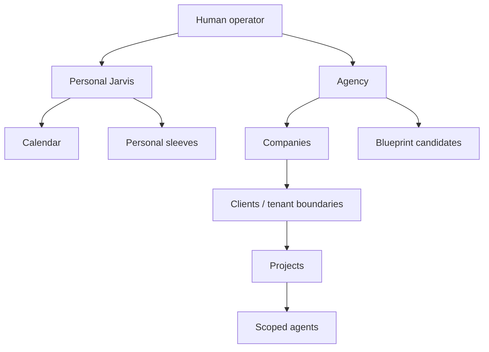

# Hierarchical Jarvis Control Site Design

## Product model

The human operator—not Jarvis—is the root authority.



This containment tree answers who owns an object. A separate delegation DAG answers who asked whom to do what. Tool and memory access are explicit grant edges and are never inherited from containment.

Jarvis is a coordinator. The operator can chat with Jarvis or a specialist, inspect delegation, filter agents and runs, review exact authority and context, approve bounded effects, stop future work, and promote or retire tested blueprints. The site never exposes hidden reasoning, silently promotes transcripts to memory, or implies that stop undoes committed effects.

## Trust and memory sleeves

Supported scopes are `personal`, `agency`, `company`, `client`, `project`, and `agent`. A client is a commercial engagement with one company and one tenant boundary. A project belongs to the agency or exactly one client.

Memory sleeves are `personal`, `agency`, `company`, `client`, `project`, `agent_scratch`, and `shared_approved`. Each has an owner scope, tenant, sensitivity, retention policy, review/expiry, record count, and version. A sleeve grant binds one agent to explicit `read`, `propose_write`, or `write` permissions, purpose, maximum sensitivity, grantor, expiry, and version.

Effective authority is the intersection of blueprint allowance, operator grant, tenant policy, channel policy, and run budget. No grant is transitive. Cross-scope knowledge becomes a reviewed, materialized `SharedKnowledgeBundle` of sanitized fragments, source references, provenance digest, destination, approver, review, and expiry; it is never a live pointer into another scope's index.

## Primary contracts

An `AgentRecord` has stable ID/name/use case, owner scope, pinned blueprint/revision, lifecycle, current run, last activity, and optimistic version. Lifecycle is:

```text
draft → validating → awaiting_approval → shadow → active ↔ paused
active → retiring → retired
any non-retired state → quarantined
```

A `Conversation` has scope, title, primary agent, explicit participants, operator-private or scope-member visibility, state, and version. Messages store an author, content artifact reference, trust label, artifact references, and time. Individual-agent conversations stay scoped to that agent; Jarvis receives only an explicit handoff artifact or approved summary.

A `Delegation` binds parent/child runs, from/to agents, objective, immutable context bundle, tool/sleeve grant IDs, inherited bounded budget, state, and time. It never passes the entire parent transcript.

An `AgentRunProjection` exposes root/parent run, agent and scope, company/client/project, status, elapsed time, tokens, known cost with coverage, and reliability window. A trace is an observable span tree of agent, handoff, delegation, retrieval, model, tool, approval, policy, and artifact events. It may show cited context, policy reason codes, permitted tool metadata, artifacts, timing, and cost—never hidden chain-of-thought. This follows the span model in [OpenTelemetry](https://opentelemetry.io/docs/specs/otel/trace/api/) and operational tracing in the [OpenAI Agents SDK](https://openai.github.io/openai-agents-js/guides/tracing/).

Reliability always includes its window and denominator: eligible, successful, verified, interventions, violations, and derived rates. Unmeasured is distinct from zero.

An `ApprovalRequest` binds agent/run/scope, exact action/effect/destination, disclosure summary, maximum cost, state fingerprint, expected resource version, state, and expiry. Approval is exact, expiring, one-time, and compare-and-swap consumed. [Human-in-the-loop](https://openai.github.io/openai-agents-js/guides/human-in-the-loop/) similarly pauses and resumes versioned state.

Every mutation uses an idempotent command envelope containing command ID, expected version, confirmation fingerprint, and strict payload. A deterministic service owns privileged state transitions.

## API shape

Keep `/api/v1/dashboard/*` compatibility projections. Add authenticated `/api/v1/control/*` resources:

- identity, scopes, posture, and kill switch;
- agents, agent runs/conversations/grants, pause/resume/retire/quarantine;
- conversations and messages;
- runs, spans, delegations, events, stop/pause/resume;
- memory sleeves, effective access, write proposals and decisions;
- grants and canonical grant plans;
- approvals and decisions;
- blueprints, canonical plans, promotion and rollback.

Agent list queries have bounded allowlisted filters for text, use case, lifecycle, company/client/project, current state, and reliability, plus opaque cursor and allowlisted sorting by name, activity, elapsed time, tokens, known cost, and success rate. Unknown filters fail validation.

Authorization checks subject, action, resource, scope, tenant, channel, and version on every request, consistent with [OWASP authorization guidance](https://cheatsheetseries.owasp.org/cheatsheets/Authorization_Cheat_Sheet.html).

## Desktop UX

The desktop shell has a scope/navigation rail, main workspace, and context inspector. The top bar shows scope breadcrumb, search/command palette, freshness/connection, autonomy posture, and an always-visible kill switch.

Primary Jarvis centers chat. The inspector shows active delegations, approvals, calendar/reminders, live budget, and returning child results. Each response may expand an evidence-only “Work performed” tree.

Agents supports tree/table views and shareable filters. Columns show agent/use case, company/client/project, lifecycle/work state, task, elapsed time, tokens, cost coverage, success rate with sample size, interventions, last activity, and attention. Selection opens the inspector without losing filters.

Individual agent tabs are Chat, Overview, Runs, Tools, Memory sleeves, Blueprint/revisions, Evals, and Audit. Headers show scope, lifecycle, run, budget, pause, retire, and quarantine.

Hierarchy uses solid ownership edges, arrow delegation edges, dashed shared-knowledge edges, grant locks, and warning badges. Selecting a node limits the diagram to relevant ancestors, descendants, delegations, and grants.

Run drilldown offers Summary, Trace, Artifacts, Context, Approvals, and Audit. Context shows fragment, sleeve, provenance, sensitivity, token allocation, inclusion reason, and omitted count.

Memory Center groups sleeves by trust domain and shows owner, sensitivity, records, review/expiry, and effective agent access. “Preview effective context” runs the actual authorization and token compiler for a selected agent/budget.

Blueprint Studio guides use case → contracts → orchestration → roles → tools → sleeves → budgets → evals → preview → candidate. Creation yields `draft` or `validating`, never active.

Approval cards answer who, scope, exact effect/destination, disclosed data, maximum cost, reason, fingerprint, and expiry. Actions are Approve once, Reject, and Edit/replan; there is no “always allow” shortcut.

## Mobile UX

Bottom navigation is Today, Jarvis, Work, Agents, More. The inspector becomes a bottom sheet; hierarchy becomes breadcrumbs plus collapsible outline and vertical delegation timeline; tables become cards retaining scope/state/time/tokens/cost/reliability; filters use a full-height sheet. Approvals get a separate review screen. Kill switch stays visible, stop and approve are separated, and streaming never moves touch targets.

## Page Studio boundary

Page Studio may add read-only `primary-jarvis-summary`, `agent-roster`, `delegation-trace-summary`, `approval-inbox`, `memory-sleeve-summary`, `blueprint-candidates`, and `run-economics` widgets. A future page manifest may bind scope, fixed allowlisted filters, and visibility. It may not add mutation endpoints, define grants, create agents, approve work, or emit executable code.

## Remote security

Network location never grants authority. The remote control site requires TLS, authenticated operator session, `__Host-` Secure/HttpOnly/SameSite=Strict cookies, short idle expiry and revocation, CSRF and origin checks, per-route ABAC, rate/body limits, and re-authentication for grants, promotion, kill-switch release, and high-risk approvals. See [OWASP session](https://cheatsheetseries.owasp.org/cheatsheets/Session_Management_Cheat_Sheet.html), [CSRF](https://cheatsheetseries.owasp.org/cheatsheets/Cross-Site_Request_Forgery_Prevention_Cheat_Sheet.html), and [NIST Zero Trust](https://www.nist.gov/publications/zero-trust-architecture).

Use authenticated POST commands plus Server-Sent Events for read-only run updates in V1. If WebSockets are later necessary, add WSS, origin validation, per-message authorization, expiry, limits, and security logging per [OWASP WebSocket guidance](https://cheatsheetseries.owasp.org/cheatsheets/WebSocket_Security_Cheat_Sheet.html).

## Red-team invariants

- Guessed IDs reveal no hidden scope, existence, count, or edge.
- Child grants are explicit intersections; recursive delegation has depth/fanout/child/token/time/cost caps.
- Personal and client sleeves are authorized before retrieval, not filtered afterward.
- External content cannot request grants or privileged transitions.
- Blueprint/eval changes remain candidate proposals.
- Approvals fail after replay, expiry, actor mismatch, state change, or concurrent decision.
- Stop prevents future steps and separately reports committed effects.
- Queue claim and supervisor both enforce quarantine and kill-switch posture.
- Missing cost is never zero; reliability always shows sample size.
- SSE is read-only; POST commands are idempotent.
- Traces and transcripts do not leak secrets, private prompts, or cross-scope content.
- Page Studio remains a fixed widget-to-read-model catalog.

## Delivery phases

1. Strict scope, agent, conversation, delegation, trace, grant, sleeve, approval, and blueprint schemas/state tests.
2. Migrations/repositories and projections from the current worker registry, queue, runs, clients, economics, and memory.
3. Authenticated shell, scope rail, agent roster/tree, filters, drilldowns, responsive mobile.
4. Primary/per-agent conversations, minimal context handoffs, span/delegation projections, SSE reconnect/freshness.
5. Memory Center, effective-access service, shared-approved bundles, exact-action approvals, pause/stop/quarantine/kill switch.
6. Blueprint preview, eval candidates, shadow/canary, promotion/retirement/rollback, read-only Page Studio widgets.
7. Remote hardening, IDOR/ABAC/concurrency tests, re-authentication, accessibility, and desktop/mobile browser verification.
