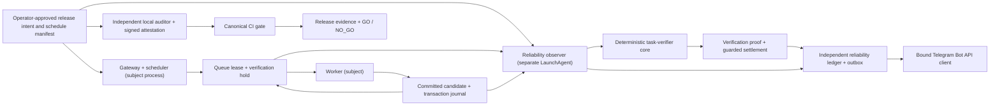

# Jarvis Last-Mile Reliability Spine Specification

**Date:** 2026-07-22

**Status:** Confirmed by the operator on 2026-07-22; implementation in progress

**Scope:** automation and unattended operations only

**Adjacent self-management boundary:** Jarvis may later draft and test repository changes in an
isolated, operator-visible change workspace. That workflow is outside the deterministic witness and
cannot mint reliability proof, approve or merge its own changes, broaden authority, or activate a
release. The witness continues to treat the editing agent as a subject.

**North star:** one exact, pre-approved scheduled job can run unattended for 14 consecutive days,
produce a proactive Telegram push for every outcome, and leave no in-scope failure without durable
evidence and an observable alert state.

## 1. Overview

This specification closes Jarvis's last-mile reliability gap without giving agents or schedulers any
new discretionary authority. It adds an out-of-process deterministic reliability witness, a narrowly
approved fixed-interval schedule, durable Telegram delivery, proof-gated run and queue settlement,
release-intent and artifact-drift verification in CI and operations, and durable ToolSmith proposals.
The existing top-level `PLAN.md` and `SPEC.md` describe the broader Agent Workbench/MVP and are not
replaced by this document. Where their aspirational statements conflict with current code, the
repository findings below are authoritative for this work.

## 2. Repository premise audit

The handoff was checked against the current modified worktree before this spec was written.

| Premise                                 | Repository truth                                                                                                                                                                                                  | Consequence for this specification                                                                                                                                 |
| --------------------------------------- | ----------------------------------------------------------------------------------------------------------------------------------------------------------------------------------------------------------------- | ------------------------------------------------------------------------------------------------------------------------------------------------------------------ |
| Expected scheduled runs exist           | The queue accepts `source.kind = 'schedule'`, but no production code materializes a schedule-source task.                                                                                                         | A deterministic, exact-scope schedule manifest and materializer are prerequisites to absence detection. Retrospective frequency rows cannot define an expectation. |
| The watchdog is a dead-man switch       | `runtime-watchdog.sh` is a separate process, but it only rotates logs, checks disk, and probes `/livez` and `/readyz`.                                                                                            | Keep the watchdog and add a separate reliability LaunchAgent that reasons from durable schedule, run, verification, and delivery evidence.                         |
| Telegram can push proactively           | The Bot API client can send to a caller-provided chat ID, but the runtime only polls and replies. There is no outbox, delivery receipt, retry state, or proactive notifier.                                       | Reuse the low-level client behind a destination-bound notifier and add a durable outbox/attempt ledger.                                                            |
| `task-verifier.ts` proves completion    | The file is not imported by production. It resolves citations and classifies command text; it does not execute acceptance criteria, bind tenant/run/task/artifact identity, or prevent unsafe paths.              | Refactor it into the deterministic verifier core. Citation resolution alone can never mint terminal success proof.                                                 |
| `succeeded` means verified              | `Supervisor` marks a run succeeded after commit, and `AutomationQueueCycle` calls `queue.succeed` whenever the runner resolves. Queue settlement checks lease/CAS but no verification proof.                      | Stage a completion candidate under a verification hold. Only the out-of-process deterministic settler may create the proof required by DB guards for success.      |
| Release immutability proves live intent | The installer accepts a caller label, packages the mutable worktree, and uses permissions without a content manifest. Runtime audit derives its expected release from the live plist and does not hash artifacts. | Introduce a canonical manifest and an independently pinned release intent; compare intended commit and bytes through installed files, plist, and launchd state.    |
| The release gate is canonical and in CI | There is no `.github` workflow or `release:gate` script. README and operator-handoff command lists differ, and `git diff --check` does not detect a dirty tree.                                                   | Make one executable gate, run it in read-only CI, and have hosted CI verify independently generated, signed live-host evidence.                                    |
| ToolSmith proposals are durable         | `ToolSmith.analyze()` returns in-memory DTOs; the scheduler logs only a count and the dashboard recomputes them.                                                                                                  | Store tenant-scoped, proposal-only records and observations. Do not bridge them automatically into queues, blueprints, code, PRs, or execution.                    |

The audit covered `PLAN.md`, top-level `SPEC.md`, `package.json`, queue/supervisor paths,
`src/queue/task-verifier.ts`, Telegram client/runtime/update processing and migration 012,
ToolSmith/monitoring/frequency repositories, database types/migrations, runtime installer/watchdog/
audit scripts, and their focused queue, Telegram, ToolSmith, gateway, database, and unattended-runtime
tests. Git status was captured first; this document is additive and does not normalize, stage, or
replace any pre-existing worktree change.

Existing strengths that remain mandatory are the queue's tenant/CAS fencing, deny-first policy,
pre-run and pre-commit kill-switch checks, artifact transaction journal, conservative restart
recovery, loopback binding, Keychain-held Telegram token, immutable release layout, dry-run installer,
and exact-state local human approval.

## 3. Scope, authority, and non-goals

### 3.1 In scope, in priority order

1. A deterministic reliability observer in a separate OS process that detects a missing expected
   occurrence, an over-deadline run, failed verification, an overdue notification, and exhausted
   notification delivery.
2. Proactive informational Telegram pushes through the existing Bot API client, bound to the exact
   installed `userId + chatId` pair.
3. Refactoring and wiring `src/queue/task-verifier.ts` into a proof-gated settlement path so a worker
   resolving without throwing is insufficient for success.
4. A canonical release gate plus CI evidence that the candidate is clean and that a protected,
   read-only host attestation sees the exact intended commit and artifact bytes live.
5. Durable, tenant-scoped ToolSmith proposals that are structurally incapable of auto-execution.

The schedule materializer is included only because a dead-man cannot detect absence without a
durable definition of what was expected. V1 permits one active, exact, human-approved daily schedule;
it is a replay of prior authority, not a decision-making agent.

### 3.2 Architectural invariants

- Agents and workers are subjects. They may produce candidates and claims; they never produce the
  witness proof that settles their own work.
- Absence detection and terminal verification execute outside the gateway/worker process.
- Every terminal verdict is deterministic. No LLM, reviewer agent, confidence score, or natural
  language judgment participates in settlement, dead-man classification, release audit, or delivery
  acknowledgment.
- Tenant, automation, task, occurrence, run, verifier revision, criteria digest, release, and
  recipient binding must match exactly. A loose client/automation/time search never satisfies an
  expected occurrence.
- Missing configuration, missing proof, an unsupported verifier, stale approval, ambiguous recovery,
  or unavailable evidence fails closed.
- The agency kill switch and tenant suspension stop new work. The reliability observer continues to
  report state but cannot resume or retry/rerun automation work, repair artifacts, release authority,
  approve, or enqueue work. Its finite verifier-infrastructure and notification-delivery retries do
  not re-execute a worker.
- Informational Telegram delivery grants no authority. Consequential outward actions and all state
  mutations outside the narrow settlement transaction remain behind the existing local exact-state
  human approval boundary.
- All retries are finite, idempotent, and durably observable.

### 3.3 Explicit non-goals

- More LLM oversight or reviewer agents.
- Using the in-process model router or context budget as enforcement.
- Confidence-threshold escalation.
- Scheduled retrieval evaluation or an external budget proxy.
- Autonomous consequential outbound actions.
- More agent hierarchy.
- Automatic repair, restart, rollback selection, schedule editing, release activation, ToolSmith code
  generation, ToolSmith PR creation, or proposal promotion.
- Public/LAN binding or new remote-access authority.

## 4. Architecture

### 4.1 Process and trust boundaries



The `com.aiagency.jarvis.reliability-observer` LaunchAgent is a one-shot command with `RunAtLoad =
true`, `StartInterval = 60`, `Umask = 0077`, immutable absolute program/config paths, bounded stdout
and stderr logs, and launchd throttling. Each invocation is a fresh process. It imports no agent,
model, router, prompt, approval, arbitrary command, worker execution, or blueprint-transition port.

It has four narrow capabilities:

1. read immutable release and schedule configuration;
2. read primary run/queue/artifact state and write only verification/guarded-settlement records;
3. write its separate owner-only reliability SQLite ledger; and
4. send allowlisted operational templates through a Telegram notifier constructed from the exact
   installed recipient pair.

SQLite cannot enforce per-table OS identities within one database. Therefore the boundary is
enforced in layers: the gateway is not composed with the verifier/settlement repository; success
updates have database triggers requiring exact pass evidence; the observer receives no worker or
general queue mutation port; import-boundary tests prevent agent/worker modules from minting proof;
and the release audit checks the exact observer and gateway entrypoints. This is a process and
capability boundary, not a claim that the local operating-system owner is adversarially sandboxed.

### 4.2 Responsibility matrix

| Component                     | May do                                                                                                                                                           | Must not do                                                                                                             |
| ----------------------------- | ---------------------------------------------------------------------------------------------------------------------------------------------------------------- | ----------------------------------------------------------------------------------------------------------------------- |
| Gateway schedule materializer | Reproduce one approved UTC occurrence ID; check posture and tenant; enqueue exact registered automation; stage a verification hold                               | Infer schedules from history; choose tenant/automation; catch up without bounds; mark success; notify proactively       |
| Worker/Supervisor             | Execute exact registered worker; stage/commit candidate; recheck kill-switch version; preserve journal; request verification                                     | Mint pass proof; mark run or queue succeeded; loosen policy; approve actions                                            |
| Reliability observer          | Derive expected slots; verify candidates; create guarded terminal proof; detect absence/staleness; maintain incidents/outbox; send fixed informational templates | Run workers; enqueue/cancel work; modify policy/posture; roll back files; run models; execute arbitrary acceptance text |
| Existing watchdog             | Probe disk, liveness, readiness, and observer checkpoint freshness                                                                                               | Decide run success; repair state; act as its own evidence source                                                        |
| Runtime audit                 | Read independent intent; hash installed bytes; compare plist/launchd; report `GO`/`NO_GO`                                                                        | Install, activate, delete, chmod-repair, or roll back                                                                   |
| ToolSmith                     | Deterministically derive and persist observational proposals                                                                                                     | Queue, execute, write code/files, call network, create PRs, or transition blueprints                                    |
| Telegram inbound processor    | Preserve exact private sender/chat allowlist and `read + propose` behavior                                                                                       | Treat a message or delivery receipt as approval or execute `/pause` directly                                            |

### 4.3 Canonicalization and identifiers

- Canonical JSON is UTF-8, recursively key-sorted, has no insignificant whitespace, and rejects
  duplicate keys, non-finite numbers, and unknown fields before SHA-256.
- All persisted timestamps are validated UTC RFC 3339 instants. Schedule arithmetic uses integer
  epoch seconds; no local time, cron, DST, or locale conversion is allowed in V1.
- IDs use length-prefixed canonical fields, never delimiter concatenation.
- Secrets, lease tokens, bot tokens, raw tenant input/output, raw provider error text, and arbitrary
  message bodies are never evidence fields or log fields.

Key identities are:

```text
occurrenceId  = sha256("occurrence:v1", scheduleId, scheduleVersion, scheduledFor)
executionRequestId = sha256("execution-request:v1", sourceKind, sourceId, tenantId, automationId)
                    // schedule sourceId is occurrenceId; API sourceId is its immutable request ID
queueTaskId   = sha256("queue-task:v1", executionRequestId, tenantId, automationId)
runId         = sha256("run:v1", executionRequestId, queueTaskId)
artifactClaimId = sha256("artifact-claim:v1", artifactScopeKey, executionRequestId, runId)
sourceClaimId = sha256("source-snapshot:v1", artifactClaimId, sourceRegistrationId)
abandonmentEvidenceId = sha256("artifact-abandonment:v1", artifactClaimId, expectedClaimVersion, reasonCode)
holdId        = sha256("verification-hold:v1", tenantId, queueTaskId, leasedVersion, queueAttempt, runId)
attemptId     = sha256("verification-attempt:v1", holdId, verifierRevision, subattempt)
settlementId  = sha256("verified-settlement:v1", holdId, attemptId, "succeeded")
failureSettlementId = sha256("failed-settlement:v1", holdId, attemptId, reasonCode)
projectionJobId = sha256("completion-projection:v1", settlementId, finalizationAction)
projectionReceiptKey = sha256("projection-receipt:v1", runId, projectionKind, projectorVersion)
incidentId    = sha256("incident:v1", kind, subjectId, policyVersion)
acceptedLossDecisionId = sha256("accepted-loss:v1", incidentId, expectedIncidentVersion,
                                subjectId, remediationEvidenceSha256, newCampaignBoundarySha256)
notificationId = sha256("notification:v1", eventKind, eventId, bindingDigest, templateVersion)
proposalId    = sha256("toolsmith:v1", tenantId, automationId, ruleVersion)
controlMutationId = sha256("control-mutation:v1", kind, planFingerprint, expectedPriorStateSha256)
```

An exact replay returns the existing receipt. Reuse of an ID with different canonical fields is an
integrity failure and never an update-in-place.

#### 4.3.1 Confirmed byte-level protocol

The following choices close the implementation ambiguities found during gap analysis:

- Canonical JSON accepts JSON data only. Object keys sort by ECMAScript UTF-16 code-unit order;
  strings retain their exact scalar values; numbers use the Node 22 `JSON.stringify` representation.
  Integer-valued numbers must also be JavaScript safe integers. Duplicate keys, negative zero,
  non-finite numbers, unsafe integers, unpaired surrogates, array holes, accessors, symbols,
  non-plain objects, unsupported values, and cycles are rejected.
- Domain-separated hashes frame the domain tag first and every subsequent canonical field as an
  unsigned 32-bit big-endian UTF-8 byte length followed by exactly those bytes. There is no delimiter,
  terminator, normalization, or implicit coercion. IDs and digests are lowercase 64-character SHA-256
  hex unless an existing contract explicitly requires the presentation prefix `sha256:`.
- Immutable artifact-scope, source, verifier, criteria, and projector registrations live under
  `config/reliability/registries/`, use strict versioned schemas, and are included in the canonical
  release manifest. Runtime request text can select only a previously resolved opaque registration
  ID, never a path, tenant, verifier, or projector.
- Missing posture or tenant-status evidence is a typed fail-closed materializer outcome and creates
  no queue task. Activation history is append-only primary-database evidence bound to the immutable
  release schedule configuration; retained history is not reconstructed from the current plist.
- Telegram binding state is exactly `pending_verification`, `active`, or `rotated`. Rotation moves
  undelivered rows to the terminal reason `binding_rotated`; disabled schedule mode does not emit a
  recurring notification, while an active schedule with an unactivated binding is `NO_GO`.
- `proof_persistence_failed` is returned only when an attempt event was durably recorded but the
  guarded terminal transaction failed. SQLite `BUSY/LOCKED` receives the bounded internal retry;
  inability to persist even the attempt event returns no typed receipt, consumes no verifier
  subattempt, and exits the observer invocation nonzero.
- A worker commit under this spine freezes a claim-scoped candidate and journal; it does not publish
  the live artifact. The verified `release` projection performs the atomic live publication and
  journal cleanup. Direct-API input is either rejected by the exact worker schema or included in the
  immutable execution-request/source digest before execution.
- The watchdog resolves expected observer paths and digests only from independently installed
  control intent. Additive schema and dormant guards land with activation disabled; pending semantics
  and proof writers land before activation, and historical success remains `legacy_unverified` rather
  than satisfying a new proof join.

### 4.4 Interface contracts

The normative typed contracts are colocated with Components 1–5 so each boundary sits beside its
failure and recovery behavior. Across all of them, object schemas are strict and versioned; unknown
fields, invalid bounds, noncanonical encodings, stale CAS versions, and identity mismatches fail
before side effects. Caller-supplied IDs are selectors only—the owning repository resolves tenant,
policy, path, destination, and evidence bindings. Successful returns are durable receipts, while a
throw, timeout, process exit, or missing receipt is never success.

## 5. Data model

### 5.1 Storage separation

The primary Jarvis database remains authoritative for schedules, queue/run bindings, verification
holds, deterministic proofs, and settlement. A separate
`$STATE_ROOT/reliability/reliability.sqlite`, created direct with mode `0600`, is authoritative for
observer cycles, incidents, Telegram outbox rows, and delivery attempts. The gateway receives a
mandatory read-only bounded summary repository for readiness and UI; it never receives the
reliability writer. `/readyz` must fail when this summary is unreadable or reports any open P0/P1,
unreconciled exhausted notification, stale observer checkpoint, or release/config mismatch.

Separating the ledger lets the observer durably report `primary_evidence_store_unavailable` when the
main database cannot be read. If the state volume itself cannot be written, the invocation returns a
bounded nonzero result and the existing disk/watchdog/runtime-audit layers remain `NO_GO`; no
same-host design can make a durable-write claim after loss of the entire state volume.

### 5.2 Primary database additions

All migrations must be replay-safe under the repository's current startup behavior. Prefer additive
tables, indexes, and triggers. The effective `verification_pending` state is represented by a hold so
the existing checked queue/run state columns do not require an unsafe replayed table alteration.

| Entity                                   | Required fields and constraints                                                                                                                                                                                                                                                                                                                                                                                                                                                                                                                                                                                                                                                                                                                                           |
| ---------------------------------------- | ------------------------------------------------------------------------------------------------------------------------------------------------------------------------------------------------------------------------------------------------------------------------------------------------------------------------------------------------------------------------------------------------------------------------------------------------------------------------------------------------------------------------------------------------------------------------------------------------------------------------------------------------------------------------------------------------------------------------------------------------------------------------- |
| `schedule_eligibility_events`            | append-only activation/deactivation, agency-posture, and tenant-status evidence needed to reconstruct eligibility at a UTC slot; exact schedule/tenant/config and source approval/posture versions; no current-state backfill; bootstrap event required before activation                                                                                                                                                                                                                                                                                                                                                                                                                                                                                                 |
| `scheduled_occurrences`                  | `occurrence_id` PK; `schedule_id`; `schedule_version`; exact `tenant_id`; `automation_id`; `scheduled_for`; `materialization_deadline`; mandatory `recorded_at`; nullable `materialized_at/start_deadline/execution_deadline/queue_task_id/run_id`; suppressed rows require all five nullable fields null plus reason `suppressed_ineligible_at_slot/suppressed_current_fence`; queued rows require materialized/start/task and permit run/deadline null only before start; `materialization` in `queued/suppressed`; at-slot and current-fence posture/tenant evidence versions; schedule and notification-binding digests; unique `(schedule_id, schedule_version, scheduled_for)`; all contract fields immutable except guarded one-time binding of exact run/deadline |
| `artifact_scope_claims`                  | `claim_id` PK; stable `artifact_scope_key`; exact tenant/automation/task/run; CAS version; state `executing/verification_pending/finalization_pending/released/abandoned`; acquired/updated/terminal times; captured queue version; nullable write-once terminal evidence kind/ID/digest; immutable ownership fields; partial unique index permits only one nonterminal claim for a scope; terminal transition is CAS-bound to finalization or pre-hold-abandonment evidence, after which a later run may obtain a new claim for the same stable scope                                                                                                                                                                                                                    |
| `source_snapshot_claims`                 | `source_claim_id` PK; exact artifact claim/task/run/tenant/automation; immutable registered source identity, safe snapshot relative path, size, SHA-256, and created time; source is snapshotted and hashed by infrastructure before worker execution, then the worker and verifier read the same immutable snapshot; terminal lifecycle follows the artifact claim                                                                                                                                                                                                                                                                                                                                                                                                       |
| `run_completion_candidates`              | `candidate_id` PK; nullable occurrence ID plus mandatory immutable `execution_request_id`; exact task/run/tenant/automation; `worker_id`; artifact claim ID/scope key; source claim ID/digest; result schema version; bounded canonical candidate result JSON and digest; artifact digest; journal claim/digest; criteria digest; captured posture version; `committed_at`; immutable; candidate content never copied into evidence/logs                                                                                                                                                                                                                                                                                                                                  |
| `work_queue_verification_holds`          | `hold_id` PK; exact candidate/task/run/tenant/artifact claim ID/scope key/source claim; captured lease version, attempt, owner, posture version, and artifact-claim version; verifier ID/revision; criteria digest; `created_at`; optional `resolved_at`; immutable binding fields; unique task/run and one unresolved hold per active artifact scope                                                                                                                                                                                                                                                                                                                                                                                                                     |
| `task_verification_events`               | `verification_event_id` PK; append-only `started/passed/failed/error/interrupted`; `attempt_id`; `subattempt` 1..2; exact hold/task/run/tenant/automation; verifier/criteria revisions; result/artifact/source digests when passed; safe reason code; checked time; nullable `next_attempt_at` permitted only on retryable subattempt-1 `interrupted/error` and required to be later than checked time; bounded redacted details; unique `(attempt_id, event_type)` and at most one terminal event per attempt                                                                                                                                                                                                                                                            |
| `verified_run_completions`               | one row per run; exact passed event FK; tenant/task/automation/candidate/criteria/artifact/result and notification-binding digests; `verified_at`; immutable                                                                                                                                                                                                                                                                                                                                                                                                                                                                                                                                                                                                              |
| `work_queue_success_evidence`            | one row per tenant/task; captured lease and terminal versions; run ID; pass event ID; deterministic settlement ID; settled time; immutable                                                                                                                                                                                                                                                                                                                                                                                                                                                                                                                                                                                                                                |
| `work_queue_failure_evidence`            | one row per terminal verification failure; exact tenant/task/run/hold and failed/error event FK; captured lease and terminal versions; deterministic settlement ID; safe reason; settled time; immutable                                                                                                                                                                                                                                                                                                                                                                                                                                                                                                                                                                  |
| `artifact_claim_abandonment_evidence`    | deterministic abandonment ID PK; exact claim/version/task/run plus stage-valid nullable source/candidate/journal bindings; allowlisted reason fixes which bindings may be null; rollback journal evidence ID/digest when a journal exists; abandoned time; immutable; unique claim ID, so replay returns exact evidence and conflicting recovery fails                                                                                                                                                                                                                                                                                                                                                                                                                    |
| `completion_projection_jobs`             | one idempotent job per terminal verification; exact run/task/candidate/artifact claim ID/scope key/journal claim; action `finalize_verified/finalize_rejected`; immutable strict per-required-kind projector-version map and plan digest; state `pending/leased/retry_wait/completed/failed`; CAS version; attempts 0..3; lease ID/expiry; next attempt; safe error; completion evidence; created in the same terminal settlement transaction                                                                                                                                                                                                                                                                                                                             |
| `completion_projection_effect_journals`  | one exact journal per filesystem projection; projection job/kind/idempotency key, normalized registered target, expected prior state/digest, intended digest, state `prepared/applied/receipted/conflict`, and timestamps; unique idempotency key; arbitrary paths forbidden                                                                                                                                                                                                                                                                                                                                                                                                                                                                                              |
| `completion_projection_receipts`         | projection job FK; kind `artifact/run_memory/diagram/frequency/release`; deterministic domain-tagged idempotency key derived from run/kind/frozen projector version; effect-journal ID when filesystem-backed; evidence digest; completed time; unique job/kind and globally unique idempotency key; append-only                                                                                                                                                                                                                                                                                                                                                                                                                                                          |
| `telegram_binding_activation_candidates` | immutable candidate written only after the inbound processor's exact user/chat/private/non-bot authorization; config version plus binding/update/identity digests, check flags, and observed time; no message text/token/raw IDs; observer copies only an exact match into its binding-activation ledger                                                                                                                                                                                                                                                                                                                                                                                                                                                                  |

Database guards must reject:

- insert or update of `agent_runs.status = 'succeeded'` without an exact
  `verified_run_completions` row;
- insert or update of `work_queue_tasks.state = 'succeeded'` without exact
  `work_queue_success_evidence` in the same transaction;
- success evidence whose tenant, task, run, automation, candidate, criteria, version, or attempt does
  not match the frozen hold;
- terminal failure of a held run/task without exact `work_queue_failure_evidence`, or any generic
  interruption/failure mutation that attempts to bypass the guarded verifier settlement;
- artifact-claim `executing -> verification_pending` without the exact candidate/hold insert and
  expected claim version in the same transaction;
- artifact-claim `executing -> abandoned` without its immutable abandonment-evidence FK, or
  `finalization_pending -> released` without exact completed job/receipt evidence in the same
  transaction;
- claim/reclaim or direct change of lease owner/token/version for a task with an unresolved
  verification hold, even after its original lease time;
- update/delete of append-only verification, success, failure, and projection-receipt evidence; and
- a success queue event whose strict JSON object differs from the allowlist
  `{runId, verificationEventId, settlementId, criteriaSha256}` or has an unknown/non-string key. Other
  sensitive values are excluded by construction rather than guessed from free-form JSON.

The success and failure triggers admit only their corresponding exact evidence inserted in the same
transaction; the guarded settler inserts terminal verification evidence first, performs the one
allowed run/queue mutation, resolves the hold, and creates the projection job atomically. The hold
is fail-closed and does not expire into another worker execution. Its timing threshold opens
a stale incident; releasing or cancelling an unresolved hold requires a separate exact-state local
human decision.

### 5.3 Reliability ledger and watchdog-owned status

| Entity                                      | Required fields and constraints                                                                                                                                                                                                                                                                                                                                                                                                                                                                                                                                                                                |
| ------------------------------------------- | -------------------------------------------------------------------------------------------------------------------------------------------------------------------------------------------------------------------------------------------------------------------------------------------------------------------------------------------------------------------------------------------------------------------------------------------------------------------------------------------------------------------------------------------------------------------------------------------------------------- |
| `reliability_observer_cycles`               | invocation ID PK; release/config digests; started time; nullable write-once classification/invocation-completed times; hard work-budget deadline; state `running/completed/failed`; status `ok/degraded/no_go`; last checked slot; bounded observation/verification/delivery/backlog counts; safe code; guarded CAS transitions only                                                                                                                                                                                                                                                                           |
| `reliability_observer_cycle_events`         | append-only `started/classified/completed/failed/recovered_lease` events with invocation/lease identity, event time, bounded counts, and safe code                                                                                                                                                                                                                                                                                                                                                                                                                                                             |
| `reliability_observer_lease`                | singleton key; CAS version; lease ID; invocation ID; acquired/expiry times from DB clock; expiry exactly +55 seconds; every reliability write references the current nonexpired lease/version                                                                                                                                                                                                                                                                                                                                                                                                                  |
| `reliability_incidents`                     | stable incident ID; kind; severity `P0/P1/P2`; subject type/ID; schedule/occurrence IDs when applicable; CAS version; state `open/resolved/closed_accepted_loss`; optional `acknowledged_at/by/version` is orthogonal; first/last observed; consecutive observations; evidence digest/reference; policy version; no raw tenant data                                                                                                                                                                                                                                                                            |
| `reliability_incident_events`               | append-only open/observed/resolved/acknowledged/closed-as-accepted-loss events with exact incident version, actor class `observer/operator`, decision/fingerprint when operator-owned, and safe reason                                                                                                                                                                                                                                                                                                                                                                                                         |
| `telegram_binding_activations`              | one immutable activation per binding/config version; activation evidence ID/digest; observed update ID digest/time; exact-private-human checks; state `active/rotated`; no bot token or raw message; proactive delivery requires the exact active row                                                                                                                                                                                                                                                                                                                                                          |
| `telegram_notification_outbox`              | stable notification ID; event kind/ID; template code/version; binding and SLA-policy kind/digest; bounded template-data JSON; immutable `event_observed_at`, `notification_required_at`, and `sla_deadline`; state `pending/leased/retry_wait/delivered/exhausted`; CAS version; attempt count 0..6 (five automatic plus at most one exact operator retry); nullable unique operator-retry decision ID and accepted-loss decision ID, each written at most once under exact CAS; nullable monotonic `provider_not_before`; next attempt; lease ID/expiry; provider message/chat IDs after delivery; timestamps |
| `telegram_notification_attempts`            | unique `(notification_id, attempt_no)`; started/completed times; outcome `delivered/timeout/transport/rate_limited/provider_rejected/invalid_response/chat_mismatch/ambiguous`; bounded HTTP code, validated provider retry-after, and over-horizon flag; safe error code; append-only                                                                                                                                                                                                                                                                                                                         |
| `$STATE_ROOT/watchdog/observer-status.json` | watchdog-owned, owner-only canonical status artifact outside the observer reliability DB; checked/expiry/checkpoint times, observer plist/path/release findings, bounded aggregate codes, and status; written by atomic replace so observer death or reliability-DB loss remains externally observable                                                                                                                                                                                                                                                                                                         |

Incident open/resolve and outbox creation for a detected condition occur in one reliability-database
transaction. Primary settlement and notification creation cannot be atomic across two databases. The
observer closes that crash gap deterministically: every scan recreates the expected notification ID
from the primary event and inserts it if absent. A settled run without an outbox row is therefore a
recoverable missing projection, not silent success.

### 5.4 ToolSmith database additions

| Entity                                  | Required fields and constraints                                                                                                                                                                                                                                                                                                 |
| --------------------------------------- | ------------------------------------------------------------------------------------------------------------------------------------------------------------------------------------------------------------------------------------------------------------------------------------------------------------------------------- |
| `toolsmith_proposals`                   | immutable stable proposal ID; exact `tenant_id` and validated `automation_id`; literal `proposal_kind = 'toolsmith_observation'`; rule version; threshold; bounded title/objective; literal `mode = 'proposal_only'`; literal `execution_eligibility = 'none'`; `created_at`; unique `(tenant_id, automation_id, rule_version)` |
| `toolsmith_proposal_observations`       | proposal FK; execution/intervention counts; average duration; last execution; canonical evidence digest; observed time; PK `(proposal_id, evidence_digest)`; append-only                                                                                                                                                        |
| `toolsmith_scan_events`                 | scan ID; started/completed; candidate/persisted counts; state `succeeded/failed`; safe reason code; no proposal authority; append-only                                                                                                                                                                                          |
| `task_frequency_records_v2`             | authoritative explicit `tenant_id`, `automation_id`, execution/intervention counts, `duration_sample_count`, integer `duration_sum_millis`, last execution, evidence digest, and CAS version; unique exact tenant/automation identity; average is derived as null when sample count is zero; no delimiter-parsed identity       |
| `task_frequency_v2_cutovers`            | one immutable cutover version/time; frozen legacy-table digest/high-water ID; V2 writer revision; activation approval/release digest; proves old writes stopped before V2 writes began                                                                                                                                          |
| `task_frequency_legacy_import_receipts` | deterministic import ID; legacy row ID/digest, exact catalog mapping digest, cutover ID, normalized counts/duration sum, target tenant/automation, before/after V2 versions, imported time; unique legacy row/digest and immutable                                                                                              |
| `task_frequency_legacy_quarantine`      | unique legacy row ID/digest; safe reason `unmapped/ambiguous/changed_after_cutover`; catalog/cutover digest; quarantined time; no tenant inference. Only catalog-proven rows from the frozen cutover snapshot may import; quarantine never feeds ToolSmith                                                                      |

There is deliberately no `approved`, `executing`, `executed`, queue task, blueprint transition, code
path, command ID, or pull-request field in the ToolSmith schema.

### 5.5 Evidence durability and retention

V1 adds no automatic evidence-pruning authority. Verification/settlement, occurrence, incident,
outbox/attempt, observer-cycle, release-intent/approval, trust-registry transition, attestation, and
ToolSmith evidence survives process restart and release replacement. Raw source snapshots, candidate
results, and artifacts remain only
inside their exact owner-only tenant/artifact roots; they are never copied into the reliability
ledger, Telegram body, logs, or CI evidence. Deleting them while a hold, projection, incident, or
acceptance campaign references them is an integrity `NO_GO`. A future retention/deletion policy must
be separately specified and human-approved rather than inferred by this observer.

## 6. Component 1 — expected runs and out-of-process dead-man

### 6.1 Interfaces

```ts
interface ApprovedScheduleV1 {
  schemaVersion: 1;
  scheduleId: string; // bounded slug, immutable within version
  scheduleVersion: number; // positive integer
  tenantId: string; // exact registered tenant
  automationId: string; // exact registered worker pair
  anchorAt: string; // UTC RFC 3339
  intervalSeconds: 86400; // V1 is daily only
  materializationGraceSeconds: number; // 120..900
  startSlaSeconds: number; // 60..900 after materialization
  maxExecutionSeconds: number; // 60..180; leaves a 60s staging margin below the 300s lease
  notificationSlaSeconds: number; // 60..900
  verifierId: string;
  verifierRevision: string;
  criteriaSha256: string;
  approvalDecisionId: string;
  approvalProposalVersion: number;
  approvalFingerprint: string;
  approvalPolicyVersion: string;
  configDigest: string;
}

interface OperationalNotificationPolicyV1 {
  schemaVersion: 1;
  policyVersion: number;
  notificationSlaSeconds: number; // 60..900; used when no trusted schedule owns the event
  policyDigest: string; // canonical fields except this digest
}

interface ScheduleActivationV1 {
  schemaVersion: 1;
  mode: 'disabled' | 'active';
  activationVersion: number;
  scheduleConfigDigest: string;
  releaseId: string;
  releaseManifestSha256: string;
  approvalDecisionId: string | null; // required only when active
  activationDigest: string;
}

interface ScheduleActivationWindowV1 {
  activation: ScheduleActivationV1 & { mode: 'active'; approvalDecisionId: string };
  schedule: ApprovedScheduleV1;
  activeFrom: string; // inclusive UTC instant
  inactiveAt: string | null; // exclusive UTC instant
}

interface ApprovedScheduleSource {
  loadExact(): Promise<{
    activation: ScheduleActivationV1;
    schedules: ReadonlyArray<ApprovedScheduleV1>;
  }>;
  loadRecentActiveWindows(input: {
    through: string;
    maxScheduledSlots: 32;
  }): Promise<ReadonlyArray<ScheduleActivationWindowV1>>;
  loadOperationalNotificationPolicy(): Promise<OperationalNotificationPolicyV1>;
}

interface ScheduleMaterializer {
  materialize(input: { now: string }): Promise<
    | {
        outcome: 'disabled';
        activationVersion: number;
        occurrenceId: null;
        queueTaskId: null;
        resolvedPostureVersion: null;
        resolvedTenantStatusVersion: null;
      }
    | {
        outcome: 'config_or_release_mismatch';
        activationVersion: number;
        safeReasonCode:
          | 'active_schedule_cardinality'
          | 'config_digest_mismatch'
          | 'release_digest_mismatch'
          | 'approval_missing';
        occurrenceId: null;
        queueTaskId: null;
        resolvedPostureVersion: null;
        resolvedTenantStatusVersion: null;
      }
    | {
        outcome: 'created' | 'already_exists' | 'suppressed' | 'missed_window';
        activationVersion: number;
        occurrenceId: string;
        queueTaskId: string | null;
        resolvedPostureVersion: number;
        resolvedTenantStatusVersion: number;
      }
  >;
}

interface ReliabilityObserver {
  check(input: { now: string }): Promise<ObserverReceipt>;
}

interface ObserverReceipt {
  invocationId: string;
  status: 'ok' | 'degraded' | 'no_go';
  resolvedReleaseIntentDigest: string;
  resolvedScheduleConfigDigest: string;
  scheduleActivationMode: 'disabled' | 'active';
  checkedThrough: string;
  observationCounts: Readonly<Partial<Record<ObservationCode, number>>>;
  verificationBacklogCount: number;
  deliveryBacklogCount: number;
  workBudgetExhausted: boolean;
  openIncidentIds: ReadonlyArray<string>; // bounded to 100
}

type WatchdogProbeCode =
  | 'DISK_GUARD_FAILED'
  | 'GATEWAY_LIVE_FAILED'
  | 'GATEWAY_READY_FAILED'
  | 'OBSERVER_STALE'
  | 'OBSERVER_PATH_DRIFT'
  | 'OBSERVER_RELEASE_DRIFT'
  | 'RELIABILITY_DB_UNAVAILABLE';

interface WatchdogObserverStatusV1 {
  schemaVersion: 1;
  intendedReleaseDigest: string;
  watchdogCheckedAt: string;
  expiresAt: string; // exactly watchdogCheckedAt + 180 seconds
  observerCheckpointAt: string | null;
  status: 'GO' | 'NO_GO';
  codes: ReadonlyArray<WatchdogProbeCode>; // sorted unique, maximum 16
}

interface ReliabilityReadinessSummaryV1 {
  schemaVersion: 1;
  generatedAt: string;
  expiresAt: string; // <= generatedAt + 180 seconds
  releaseIntentDigest: string;
  observerCheckpointAt: string;
  openP0Count: number;
  openP1Count: number;
  unreconciledExhaustedNotificationCount: number;
  configOrReleaseMismatchCount: number;
}

interface IncidentAcknowledgmentV1 {
  incidentId: string;
  expectedIncidentVersion: number;
  confirmationFingerprint: string;
  actorPrincipalId: 'principal:web_operator';
}

interface AcceptedLossDecisionV1 {
  decisionId: string; // must equal the canonical acceptedLossDecisionId formula
  incidentId: string;
  expectedIncidentVersion: number;
  subject:
    | { kind: 'occurrence'; occurrenceId: string }
    | { kind: 'notification'; notificationId: string; expectedOutboxVersion: number };
  action: 'close_as_accepted_loss';
  remediationEvidenceSha256: string;
  newCampaignBoundarySha256: string;
  confirmationFingerprint: string;
  actorPrincipalId: 'principal:web_operator';
}

type ObservationCode =
  | 'on_time'
  | 'suppressed_by_exact_posture'
  | 'missing_after_grace'
  | 'occurrence_binding_missing'
  | 'execution_not_started'
  | 'lease_without_run'
  | 'deadline_evidence_missing'
  | 'running_past_deadline'
  | 'terminal_failed'
  | 'verification_missing'
  | 'verification_failed'
  | 'notification_overdue'
  | 'notification_exhausted'
  | 'primary_evidence_store_unavailable'
  | 'posture_evidence_missing'
  | 'tenant_status_evidence_missing'
  | 'observer_gap_exceeds_window'
  | 'observer_work_backlog'
  | 'config_or_release_mismatch';
```

The schedule lives in an immutable release file whose digest is pinned by independent release
intent. A schedule change is consequential configuration: extend the existing action-proposal enum
with `activate_schedule_config`, whose payload digest is the exact schedule config digest and whose
binding fixes tenant, scope, policy version, proposal version, and confirmation fingerprint. Only an
approved, unexpired-at-decision local web-operator decision may be applied; agents and Telegram
cannot approve. Application creates a new immutable release/schedule version and does not become an
open-ended right to edit it. Neither request text nor an agent can select tenant, automation, time,
or verifier. Wrong principal, expired proposal, stale version, wrong fingerprint/digest, or replay
against another config fails closed.

Activation is an independently pinned, deny-default runtime contract: `disabled` requires exactly
zero schedules and produces an explicit disabled materializer/observer receipt; `active` requires
exactly one schedule, a matching config/release/approval digest, and readiness to be otherwise
healthy. Zero, multiple, or mismatched schedules while active are immediate
`config_or_release_mismatch`/`NO_GO`, never “nothing expected.”
`activationDigest` hashes the canonical activation fields except itself; release intent pins that
digest, while activation pins the already-known release ID and manifest digest, avoiding a circular
hash dependency.

Activation/deactivation history and the immutable schedule files of retained releases are never
replaced by the current disabled view. For every invocation, the observer loads recent exact active
windows and independently derives up to the last 32 UTC slots whose `scheduledFor` fell inside an
active window. This includes slots for which the gateway wrote no row and slots immediately before a
deactivation. Disabled mode prevents new materialization but does not erase or stop scanning prior
active slots. More than 32 unchecked slots creates `observer_gap_exceeds_window` and requires
operator reconciliation; older slots are not silently discarded or auto-enqueued.

### 6.2 Deterministic behavior

1. Before the slot, no occurrence or incident is required.
2. The gateway may materialize only in the closed-open interval
   `[scheduledFor, scheduledFor + materializationGraceSeconds)`. In one transaction it resolves both
   eligibility effective at `scheduledFor` from append-only history and the deny-first posture/tenant
   fence effective at actual materialization. It creates the occurrence plus queue task only when
   both are active. Ineligibility at the slot records `suppressed_ineligible_at_slot`; eligibility at
   the slot followed by a current pause/suspension records `suppressed_current_fence`. Both persist
   exact evidence and create no task. At or after the upper boundary it returns `missed_window` and
   never catches up.
3. At `scheduledFor + materializationGraceSeconds`, the observer classifies an absent occurrence from
   eligibility effective at the slot: an eligible slot is `missing_after_grace` (P1), while an
   ineligible slot is `suppressed_by_exact_posture` with a reliability incident/outbox but no
   fabricated primary occurrence. Missing historical evidence fails closed under its specific code.
   An occurrence whose exact queue task is missing/mismatched is `occurrence_binding_missing` (P1).
   A persisted suppressed row is an explicit outcome, not success; it produces one informational/P1
   push and never causes catch-up execution.
4. The occurrence persists `startDeadline = materializedAt + startSlaSeconds`. An exact queue row
   still queued at that instant is `execution_not_started`; a leased row without its exact run is
   `lease_without_run`. Once the run starts, it persists
   `executionDeadline = startedAt + maxExecutionSeconds`; a nonterminal run at that instant is
   `running_past_deadline`. Boundary equality is late. The V1 execution bound remains below the
   existing queue lease; later support for longer work requires exact CAS lease renewal before
   widening it. A started run without its transactional deadline is
   `deadline_evidence_missing` (P1), never an unbounded wait.
5. A worker failure, deterministic verification failure, or exhausted verifier attempt is P1.
6. Every notification-producing event—verified, failed, missing, stale, suppressed, verification
   failure, primary-store failure, or an observer-classified/release `NO_GO`—persists one outbox row
   with the first deterministic condition boundary as `notificationRequiredAt`, the first durable
   observation as `eventObservedAt`, and
   `slaDeadline = notificationRequiredAt + notificationSlaSeconds`. A row not strictly delivered at
   deadline equality is `notification_overdue` (P1), including a zero-attempt pending row or a stuck
   send lease. Exhaustion remains open until exact delivery recovery or explicit accepted-loss
   closure; acknowledgment alone does not resolve it or reset attempts.
7. A different tenant, schedule version, occurrence, task, run, automation, verifier revision, or
   criteria digest never satisfies the slot.

Schedule-owned events use the exact schedule's `notificationSlaSeconds` and config digest. Global
events—including primary-store failure, observer/release `NO_GO`, disabled mode, and schedule-config
mismatch—use the independently loaded `OperationalNotificationPolicyV1`, whose digest is pinned in
release intent and live audit. The outbox records which policy supplied the deadline. A missing or
digest-mismatched global policy is itself `config_or_release_mismatch`: the observer writes no
untracked/untimed notification and exits `20`, while watchdog status, readiness, and runtime audit
remain `NO_GO`.

`materializedAt` and `startDeadline` are written in the occurrence/task creation transaction. The
exact run-start transaction may change `runId` and `executionDeadline` only once, together, from
`NULL` to the started run ID and `startedAt + maxExecutionSeconds`; a second or different run, a
deadline rewrite, or either field without the other is rejected by database guards. Suppressed rows
retain all five nullable occurrence fields as `NULL` and cannot later be converted to queued work.

Suppression for an absent slot is reconstructed only from append-only posture and tenant-status
evidence effective at that slot. Current state is never projected backward. A materializer-created
`suppressed_current_fence` row separately proves the later deny-first check and cannot reclassify the
slot's historical eligibility. If the gateway was absent and historical evidence is incomplete, the
observer records `posture_evidence_missing` or `tenant_status_evidence_missing` and fails closed
rather than calling the slot suppressed or missing.

The observer does not enqueue a missed run, extend authority, resume posture, restart a process,
choose a rollback, or suppress an incident because a later run succeeded. It resolves an incident
only after the exact subject reaches the specified recovered state.

Some historical conditions, such as a permanently missed no-catch-up slot or an unrecoverable
delivery ambiguity, cannot reach technical recovery. The local web operator may apply one
`AcceptedLossDecisionV1` only after exact incident/outbox version checks, durable remediation
evidence, and creation of a new acceptance-campaign boundary. This transitions the incident to
`closed_accepted_loss` and clears that incident's operational `NO_GO`; it does not create an
occurrence, rerun work, mark a run successful, fabricate a provider receipt, or make the failed slot
eligible for a 14-day campaign. A stale fingerprint/version or missing remediation evidence fails
closed. Only a terminal occurrence loss or notification loss is eligible; P0 integrity,
cross-tenant, release-drift, and missing-evidence incidents require technical recovery.
For notification loss the outbox remains `exhausted` but receives the exact decision ID, so readiness
can distinguish reconciled historical loss from a new unreconciled exhaustion. Acknowledgment is not
accepted loss.

### 6.3 Alert escalation

| Severity | Deterministic conditions                                                                                                                                                                    | Required response                                                                                                                                                                                                   |
| -------- | ------------------------------------------------------------------------------------------------------------------------------------------------------------------------------------------- | ------------------------------------------------------------------------------------------------------------------------------------------------------------------------------------------------------------------- |
| P0       | Cross-tenant/binding proof attempt, corrupted append-only witness evidence, or intended-release artifact integrity/tamper mismatch                                                          | Open one stable incident immediately, enqueue the fixed owner alert if the channel is usable, make readiness/runtime audit `NO_GO`, and require exact local operator recovery. No automatic repair or execution.    |
| P1       | Missing/suppressed/stale/terminal-failed run, deterministic verification failure/exhaustion, notification SLA breach/exhaustion, stale observer checkpoint, or commit/live-release mismatch | While observer is live, open one stable incident/outbox and preserve it; observer death uses watchdog/readiness/audit immediately and reconstructs incident/outbox after recovery. Require exact recovery evidence. |
| P2       | A retryable verifier or Telegram attempt still within its finite budget, or a ToolSmith persistence cycle failure                                                                           | Record durable bounded evidence and expose degraded status. Promote to the associated P1 condition only when its exact SLA/attempt limit is crossed.                                                                |

Severity never authorizes action. There is no automated restart, discretionary rollback selection,
posture change, rerun, fallback recipient, SMS, code change, or approval. The gateway may only
finalize/roll back the exact already-staged transaction selected by its deterministic verification
result. If Telegram itself is exhausted, the P1 incident and `NO_GO` state are the escalation
evidence; the system does not recurse into another Telegram message.

The P1 row's immediate incident/push rule applies only while the observer can write its ledger. A
stale/dead observer is instead reported immediately by the watchdog-owned status, readiness, and
runtime audit—never by a fictional observer incident. On the first recovered invocation, the observer
reconstructs one stable historical stale-gap incident and outbox event rooted at
`lastCheckpointAt + 180 seconds`; recovery does not erase the gap, and the late push uses that
original required time.

### 6.4 Process failure and recovery

- Materialization uses one SQLite transaction with a 2-second busy timeout per 60-second scheduler
  invocation and no in-invocation retry. Before the grace boundary, the next invocation may replay the stable
  occurrence ID; crash before commit leaves neither row nor task, and crash after commit returns
  `already_exists`. At/after the boundary, it never enqueues, and the observer records the miss.
- Each 60-second invocation takes a versioned exclusive observer lease in the reliability DB that
  expires exactly 55 seconds after acquisition. A live lease makes an overlapping invocation exit
  cleanly; an expired lease is reclaimed by CAS with an append-only recovery event. Every later
  reliability-ledger write and pre-send check is fenced by the current lease ID/version and database
  time; a paused old process cannot commit after expiry. Primary settlement is separately fenced by
  the unique hold/attempt IDs and guarded CAS transaction. A send that crossed lease loss after the
  network boundary is handled as the existing ambiguous-delivery case.
- Each invocation has a hard 45-second wall-clock budget. It first scans the bounded 32-slot window,
  classifies primary/reliability facts, commits incidents/outbox rows and a classification checkpoint
  within 5 seconds, then processes at most two oldest-due verification holds (8-second timeout each)
  and two oldest-due Telegram rows (8-second timeout each). Remaining time is reserved for durable
  attempt/receipt commits and orderly exit. Equal due times sort by stable ID. Remaining counts are
  persisted in the receipt; any due backlog is `degraded`, and backlog past an SLA/deadline opens
  `observer_work_backlog` and is `NO_GO`. A verifier/send timeout still produces a terminal attempt
  record and a fresh completed checkpoint; one slow subject cannot starve classification or the
  oldest due item indefinitely.
- The existing watchdog and runtime audit check that the observer plist is present/loaded, points to
  the intended immutable release, and has a completed checkpoint no older than 180 seconds. The
  observer is not its sole liveness witness.
- The watchdog opens the reliability ledger direct/query-only with a bounded timeout. Disk, `/livez`,
  `/readyz`, and observer-checkpoint probes run independently and aggregate all result codes before
  exit; no failed early probe may skip `OBSERVER_STALE`. On every invocation it atomically replaces
  `$STATE_ROOT/watchdog/observer-status.json` with its own timestamp, intended release digest, probe
  times, and bounded aggregate codes. The file is owner-only and is not written by the observer.
  Runtime audit separately verifies that the watchdog itself is loaded from the intended immutable
  path and that this status artifact is fresh and well formed. At equality with its exact
  `expiresAt = watchdogCheckedAt + 180 seconds`, gateway readiness and runtime audit classify
  `WATCHDOG_STATUS_STALE`/`NO_GO`; neither trusts the last `GO` indefinitely.
- If the primary DB is unavailable, the observer writes one stable incident to its separate ledger,
  attempts the bound operational push, and never guesses run state.
- If the reliability DB is unavailable, it emits one bounded JSON error and exits `20`; the
  watchdog-owned status records `RELIABILITY_DB_UNAVAILABLE`, and gateway readiness/runtime audit
  remain `NO_GO`. It neither sends an untracked message nor proceeds with settlement.
- Gateway `/readyz` must consume the bounded reliability summary plus the fresh watchdog-owned status;
  unreadable/stale state or any open P0/P1, unreconciled exhausted notification, release/config
  mismatch, or observer failure makes readiness fail. It evaluates the watchdog's
  observer/reliability/release codes but deliberately ignores the prior `GATEWAY_READY_FAILED` probe
  code, preventing a feedback loop in which readiness consumes its own previous result. This is
  mandatory wiring, not an optional dashboard feed.
- Exit `0` means a complete scan with no overdue P0/P1 condition, `10` means a complete scan with an
  open overdue P0/P1 condition, and `20` means the scan itself could not produce durable evidence.
- The observer cannot create an incident or Telegram push about its own death. Observer death and
  reliability-ledger loss are instead visible through the independently written watchdog status,
  failed readiness, and runtime audit. A Telegram guarantee for observer death would require a
  second independently credentialed notifier/fault domain and is not claimed here.
- No local process can push after total host, power, state-volume, or network loss. Signed start/end
  attestations prove release state only at their check times; they are not a continuous absence
  signal. This spec does not pretend that same-host software proves the host is alive, and Section 16
  excludes that outer fault domain from the Telegram guarantee.

### 6.5 Failing-first tests

Write these before implementation:

- exact daily slot is materialized once across repeated cycles and restart;
- deny-default activation with zero schedules produces an explicit disabled receipt and no work;
  active activation with zero or two schedules is `config_or_release_mismatch`/`NO_GO`;
- deactivation exposes zero current schedules but retains the prior active window/config, so a slot
  immediately before deactivation is still scanned and cannot disappear;
- same automation under another tenant or schedule version cannot satisfy the slot;
- no incident before grace and exactly one stable incident/outbox row one tick after grace;
- scheduled events derive SLA only from their exact schedule, while disabled/config-mismatch/
  primary-store/release events derive it from the pinned operational policy; missing/wrong policy is
  untimed `NO_GO` with no send;
- restart at the materialization boundary and many days later never enqueues catch-up work;
- occurrence-without-task, queued-past-start, lease-without-run, and run-without-deadline each produce
  their exact stable incident; a run at the execution-deadline equality becomes stale once, with no
  alert storm;
- occurrence materialized/start fields are immutable; exact run/deadline bind once in the run-start
  transaction, and a second/different run or rewritten deadline is rejected;
- gateway stopped: the separate observer still detects the absent slot without gateway HTTP;
- paused/suspended exact posture records suppression, does not enqueue, and remains observable;
  gateway-down-at-slot and posture-change-after-slot use historical evidence; missing history fails
  closed;
- the four eligibility/fence cases—active/active, inactive/active, active/inactive, and missing
  at-slot history—produce respectively queued, slot-suppressed, current-fence-suppressed, and
  evidence-missing outcomes; a within-grace posture change is never projected backward;
- a pending verification hold is stale but never reclaimed for a second worker;
- 32-slot lookback is bounded; a larger gap emits `observer_gap_exceeds_window`;
- a permanently missed slot remains failed; exact `close_as_accepted_loss` preserves its evidence,
  creates no success/delivery proof, clears only its operational `NO_GO`, and requires a new campaign
  boundary; the canonical decision ID replays exactly, while stale fingerprints or conflicting ID
  reuse fail;
- restart reclaims only an expired observer lease and preserves incident/outbox identity;
- a paused invocation resuming after the 55-second lease cannot commit or send; the new lease owner
  retains unique incidents/attempts, and a network-boundary race is persisted as ambiguous;
- a large mixed backlog is processed oldest-due within the 45-second/two-verification/two-delivery
  limits; classification/checkpoint remains fresh when every verifier/send times out, and an overdue
  remainder becomes `observer_work_backlog`/`NO_GO`;
- the observer's query-only evidence port cannot mutate queue, run, approval, policy, or posture;
  its separately composed guarded-settlement port cannot perform an arbitrary queue/run mutation;
- installer tests assert the third plist's exact path, `RunAtLoad`, 60-second interval, `Umask`, no
  token, and dry-run purity;
- watchdog executes disk, liveness, readiness, and observer-checkpoint probes independently,
  aggregates all failures, and still emits `OBSERVER_STALE` when another probe fails; runtime audit
  verifies both watchdog and observer loaded/path state and fails for a checkpoint older than 180
  seconds;
- kill the observer while the gateway remains healthy, and separately make the reliability DB
  unreadable: watchdog status, `/readyz`, and runtime audit all become `NO_GO` without relying on an
  observer-written incident or claiming a Telegram push; after recovery, one stable historical
  stale-gap incident/outbox is reconstructed from the original boundary;
- kill only the watchdog: its status becomes stale exactly at `expiresAt`, and `/readyz` plus runtime
  audit reject the old `GO`.

## 7. Component 2 — proactive Telegram delivery

### 7.1 Interfaces

The low-level existing client remains the only Bot API transport, but its success return becomes a
strict bounded receipt. Telegram documents that `sendMessage` returns the sent `Message`, and that
flood-control errors may include `retry_after`; implementation must parse only the required fields
from the [official Bot API](https://core.telegram.org/bots/api#sendmessage).

```ts
interface TelegramSendReceipt {
  providerMessageId: number; // positive safe integer
  providerChatId: number; // must equal bound chatId
}

interface TelegramBotApiClient {
  // Transport is constructed with a non-disableable 8-second request deadline.
  send(chatId: number, text: string): Promise<TelegramSendReceipt>;
}

interface BoundTelegramNotifier {
  // No userId, chatId, URL, token, or arbitrary body argument exists here.
  deliver(notificationId: string): Promise<DeliveryAttemptReceipt>;
}

type DeliveryAttemptReceipt =
  | {
      outcome: 'delivered';
      notificationId: string;
      attemptNo: number;
      providerMessageId: number;
      providerChatId: number;
      deliveredAt: string;
    }
  | {
      outcome: 'retry_wait' | 'exhausted' | 'ambiguous';
      notificationId: string;
      attemptNo: number;
      safeReasonCode: string;
      nextAttemptAt: string | null;
    };

interface TelegramRecipientBindingV1 {
  schemaVersion: 1;
  userId: number; // exact positive safe-integer installed allowlist ID
  chatId: number; // exact positive safe-integer installed private-chat ID
  configVersion: number;
  keychainService: string;
  keychainAccount: string;
  bindingDigest: string; // sha256 of the canonical pair + version
  activationEvidenceId: string;
  activationEvidenceSha256: string;
}

interface ExhaustedNotificationDecisionV1 {
  decisionId: string;
  notificationId: string;
  expectedOutboxVersion: number;
  action: 'acknowledge_only' | 'retry_once';
  confirmationFingerprint: string;
  actorPrincipalId: 'principal:web_operator';
}
```

The bound notifier is constructed once from the immutable observer configuration. It loads the bot
token from the existing Keychain handle. Outbox rows carry only `bindingDigest`; delivery rejects a
row whose digest differs from the loaded exact `userId + chatId + configVersion`. The low-level call
uses the bound `chatId`, and the returned `Message.chat.id` must match it. Jarvis does not assume
`userId === chatId`; current tests intentionally use distinct values. Because `sendMessage` presents
only `chatId` to Telegram, `userId` cannot be provider-reverified during send. Before proactive push
is enabled, Jarvis must have one durable activation row from an inbound update under the same config
version that passed the exact user ID, chat ID, `chat.type = private`, and `is_bot = false` checks.
The binding includes that evidence ID/digest. Rotation returns the binding to
`pending_verification`; only undelivered old-binding outbox rows become
`binding_rotated`/exhausted and are never redirected or sent to the new pair. Already delivered rows
and provider receipts remain immutable. Reissuing a historical operational notice to the newly
activated binding requires an exact local operator decision and a new notification ID.

The inbound processor writes only a redacted immutable activation candidate to the primary DB after
all four checks pass. On its next invocation, the observer recomputes the installed binding digest,
requires the same config version and check flags, and records the reliability-ledger activation. Thus
the gateway does not receive the reliability writer and a rejected inbound update can never activate
proactive delivery.

Architecture/import tests permit direct use of `TelegramBotApiClient.send` only in the existing
inbound-reply adapter and the bound notifier. Proactive runtime code can import only
`BoundTelegramNotifier`, preventing a positive but unbound chat ID from bypassing the pair.

### 7.2 Allowed messages and authority

Only versioned fixed templates are legal:

- `scheduled_run_verified_v1`
- `scheduled_run_failed_v1`
- `scheduled_run_missing_v1`
- `scheduled_run_stale_v1`
- `scheduled_run_suppressed_v1`
- `verification_failed_v1`
- `release_or_observer_no_go_v1`

Template data is a validated union of stable short IDs, UTC timestamps, fixed reason codes, and
bounded owner-facing labels from immutable configuration. It cannot contain raw tenant records,
worker output, exception text, prompts, arbitrary Markdown/HTML, links that execute actions, inline
approval buttons, or callback data. Every text includes the short stable notification ID so a human
can correlate a possible duplicate.

These pushes are informational operational side effects, pre-authorized only to the exact personal
operator binding. They cannot approve, pause, resume, rerun, deploy, send client communication, or
settle work. Existing inbound private-chat checks and `read + propose` principal stay unchanged;
`/pause` remains proposal-only.

### 7.3 Idempotency, retry, and escalation

Delivery is at-least-once, not exactly-once. Telegram has no Jarvis idempotency key shared with the
local SQLite transaction. A crash or timeout after provider acceptance but before receipt commit is
`ambiguous` and may yield a duplicate on bounded retry.

The exact attempt policy is:

| Attempt | Earliest retry after prior failure |
| ------- | ---------------------------------- |
| 1       | immediate                          |
| 2       | 60 seconds                         |
| 3       | 300 seconds                        |
| 4       | 900 seconds                        |
| 5       | 3600 seconds                       |

- Timeout, transport failure, HTTP 5xx, and HTTP 429 are retryable within the five-attempt limit.
- A numeric Telegram `retry_after` is validated as a bounded positive integer. Values from 1..3600
  seconds are honored without downward rounding (the next time is the later of policy backoff and
  provider delay). A value above 3600 exceeds the automatic retry horizon and moves the row to
  exhausted/operator-recovery state, while persisting
  `providerNotBefore = attemptCompletedAt + retry_after`; Jarvis never retries earlier than Telegram
  requested.
- HTTP 400/401/403, malformed success, or returned chat mismatch is non-retryable and immediately
  exhausts the row with a P1 incident. Provider descriptions are sanitized and not stored.
- A send lease expires after 120 seconds. Because `started` commits before the network call, a stale
  attempt cannot distinguish crash-before-send from crash-after-provider-acceptance. It is always
  conservatively `ambiguous`, consumes the attempt, and follows the bounded retry policy.
- Provider success counts only after the strict message/chat receipt and attempt/outbox update commit.
- Exhaustion opens or preserves `notification_exhausted`, makes runtime audit `NO_GO`, and does not
  recursively enqueue another Telegram alert. `acknowledge_only` records operator awareness but
  leaves the incident open and `NO_GO`; it never resets attempts or claims recovery. `retry_once`
  requires an exact current outbox version/fingerprint through the local approving principal and
  grants exactly one additional attempt to the same active binding. Attempt 6 becomes due at
  `max(operatorDecisionAt, providerNotBefore)` and is terminal: strict success delivers; every other
  result returns to exhausted with no seventh attempt. Wrong/stale decisions fail.
- The current escalation JSON's SMS/automatic-remediation prose is not implemented authority and is
  not activated by this work.

### 7.4 Failure and recovery

An outbox row is inserted before any network call. Every attempt inserts `started` before send and a
terminal outcome after send. A stale `started` attempt becomes `ambiguous` on the next fresh observer
invocation. A delivered receipt survives process restart. If a notification was missed between
primary settlement and outbox creation, the next observer scan reconstructs the same notification ID
and creates it once.

`notification_overdue` opens on the first observer scan at or after each row's persisted exact
`slaDeadline` (therefore no later than SLA plus one 60-second interval while the observer is healthy).
This applies to every fixed template, not only verified outcomes, and to rows with no attempt or an
expired lease. Finite delivery retries continue while it is open. A later strict provider receipt
resolves the overdue incident with a recovery event; exhaustion occurs after attempt 5 or an
immediately non-retryable/provider-delay-over-horizon result. Acknowledgment is orthogonal to
resolution. Delivery recovery creates only that incident event, never a new recovery-notification
outbox row, so a recovered notice cannot recursively notify about itself.

The current inbound reply path's `pendingReplay` behavior can abandon a failed reply. This spec does
not claim interactive replies have been made reliable. Migrating inbound replies to the same outbox
is a follow-up only if separately scoped; proactive reliability acceptance uses only the new outbox.

### 7.5 Failing-first tests

- no proactive caller can supply or override destination IDs;
- a positive but never activated pair, wrong user/chat/config/activation digest, rotated binding, and
  old-binding outbox row reject before network access;
- token remains Keychain-only and is absent from plist, environment snapshots, DB, logs, and errors;
- a strict provider `Message` returns and persists message ID/chat ID; mismatched or malformed chat
  fails;
- repeated enqueue of the same event yields one outbox row;
- verified, failed, missing, stale, suppressed, verification-failed, primary-store, and release
  events each persist their immutable required/observed/SLA times; a zero-attempt pending row and an
  expired send lease become overdue exactly at SLA equality;
- timeout, 429 within the horizon, and 5xx follow the exact five-attempt schedule; `retry_after =
7200` never retries at 3600; an approved sixth attempt waits until provider-not-before and any
  sixth-attempt failure is terminal;
- 400/401/403 stop immediately; no retry or fallback channel occurs;
- every stale started lease is ambiguous after restart; success-then-crash produces a documented
  possible duplicate rather than a false exactly-once claim;
- exhausted delivery is visible to the next observer and runtime audit;
- acknowledgment leaves the incident open; only exact delivered evidence resolves it, and a stale
  operator retry/acknowledgment decision fails CAS;
- binding rotation exhausts only undelivered old-binding rows and preserves delivered receipts;
  delayed-delivery recovery records one incident event and creates no recursive recovery notice;
- fixed renderer rejects unknown template/version, arbitrary body, raw output, markup/action payload,
  oversized values, and cross-tenant data;
- all existing wrong-user, wrong-chat, group-chat, bot-sender, free-text, and `/pause` proposal-only
  tests remain green.

## 8. Component 3 — deterministic verification-gated settlement

### 8.1 Interface contracts

`src/queue/task-verifier.ts` becomes the shared deterministic verification core used by the observer
CLI. It must not be imported by a worker or agent path that can mint terminal proof.
The existing `agency-delivery-verifier` profile remains advisory/profile-only and cannot import the
guarded repository, construct branded pass results, or change delivery/run state.

```ts
interface SettlementVerificationRequestV1 {
  schemaVersion: 1;
  holdId: string; // the only caller-provided selector
}

interface ResolvedVerificationSubjectV1 {
  tenantId: string;
  taskId: string;
  leasedVersion: number;
  queueAttempt: number;
  leaseOwner: string;
  runId: string;
  automationId: string;
  executionRequestId: string;
  occurrenceId: string | null;
  candidateId: string;
  artifactClaimId: string;
  artifactScopeKey: string;
  sourceClaimId: string;
  capturedPostureVersion: number;
  verifierId: string;
  verifierRevision: string;
  criteriaSha256: string;
}

type VerificationReasonCode =
  | 'criteria_missing'
  | 'binding_mismatch'
  | 'source_missing'
  | 'source_mismatch'
  | 'output_invalid'
  | 'artifact_missing'
  | 'artifact_unsafe'
  | 'artifact_mismatch'
  | 'verifier_timeout'
  | 'verifier_crash'
  | 'proof_persistence_failed'
  | 'verification_interrupted'
  | 'verification_unavailable';

type SettlementVerificationResultV1 =
  | {
      verdict: 'passed';
      attemptId: string;
      criteriaSha256: string;
      sourceSha256: string;
      resultSha256: string;
      artifactSha256: string;
      checkedAt: string;
    }
  | {
      verdict: 'failed' | 'error';
      attemptId: string;
      reasonCode: VerificationReasonCode;
      checkedAt: string;
    };

interface PrimaryEvidenceReader {
  // Opens the existing DB query-only and resolves IDs to bounded immutable facts.
  resolveHold(holdId: string): Promise<ResolvedVerificationSubjectV1>;
  readCandidate(candidateId: string): Promise<BoundedCandidateResult>;
}

interface BoundedCandidateResult {
  schemaVersion: 1;
  canonicalResultJson: string; // verifier-schema-valid, <= 256 KiB; tenant data, never logged
  resultSha256: string;
  artifactSha256: string;
  journalClaimSha256: string;
  sourceClaimId: string;
  sourceSha256: string;
}

interface SourceSnapshotClaim {
  sourceClaimId: string;
  artifactClaimId: string;
  sourceRegistrationId: string;
  snapshotRelativePath: string; // infrastructure-derived, never task/worker text
  sourceSha256: string;
  size: number;
  createdAt: string;
}

interface VerificationFreezeContext {
  tenantId: string;
  automationId: string;
  taskId: string;
  runId: string;
  executionRequestId: string;
  occurrenceId: string | null;
  artifactClaimId: string;
  artifactScopeKey: string;
  capturedPostureVersion: number;
}

interface CandidateWorkerResult {
  schemaVersion: number;
  value: unknown; // parsed immediately by the exact-pair adapter; never persisted unvalidated
}

interface CompletionCandidateClaim {
  candidateId: string;
  artifactClaimId: string;
  artifactScopeKey: string;
  sourceClaimId: string;
  sourceSha256: string;
  resultSha256: string;
  artifactSha256: string;
  journalClaimSha256: string;
}

interface VerificationSettlementService {
  // Private observer composition: invokes the verifier and guarded repository itself.
  verifyAndSettle(input: { holdId: string; now: string }): Promise<
    | {
        outcome: 'succeeded';
        verificationEventId: string;
        settlementId: string;
        projectionJobId: string;
        replayed: boolean;
      }
    | {
        outcome: 'verification_failed';
        verificationEventId: string;
        settlementId: string;
        projectionJobId: string;
        reasonCode: VerificationReasonCode;
        replayed: boolean;
      }
    | {
        outcome: 'retry_pending';
        verificationEventId: string; // persisted interrupted/error evidence for subattempt 1
        attemptId: string;
        subattempt: 1;
        nextAttemptAt: string;
        reasonCode: 'verifier_timeout' | 'verifier_crash' | 'proof_persistence_failed';
        replayed: boolean;
      }
  >;
}

interface CompletionCandidateAdapter {
  prepareSourceSnapshot(context: VerificationFreezeContext): Promise<SourceSnapshotClaim>;
  freezeForVerification(
    context: VerificationFreezeContext,
    result: CandidateWorkerResult,
    source: SourceSnapshotClaim
  ): Promise<CompletionCandidateClaim>;
  abandonUnheld(input: {
    artifactClaimId: string;
    sourceClaimId: string | null;
    candidateId: string | null;
    reasonCode:
      | 'source_snapshot_failed'
      | 'worker_failed'
      | 'commit_failed'
      | 'hold_cas_failed'
      | 'startup_orphan';
    expectedClaimState: 'executing';
    expectedClaimVersion: number;
    expectedJournalClaimSha256: string | null;
  }): Promise<{
    abandonmentEvidenceId: string;
    abandonmentEvidenceSha256: string;
    terminalClaimVersion: number;
    replayed: boolean;
  }>;
}

type CompletionProjectionKind = 'artifact' | 'run_memory' | 'diagram' | 'frequency' | 'release';
type CompletionProjectionFailureCode =
  | 'artifact_conflict'
  | 'effect_journal_mismatch'
  | 'projection_timeout'
  | 'sqlite_busy'
  | 'projection_unavailable';

interface CompletionProjectionLeaseBaseV1 {
  jobId: string;
  leaseToken: string;
  jobVersion: number;
  attemptNo: 1 | 2 | 3;
  tenantId: string;
  automationId: string;
  taskId: string;
  runId: string;
  candidateId: string;
  artifactClaimId: string;
  artifactClaimVersion: number;
  artifactScopeKey: string;
  journalClaimSha256: string;
  completedKinds: ReadonlyArray<CompletionProjectionKind>;
}

type CompletionProjectionLeaseV1 = CompletionProjectionLeaseBaseV1 &
  (
    | {
        action: 'finalize_verified';
        requiredKinds: readonly ['artifact', 'run_memory', 'diagram', 'frequency', 'release'];
        projectorVersions: Readonly<{
          artifact: string;
          run_memory: string;
          diagram: string;
          frequency: string;
          release: string;
        }>;
      }
    | {
        action: 'finalize_rejected';
        requiredKinds: readonly ['artifact'];
        projectorVersions: Readonly<{ artifact: string }>;
      }
  );

interface ProjectionEffectReceiptV1 {
  projectionReceiptId: string;
  jobId: string;
  kind: CompletionProjectionKind;
  idempotencyKey: string;
  outcome: 'created' | 'already_exact';
  effectJournalId: string | null;
  evidenceSha256: string;
  completedAt: string;
}

interface CompletionProjector {
  apply(input: {
    lease: CompletionProjectionLeaseV1;
    kind: CompletionProjectionKind;
  }): Promise<ProjectionEffectReceiptV1>;
}

interface CompletionProjectionRepository {
  claimNext(input: {
    workerId: string;
    now: string;
    leaseSeconds: 60;
  }): Promise<CompletionProjectionLeaseV1 | null>;
  failAttempt(input: {
    jobId: string;
    leaseToken: string;
    expectedJobVersion: number;
    safeReasonCode: CompletionProjectionFailureCode;
    now: string;
  }): Promise<
    | { state: 'retry_wait'; nextAttemptAt: string; nextVersion: number }
    | { state: 'failed'; nextAttemptAt: null; nextVersion: number }
  >;
  completeAndRelease(input: {
    jobId: string;
    leaseToken: string;
    expectedJobVersion: number;
    artifactClaimId: string;
    expectedArtifactClaimVersion: number;
    requiredReceiptIds: ReadonlyArray<string>;
  }): Promise<{ completedAt: string; terminalClaimVersion: number }>;
}
```

The observer's `PrimaryEvidenceReader` opens the already-existing primary database with foreign keys,
WAL, a bounded busy timeout, query-only enforcement, and an exact supported schema version. It never
calls the current `createDatabase()` path or replays migrations. A separately composed guarded writer
is private to `VerificationSettlementService`; it exposes no generic queue/run update. The service
resolves all subject fields from the frozen hold and immutable verifier registration. No caller,
worker output, queue payload, agent, or HTTP request may supply a path, verdict, digest, criteria,
tenant, automation, or evidence body to be trusted.

Before the worker starts, the registered infrastructure adapter acquires the durable artifact claim,
opens the registered source direct/no-follow, copies it into that claim's immutable snapshot area,
hashes it, and persists `SourceSnapshotClaim`. The worker receives only that exact snapshot, and the
candidate binds its source claim/digest. The external verifier independently reopens the same
snapshot from the claim. Reading a mutable source once for the worker and again later for the
verifier is forbidden because a changed source could make both honest computations incomparable.

The verifier core returns an internal branded result that only the guarded repository can accept. For
a pass, one primary transaction inserts the terminal `passed` event, completion, success evidence,
strict queue event and finalization job; copies the verifier-validated bounded candidate result into
the run output; updates the run/queue; resolves the hold; and moves the artifact-scope claim to
`finalization_pending`. For terminal `failed/error`, the guarded transaction inserts the terminal
event and `work_queue_failure_evidence` first, uses the existing queue terminal reason
`verification_failed` while preserving the precise reason in verification evidence, marks run/task
failed, resolves the hold, moves the artifact claim to `finalization_pending`, and creates a
`finalize_rejected` job. Triggers permit that exact evidence-bound failure transition while rejecting
generic interruption/failure updates against a held task. An `attempt_id` has one `started` event and
at most one terminal event, each with its own FK-addressable deterministic `verification_event_id`.

A retryable first infrastructure failure returns `retry_pending`: its interrupted/error event and
`nextAttemptAt` are durable, but the hold, raw leased queue row, running run, artifact claim, and
candidate remain unchanged. Only subattempt 2 may convert another infrastructure failure into the
terminal failure transaction. A process return, thrown error, or missing receipt can never be
interpreted as success.
The service may return `retry_pending` only after the subattempt-1 terminal event and
`next_attempt_at` commit. If proof persistence itself is unavailable, it returns no typed settlement
receipt and consumes no subattempt; the observer records `primary_evidence_store_unavailable` in its
separate ledger. Once primary storage recovers, a stranded `started` event is deterministically
closed as `interrupted` with the retry deadline before a second subattempt can begin.

Hold creation itself transactionally CAS-checks exact tenant/task, `leased` state, version, attempt,
owner, raw token, unexpired lease, posture version, and artifact-scope claim/version. The same
candidate+hold transaction CAS-transitions the claim from `executing` to `verification_pending`; a
missing/changed claim version rolls back the entire freeze. The raw token is not stored in the hold.
Later guarded settlement may occur after lease expiry only if the queue row is still leased at the
captured version/attempt/owner and the hold is unresolved. Ordinary `queue.succeed` remains unusable.
DB guards prevent lease owner/token/version changes while held.
If the worker, candidate commit, or hold CAS fails before a hold exists, `abandonUnheld` performs the
exact journal rollback, inserts immutable `artifact_claim_abandonment_evidence`, and CAS-transitions
that claim/version from `executing` to `abandoned` with the evidence FK/digest in one primary
transaction. Replay returns the same evidence; a different reason, journal, owner, version, held
claim, or already-replaced active claim conflicts. Startup uses that same contract for an active
claim with no hold after revalidating its exact candidate/journal state.

The existing citation resolver is retained as a nonterminal subcheck for project work. A citation
being present/resolvable or an acceptance string being classified is never a pass. Unsupported,
missing, prose-only, or unexecuted acceptance criteria produce `criteria_missing` or
`verification_unavailable`. Any future acceptance command must be a verifier-revision-owned fixed
argv/cwd/environment/timeout, not task text.

### 8.2 Settlement lifecycle

```text
queue leased
  -> pre-run kill-switch, tenant, registration, and policy-version fence passes
  -> durable exact artifact-scope claim acquired
  -> registered source snapshotted and hashed by infrastructure
  -> pre-worker fence rechecked against the captured posture version
  -> worker executes
  -> kill-switch/posture version rechecked
  -> candidate artifact committed; adapter freezes result/journal and releases in-process lock
  -> immutable completion candidate + verification hold committed while lease is valid
  -> effective state: verification_pending (raw queue remains held/leased; run remains running)
  -> external observer verifies exact candidate
       passed -> proof + run success + queue success evidence + finalization job in one primary DB txn
       failed/error -> terminal evidence + failed run/task + rollback finalization job in one txn
  -> live gateway finalizer releases verified journal/projections or rolls rejected candidate back
```

`Supervisor` must stop before current memory/diagram/frequency/release work that assumes success. Those
become idempotent projections after a verified completion. A live gateway finalizer consumes
`completion_projection_jobs`. `claimNext` CAS-leases one oldest-due job for 60 seconds and returns the
complete immutable action/run/candidate/claim/journal payload plus required/completed kinds; the
finalizer never reconstructs it from request text. It revalidates the existing artifact claim and
processes only missing kinds through `CompletionProjector.apply`. Every key is
`sha256("projection-receipt:v1", runId, kind, frozenProjectorVersion)`, derived inside the projector
from the job's immutable version map—never supplied by the live caller. Terminal settlement resolves
that map from the installed registry and persists its canonical plan digest with the job. An exact
replay returns the existing receipt, while a different version, target, prior state, intended digest,
or evidence conflicts and fails closed. Installer planning refuses a release switch while any hold,
active artifact claim, or projection job is nonterminal, so recovery cannot silently swap projector
implementations underneath a frozen job.

Filesystem-backed projectors first persist a compare-or-create effect journal using only a
registry-derived normalized target and expected prior digest, write to a same-directory temporary
path direct/no-follow, fsync, and atomically rename only when the prior state still matches. Crash
after apply but before receipt is recovered by hashing the intended target against the journal; exact
bytes produce `already_exact`, while different bytes become `conflict` and are never overwritten.
Database-backed projectors commit their domain mutation and projection receipt in one transaction;
frequency increment and its receipt therefore cannot double-count. After all required receipt IDs
exist, `completeAndRelease` CAS-marks the job completed and the artifact claim released in one primary
transaction. No coarse whole-job adapter call or in-memory “already done” flag is evidence.

Attempt 1 is immediate; a retryable failure schedules attempt 2 at +60 seconds and attempt 3 at +300
seconds after the second failure. A third failure or any nonretryable conflict marks the job failed,
opens P1, and keeps readiness/runtime audit `NO_GO`. Deterministic rollback of the exact rejected
transaction is permitted safety recovery; choosing a different rollback remains human-only.
Projection failure cannot erase or fabricate authoritative proof.
Only `projection_timeout`, `sqlite_busy`, and `projection_unavailable` are retryable;
`artifact_conflict` and `effect_journal_mismatch` are immediately terminal. The repository derives
this mapping from the closed code and accepts no caller-chosen retryability flag.
`finalize_verified` requires all five kinds; `finalize_rejected` requires only the artifact rollback
receipt and is structurally forbidden from memory, diagram, frequency, or release-success projection.

The queue cycle must not call `queue.succeed` because the runner resolved. It stages the hold and
returns a bounded pending receipt; cycle/read models expose derived `verification_pending` and
`finalization_pending` states and never report held expired leases as ready. Direct HTTP first creates
an exact `source.kind = 'api'` queue task and immutable `executionRequestId`; its occurrence is null,
then it follows the same lifecycle and returns `202` with request/task/run/hold IDs. There is no
separate synchronous shortcut.

The candidate adapter is infrastructure registered for the exact tenant/automation. Its candidate
claim is still a subject assertion, never proof. It exists because the current worker `commit()` /
`release()` API cannot preserve a journal while safely releasing its in-process lock. The durable
artifact-scope claim is acquired before execution, remains across verification/finalization/restart,
and rejects any second queue or direct invocation targeting the same canonical output while active.
After exact release or abandonment evidence, a later execution may create a new claim ID for the same
stable scope key; ownership is never updated in place.

### 8.3 Initial exact verifier

V1 registers only `acme_corp + daily-report` for terminal automation proof. The verifier independently:

1. resolves the tenant, registered source, snapshot, and artifact roots from immutable registration;
2. opens the claimed immutable source snapshot and artifact paths direct/no-follow, within their
   registered roots, with explicit file
   type, ownership, and size limits;
3. validates the exact execution-request/run/task/candidate/criteria bindings and, for schedule
   source only, the non-null exact occurrence binding;
4. validates output schema and invariants, including the fixture's `sourceRows === 10`, count equality,
   unique valid leads, and bounded fields;
5. independently derives qualified leads from the exact CSV source;
6. canonicalizes `output/report.json` and proves semantic equality to both the independently derived
   expectation and staged result digest; and
7. returns source, result, and artifact SHA-256 digests.

No worker helper that asserts its own success is reused. An unregistered pair cannot execute scheduled
work: composition/readiness fails before worker invocation.

### 8.4 Failure, retries, and restart recovery

- Deterministic mismatch is attempted once, records `failed`, opens P1, never succeeds, and requests
  existing artifact rollback.
- Verifier crash, timeout, or transient SQLite busy/locked gets one retry on the next observer cycle;
  maximum two attempts. Subattempt 1 durably returns `retry_pending` without changing hold/run/queue
  or artifact claim. Exhaustion records `error` with `verification_unavailable` and requests the
  exact rejected-finalization job. A schema, binding, safety, or integrity error is not retryable.
  All verifier terminal failures use the existing raw queue reason `verification_failed`; the typed
  reason union remains in proof/incident evidence so additive migration does not violate today's
  queue CHECK constraint.
- The effective verification hold blocks lease reclaim and duplicate worker execution. It never
  expires into implicit success or automatic rerun. The artifact-scope claim also blocks a different
  task/direct call aimed at the same canonical output.
- Crash before a hold exists follows exact pre-hold recovery: validate the claim/source/candidate and
  journal, roll back that transaction, record abandonment evidence, and CAS the claim to `abandoned`.
  A missing or mismatched journal is an integrity incident, not permission to release the scope.
- If execution/staging cannot create the hold before the existing 300-second lease expires, hold CAS
  fails, the candidate is rolled back through the exact recovery path, and no success proof can be
  minted. V1's 180-second execution cap plus 60-second staging margin is mandatory; longer jobs need
  a separately specified exact-CAS lease-renewal design.
- Crash after hold creation but before proof leaves the candidate frozen for the external observer;
  startup must not apply today's generic “running means interrupted” rule to it.
- Crash after proof/run success but before notification is repaired by deterministic outbox projection.
- Pass proof plus journal/artifact mismatch at restart is ambiguous and stops readiness; neither side
  wins automatically.
- An existing `succeeded` run without pass proof is `legacy_unverified`. It may remain historical but
  cannot satisfy a reclaimed/new queue task or a scheduled occurrence.
- Failed artifact rollback remains an explicit recovery incident and `NO_GO`; it does not change a
  failed verification into success.
- A posture pause or tenant suspension after the captured pre-commit fence prevents all new work but
  does not strand the already committed transaction. The observer may record its deterministic
  verdict, and the gateway finalizer may release or roll back that exact candidate as safety
  accounting. Neither operation resumes or reruns work.

Startup and the live finalizer use the same exact recovery decision table:

| Durable state                                                          | Required recovery                                                                             |
| ---------------------------------------------------------------------- | --------------------------------------------------------------------------------------------- |
| Active artifact/source claim with no hold                              | Exact rollback + abandonment evidence; CAS claim to `abandoned`; otherwise integrity `NO_GO`. |
| Running run with no hold and no recoverable exact claim                | Preserve conservative behavior: mark interrupted/failed; never claim artifact recovery.       |
| Running run + exact unresolved hold + matching candidate/journal/scope | Preserve candidate and claim; do not mark interrupted; allow external verification.           |
| Passed completion + pending exact finalization                         | Revalidate artifact/journal, replay only missing projection receipts, then release scope.     |
| Failed/error completion + pending exact finalization                   | Revalidate claim, roll back exact journal, replay missing receipts, then release scope.       |
| Any hold/proof/candidate/journal/scope mismatch                        | Stop readiness, open integrity incident, and perform no automatic winner selection.           |

### 8.5 Failing-first tests

In `tests/queue/task-verifier.test.ts`:

- exact daily-report fixture passes with stable digests;
- worker and verifier consume the same pre-execution source snapshot; mutation of the original source
  after snapshot does not alter proof, while snapshot replacement/digest drift fails closed;
- malformed output, independently derived source mismatch, missing/unsafe/symlink/oversized artifact,
  and result/artifact mismatch fail;
- `..`, absolute path, root symlink, line drift, and worker-provided path/verdict are rejected;
- absent/prose/classified-only acceptance never yields terminal pass;
- verifier has no model, network, arbitrary command, approval, or worker execution capability.

In supervisor/queue/database tests:

- resolved worker with no proof leaves a hold and never calls ordinary `queue.succeed`;
- posture change still prevents candidate commit/hold creation;
- cross-tenant/task/run/automation/criteria proof fails;
- success without proof is rejected by the DB even through a raw repository path;
- exact proof, run completion, queue success evidence, queue transition, and event are one transaction;
- passed/failed terminal event, hold resolution, exact queue/run transition, artifact-scope transition,
  and finalization job are one transaction with a FK-addressable event ID;
- a held task cannot take a generic failed/interrupted transition; exact failure evidence plus the
  terminal verifier event permits only the guarded failure transaction;
- injected evidence/event failure rolls the whole success transaction back;
- repeated settlement ID returns the same receipt; conflicting replay fails;
- held tasks are never reclaimed after lease time;
- hold creation rejects expired/mismatched owner/token/version/posture; guarded settlement after expiry
  succeeds only if frozen owner/version/attempt and unresolved hold remain unchanged;
- candidate+hold creation CAS-transitions the exact artifact claim/version from executing to
  verification-pending in the same transaction; a stale claim version leaves no candidate or hold;
- crossing lease expiry before hold creation rolls back and never enters verification;
- worker/commit/hold-CAS crashes leave no permanent pre-hold scope claim: exact rollback and
  FK-addressable abandonment evidence/CAS are replay-safe, while a raw abandonment or mismatched
  journal/version keeps the claim active and readiness `NO_GO`;
- another task/direct API call for the same artifact scope is rejected before worker execution;
- deterministic failure and two-attempt infrastructure exhaustion invoke bounded rollback recovery;
- first transient verifier failure returns durable `retry_pending` with hold/run/queue/scope intact;
  no second attempt begins before persisted `nextAttemptAt`, and a second infrastructure failure
  alone creates the terminal failure evidence; unavailable retry-record persistence consumes no
  attempt and surfaces primary-store failure;
- a live finalizer releases/rolls back without requiring restart; its three-attempt exhaustion is
  `NO_GO`; restart before proof preserves the hold, restart after proof follows the exact recovery
  table, and legacy success without proof fails closed;
- crash after each artifact, memory, diagram, frequency, and release projection replays only the
  missing compare-or-create journal/receipt; exact filesystem bytes return `already_exact`, frequency
  increments once, conflicting target/prior/evidence fails, and job completion plus claim release is
  one transaction that cannot run before every required receipt exists;
- projection claims return the complete immutable payload and exact action-specific kind tuple;
  expired/wrong lease tokens fail, retryable attempts schedule +60 then +300 seconds, and the third or
  nonretryable failure becomes terminal `NO_GO`;
- terminal settlement freezes the complete action-specific projector-version map and canonical plan
  digest; a live caller cannot choose or alter a version, receipt keys are derived from the frozen
  version, and installation is refused while any hold, artifact claim, or projection job is
  nonterminal;
- verified frequency projection writes exact tenant/automation fields to V2 and never appends a new
  opaque legacy signature;
- direct API and scheduled paths exhibit identical pending/verified semantics.

## 9. Component 4 — canonical release gate and live-equals-intended evidence

### 9.1 Release contracts

```ts
interface ReleaseManifestBodyV1 {
  schemaVersion: 1;
  sourceCommit: string; // exact 40-hex commit
  sourceTree: string; // exact Git tree ID
  packageLockSha256: string;
  target: {
    os: 'darwin';
    arch: 'arm64';
    nodeVersion: string; // exact Node 22 patch
    nodeExecutableSha256: string;
    nodeModulesAbi: string;
  };
  entries: ReadonlyArray<
    | {
        kind: 'file';
        path: string; // normalized relative path; no absolute/.. or duplicate
        sha256: string; // exact file bytes
        size: number;
        mode: number;
      }
    | {
        kind: 'symlink';
        path: string;
        linkTarget: string; // normalized contained relative target, never absolute/escaping
        linkTargetSha256: string; // exact UTF-8 target bytes
        linkTargetSize: number;
      }
  >; // lexically sorted by path
}

interface ReleaseBundleEnvelopeV1 {
  schemaVersion: 1;
  releaseId: string; // <sourceCommit>-<first 16 lowercase hex of manifestSha256>
  manifestSha256: string;
  payloadFormat: 'posix-ustar-v1';
  payloadArchiveSha256: string;
  payloadArchiveSize: number;
}

interface ProposedReleaseIntentBodyV1 {
  schemaVersion: 1;
  releaseId: string;
  expectedHostId: string;
  sourceCommit: string;
  sourceTree: string;
  manifestSha256: string;
  bundleEnvelopeSha256: string;
  payloadArchiveSha256: string;
  nodeExecutableSha256: string;
  scheduleConfigSha256: string;
  scheduleActivationDigest: string;
  operationalNotificationPolicySha256: string;
  telegramBindingDigest: string;
  independentAuditorSha256: string;
  operatorApprovalRootSha256: string;
  hostKeyRegistryVersion: number;
  hostKeyRegistrySha256: string; // canonical HostAttestationKeyRegistryEnvelopeV1 digest
  previousReleaseId: string | null;
}

interface ReleaseInstallPlanBodyV1 {
  schemaVersion: 1;
  proposedIntentSha256: string;
  priorStateSha256: string;
  installerVersion: string;
  createdAt: string;
  expiresAt: string;
}

interface ReleaseApprovalReceiptBodyV1 {
  schemaVersion: 1;
  decisionId: string;
  proposedIntentSha256: string;
  planFingerprint: string;
  priorStateSha256: string;
  approvedByPrincipalId: 'principal:web_operator';
  approvedAt: string;
  expiresAt: string;
}

interface ReleaseApprovalReceiptV1 {
  body: ReleaseApprovalReceiptBodyV1;
  bodySha256: string;
  userPresenceEvidenceSha256: string;
  operatorApprovalKeyId: string;
  approvalSignatureEd25519: string;
}

interface ReleaseIntentV1 {
  schemaVersion: 1;
  proposed: ProposedReleaseIntentBodyV1;
  proposedIntentSha256: string;
  planFingerprint: string;
  approvalReceiptSha256: string;
  activatedAt: string;
}

interface HostAttestationKeyRegistrationV1 {
  schemaVersion: 1;
  hostId: string;
  hostKeyId: string;
  publicKeyEd25519: string; // canonical base64, exactly 32 decoded bytes
  independentAuditorSha256: string;
  state: 'active' | 'revoked';
  activatedAt: string;
  activationApprovalEvidenceSha256: string;
  replacedHostKeyId: string | null;
  revokedAt: string | null;
  revocationApprovalEvidenceSha256: string | null;
}

interface HostAttestationKeyRegistryBodyV1 {
  schemaVersion: 1;
  registryVersion: number;
  entries: ReadonlyArray<HostAttestationKeyRegistrationV1>; // sorted by hostId, hostKeyId
}

type HostAttestationKeyRegistrationCoreV1 = Omit<
  HostAttestationKeyRegistrationV1,
  'activationApprovalEvidenceSha256' | 'revocationApprovalEvidenceSha256'
>;

interface HostAttestationKeyRegistryCoreBodyV1 {
  schemaVersion: 1;
  registryVersion: number;
  entries: ReadonlyArray<HostAttestationKeyRegistrationCoreV1>;
}

interface HostKeyRegistryTransitionBodyV1 {
  schemaVersion: 1;
  action: 'activate' | 'rotate' | 'revoke';
  hostId: string;
  priorRegistryVersion: number;
  priorRegistrySha256: string | null; // null iff prior version is the empty v0 bootstrap state
  nextRegistryVersion: number;
  nextRegistryCoreSha256: string;
  effectiveAt: string;
}

interface HostKeyRegistryApprovalReceiptBodyV1 {
  schemaVersion: 1;
  decisionId: string;
  transitionFingerprint: string;
  transitionBodySha256: string;
  approvedByPrincipalId: 'principal:web_operator';
  approvedAt: string;
  expiresAt: string;
}

interface HostKeyRegistryApprovalReceiptV1 {
  body: HostKeyRegistryApprovalReceiptBodyV1;
  bodySha256: string;
  userPresenceEvidenceSha256: string;
  operatorApprovalKeyId: string;
  approvalSignatureEd25519: string;
}

interface HostKeyRegistryTransitionEvidenceV1 {
  transitionBody: HostKeyRegistryTransitionBodyV1;
  transitionBodySha256: string;
  transitionFingerprint: string;
  nextRegistryCore: HostAttestationKeyRegistryCoreBodyV1;
  approvalReceipt: HostKeyRegistryApprovalReceiptV1;
  approvalReceiptSha256: string;
}

interface HostAttestationKeyRegistryEnvelopeV1 {
  schemaVersion: 1;
  body: HostAttestationKeyRegistryBodyV1;
  bodySha256: string;
  transitions: ReadonlyArray<HostKeyRegistryTransitionEvidenceV1>; // version-ascending, 1..64
}

type ControlMutationKind = 'release_cutover' | 'trust_registry_sync';

interface ControlMutationFence {
  begin(input: {
    kind: ControlMutationKind;
    mutationId: string;
    planFingerprint: string;
    expectedPriorStateSha256: string;
  }): Promise<{
    journalId: string;
    fenceEpoch: number;
    journalVersion: number;
    replayed: boolean;
  }>;
  complete(input: {
    journalId: string;
    fenceEpoch: number;
    expectedJournalVersion: number;
    terminalOutcome: 'committed' | 'rolled_back';
    terminalEvidenceSha256: string;
  }): Promise<{ journalVersion: number }>;
}

type LiveAuditFailureCode =
  | 'INTENT_MISSING'
  | 'COMMIT_DRIFT'
  | 'TREE_DRIFT'
  | 'MANIFEST_INVALID'
  | 'BUNDLE_ENVELOPE_DRIFT'
  | 'ARTIFACT_DRIFT'
  | 'EXTRA_ARTIFACT'
  | 'PAYLOAD_ARCHIVE_DRIFT'
  | 'NODE_EXECUTABLE_DRIFT'
  | 'INDEPENDENT_AUDITOR_DRIFT'
  | 'RELEASE_APPROVAL_DRIFT'
  | 'OPERATOR_APPROVAL_ROOT_DRIFT'
  | 'HOST_ID_MISMATCH'
  | 'HOST_KEY_REGISTRY_DRIFT'
  | 'SCHEDULE_CONFIG_DRIFT'
  | 'SCHEDULE_ACTIVATION_DRIFT'
  | 'OPERATIONAL_NOTIFICATION_POLICY_DRIFT'
  | 'TELEGRAM_BINDING_DRIFT'
  | 'PLIST_DRIFT'
  | 'LOADED_RELEASE_DRIFT'
  | 'OBSERVER_STALE'
  | 'WATCHDOG_STATUS_STALE'
  | 'RELIABILITY_DB_UNAVAILABLE'
  | 'READINESS_FAILED';

type CiAttestationReasonCode =
  | 'INPUT_INVALID'
  | 'SIGNATURE_INVALID'
  | 'HOST_KEY_UNREGISTERED'
  | 'HOST_KEY_REVOKED'
  | 'HOST_ID_MISMATCH'
  | 'HOST_KEY_REGISTRY_INVALID'
  | 'HOST_KEY_REGISTRY_MISMATCH'
  | 'HOST_KEY_REGISTRY_OVERLAP'
  | 'APPROVAL_ROOT_MISMATCH'
  | 'APPROVAL_EVIDENCE_INVALID'
  | 'RELEASE_INTENT_MISMATCH'
  | 'AUDITOR_MISMATCH'
  | 'EVIDENCE_DIGEST_MISMATCH'
  | 'ATTESTATION_STALE'
  | 'ATTESTATION_NO_GO'
  | 'EXPECTED_OBSERVED_MISMATCH'
  | 'CANDIDATE_RUN_MISMATCH'
  | 'CANDIDATE_COMMIT_MISMATCH'
  | 'MANIFEST_MISMATCH'
  | 'BUNDLE_ENVELOPE_MISMATCH'
  | 'CANDIDATE_ARTIFACT_MISMATCH';

interface LiveAttestationBodyV1 {
  schemaVersion: 1;
  attestationId: string;
  hostId: string;
  hostKeyId: string;
  independentAuditorVersion: string;
  independentAuditorSha256: string;
  expected: {
    hostId: string;
    releaseIntentSha256: string;
    releaseApprovalReceiptSha256: string;
    releaseId: string;
    sourceCommit: string;
    sourceTree: string;
    manifestSha256: string;
    bundleEnvelopeSha256: string;
    payloadArchiveSha256: string;
    nodeExecutableSha256: string;
    scheduleConfigSha256: string;
    scheduleActivationDigest: string;
    operationalNotificationPolicySha256: string;
    telegramBindingDigest: string;
    operatorApprovalRootSha256: string;
    hostKeyRegistryVersion: number;
    hostKeyRegistrySha256: string;
  };
  observed: {
    hostId: string;
    releaseIntentSha256: string;
    releaseApprovalReceiptSha256: string;
    releaseId: string;
    sourceCommit: string;
    sourceTree: string;
    manifestSha256: string;
    bundleEnvelopeSha256: string;
    payloadArchiveSha256: string;
    nodeExecutableSha256: string;
    scheduleConfigSha256: string;
    scheduleActivationDigest: string;
    operationalNotificationPolicySha256: string;
    telegramBindingDigest: string;
    operatorApprovalRootSha256: string;
    hostKeyRegistryVersion: number;
    hostKeyRegistrySha256: string;
    gatewayRoot: string;
    watchdogRoot: string;
    observerRoot: string;
    observerCheckpointAt: string;
    watchdogStatusSha256: string;
    watchdogCheckedAt: string;
  };
  result: 'GO' | 'NO_GO';
  failureCodes: ReadonlyArray<LiveAuditFailureCode>; // sorted unique, maximum 32
  checkedAt: string;
  expiresAt: string; // <= checkedAt + 15 minutes
}

interface SignedLiveAttestationV1 {
  body: LiveAttestationBodyV1;
  evidenceSha256: string;
  signatureEd25519: string; // canonical base64, exactly 64 decoded bytes
}

interface LiveEvidencePackageV1 {
  schemaVersion: 1;
  releaseIntent: ReleaseIntentV1;
  releaseIntentSha256: string;
  releaseApprovalReceipt: ReleaseApprovalReceiptV1;
  releaseApprovalReceiptSha256: string;
  signedAttestation: SignedLiveAttestationV1;
}

interface CiAttestationVerificationV1 {
  schemaVersion: 1;
  workflowName: 'release-gate';
  verifierWorkflowRunId: string;
  candidateWorkflowRunId: string;
  candidateArtifactId: string;
  candidateArtifactSha256: string;
  candidateCommit: string;
  bundleEnvelopeSha256: string;
  releaseIntentSha256: string;
  releaseApprovalReceiptSha256: string;
  operatorApprovalRootSha256: string;
  hostKeyRegistrySha256: string;
  attestationId: string;
  attestationEvidenceSha256: string;
  verifiedAt: string;
  verdict: 'live_equals_intended' | 'rejected';
  reasonCodes: ReadonlyArray<CiAttestationReasonCode>; // sorted unique, maximum 32
}
```

The manifest identity is the SHA-256 of the canonical `ReleaseManifestBodyV1`, and `releaseId` is
`<sourceCommit>-<first-16-lowercase-hex-of-manifestSha256>`; the full digest remains authoritative.
`bundleEnvelopeSha256` is the SHA-256 of canonical `ReleaseBundleEnvelopeV1` bytes and is carried only
by intent/attestation, not inside that envelope. The body and envelope are outside the payload archive
and are excluded from its entry set, avoiding self-reference. CI produces one uncompressed POSIX
ustar payload for the exact current target
(`darwin-arm64`) containing the compiled runtime, production dependencies, and its pinned Node 22
executable. Entries are lexical, uid/gid are zero, names are empty, mtime is zero, modes come from the
manifest, and PAX/GNU extensions are forbidden, making archive bytes deterministic. Only regular
files, derived directories, and contained relative symlinks are legal; hard links, devices, FIFOs,
sockets, absolute paths, and traversal are rejected.
The checked-in toolchain lock pins the exact Node version and official distribution checksum before
CI uses it. The operator installs those exact bytes—never a rebuild or `npm ci` on the live host.
The installer retains exactly three bundle files outside the runtime root at
`$CONTROL_ROOT/bundles/<releaseId>/{manifest-body.json,bundle-envelope.json,payload.tar}` with
owner-only directories/files (`0500`/`0400`). The expanded runtime lives separately at
`$RELEASES_ROOT/<releaseId>/`; manifest entries cover only its regular files and symlinks, while every
derived ancestor directory has canonical mode `0555`. Runtime extra-path audit permits only those
derived directories and manifest entries. Bundle-root audit permits exactly the three named retained
files. Intent pins all three digests, and the independent auditor rehashes both roots. Deleting,
adding, or replacing a retained input—or making a runtime directory writable—is drift, not cleanup.

Intent is stored in an owner-only control directory outside the release and is never derived from the
live plist or passed as a writable gateway path. The trusted live auditor is also installed in that
control directory as a separately versioned, exact-approved tool. It is not copied from or updated
with the candidate release, and its digest is pinned in intent and CI. A candidate's own
`runtime-audit.sh` may be a development wrapper, but it cannot attest its own release.

V1 has one out-of-band operator-approval root whose Ed25519 public key and key ID are pinned in the
independent control tool and in
`.github/attestation/operator-approval-root.v1.json` at the protected workflow revision. The exact
public-root digest is pinned in release intent and installed owner-only at
`$CONTROL_ROOT/trust/operator-approval-root-v1.json`; it never comes from candidate bytes. Its private
key remains in Keychain under user-presence access control and is available only to the independent
local approval tool, never to gateway, worker, observer, installer subprocesses, or Telegram. For
both release and registry receipts, that tool signs
`sha256("operator-approval:v1", bodySha256, userPresenceEvidenceSha256, operatorApprovalKeyId)`.
Verification requires the pinned key ID/root, exact canonical body hash, signature, principal,
fingerprint, state/version, approval-before-expiry, and one-use decision ID. Provisioning or rotating
this bootstrap root is a separate offline administrative ceremony outside V1; mismatch or absence is
`OPERATOR_APPROVAL_ROOT_DRIFT`/`APPROVAL_ROOT_MISMATCH`, never trust-on-first-use.

The host signing public key is not accepted from a workflow input or candidate artifact. Canonical
`HostAttestationKeyRegistryEnvelopeV1` is stored at
`.github/attestation/trusted-host-keys.v1.json` in the protected default-branch revision that executes
`attestation-verify`; its canonical envelope digest, body version, and exact expected host ID are
also pinned in release intent. The envelope embeds every canonical transition body, proposed next
core, approval receipt, and receipt digest from empty version 0 through the current body; this is the
durable receipt store, not a list of unverifiable hashes. It is bounded to 64 transitions and has
exactly one evidence item for every integer version `1..registryVersion`.

The trusted operator/control path supplies the exact protected-revision envelope bytes as a separate
trust-sync input—not as part of the candidate bundle. The monotonic trust-sync journal accepts only
the next version whose complete history has the current local envelope as its exact prefix, validates
the protected-revision digest plus every transition and approval signature, and atomically replaces
the owner-only snapshot at `$CONTROL_ROOT/trust/host-key-registry-v1.json`. It cannot downgrade,
delete history, reactivate a revoked key, or mutate release state. The independent auditor reads and
validates that local envelope offline; missing bytes, a different canonical digest/version/history,
or an unexpected host/key/auditor registration is `HOST_KEY_REGISTRY_DRIFT` and `NO_GO`. Gateway,
worker, observer, installer, and candidate release processes cannot write that path.
The trust-sync plan fingerprint is
`sha256("trust-registry-sync-plan:v1", currentEnvelopeSha256, nextEnvelopeSha256,
protectedWorkflowCommit, operatorApprovalRootSha256)`; the generic `controlMutationId` formula binds
that fingerprint and the complete current trust-state digest.

Trust sync and release cutover share one independent control-plane mutation fence at
`$CONTROL_ROOT/mutations/`. `begin` acquires a direct/no-follow owner-only OS lock for the entire
mutation, increments a durable fencing epoch, and fsyncs one nonterminal journal before any trust,
intent, release-reference, or plist write. A nonterminal `trust_registry_sync` journal blocks release
cutover, and a nonterminal `release_cutover` journal blocks trust sync. Exact recovery must present
the same kind, mutation ID, plan fingerprint, prior-state digest, journal version, and fence epoch;
any other begin fails closed. If a process dies, the OS releases the lock but the journal remains, so
the next control invocation may only resume or exactly roll back that mutation. A paused process
retains the lock and cannot be overtaken; every mutation step revalidates the persisted fence before
atomic replace. Corrupt or ambiguous journal state is `NO_GO` and admits neither operation.

CI reads the registry from its own protected workflow revision—not the candidate commit—and requires
the protected envelope, proposed intent, retained local envelope observation, approval root, and
attestation to agree. Initial activation, rotation, and revocation each require an exact-state local
web-operator approval with user presence; the control tool emits an inert envelope file and never
commits, pushes, or modifies GitHub. A human separately submits those exact bytes through repository
protection before the monotonic local trust sync. Rotation registers the new key and revokes the
prior key as one reviewed transition.

Registry approval is cycle-free and replay-verifiable from genesis. For version 1,
`priorRegistryVersion = 0` and `priorRegistrySha256 = null`; every later transition names the exact
prior canonical envelope digest and increments the version by one. `nextRegistryCoreSha256` hashes
the embedded next registry with all approval-evidence fields omitted; `transitionBodySha256` hashes
the canonical `HostKeyRegistryTransitionBodyV1`; and `transitionFingerprint` is
`sha256("host-key-registry-transition:v1", transitionBodySha256)`. The signed approval receipt binds
that fingerprint and transition-body digest. The core diff is closed: `activate` adds exactly one new
active row, `rotate` revokes exactly the current row and adds exactly one replacement, and `revoke`
revokes exactly the current row; all unrelated rows are byte-identical, action timestamps equal
`effectiveAt`, and a revoked row is never changed again. Only after signature verification does
deterministic construction carry all prior approval evidence unchanged and set the changed
activation/revocation field to the canonical receipt digest. Replaying the ordered evidence must
reconstruct every prior envelope digest and the exact final body/envelope bytes. The receipt never
hashes that final envelope, so no field depends on itself. An exact crash replay returns the
already-constructed envelope; a stale prior registry, mismatched next core, missing/reordered receipt,
invalid approval signature, conflicting decision reuse, or alternative full-registry construction
fails closed.

CI rejects unknown, revoked, wrong-host, auditor-mismatched, or overlapping active registrations.
Runtime processes receive neither the private key handle nor registry mutation authority.
`(hostId, hostKeyId)` is unique and each host has at most one active key. Active rows require null
revocation fields; revoked rows require both revocation fields and can never become active again.

Installer behavior remains dry-run by default:

1. accept only the CI bundle body, envelope, and payload whose three digests match plus the separately
   synchronized local trust-registry envelope and approval root whose canonical versions/digests
   match the proposed intent; never package the caller's worktree or take trust bytes from the
   candidate bundle;
2. emit an exact non-secret `ReleaseInstallPlanBodyV1`; `priorStateSha256` covers the current intent,
   all three plists, active release reference, retained bundle references, prior approval receipt,
   independent auditor, operator-approval root, and local trust-registry snapshot, and the
   domain-tagged canonical body digest is the plan fingerprint;
3. require the exact approval receipt for that fingerprint, then recheck the proposed intent, bundle,
   trusted registry, independent auditor, and complete prior state;
4. enter the shared `release_cutover` mutation fence and create its exact durable cutover journal;
   stage/unpack the payload direct/no-follow; and rehash every entry, extra/missing path, symlink
   target, bundled Node, and staged archive;
5. retain the reverified body, envelope, and archive under the separate canonical bundle-control
   path; retain the canonical release approval receipt at
   `$CONTROL_ROOT/approvals/release/<approvalReceiptSha256>.json`; rename the complete runtime release
   directory; atomically replace final intent and each of the three plists in a documented sequence,
   recording every individual step in the journal; and
6. on crash or mismatch, never infer that the multi-file cutover was atomic. Exact replay resumes the
   same fingerprint, while same-journal exact operator rollback restores the recorded prior intent,
   release reference, and plists only when they pin the still-current registry/root. Trust state is
   never rolled back by a release journal. An orphan staged/release directory stays quarantined and
   unreferenced until reconciled. The installer still never calls `launchctl`, so partial plist
   replacement cannot silently switch the loaded process.

Between dry-run and install, the local operator uses the independent control tool to approve the
exact plan fingerprint with user presence. Construction is explicitly non-self-referential:
`proposedIntentSha256` is the domain-tagged canonical digest of
`ProposedReleaseIntentBodyV1`; `planFingerprint` is the domain-tagged canonical digest of
`ReleaseInstallPlanBodyV1`; `ReleaseApprovalReceiptV1.bodySha256` hashes only its canonical body; the
pinned operator root verifies the receipt signature; and `approvalReceiptSha256` hashes the completed
signed receipt envelope. The final `ReleaseIntentV1` is then constructed from the unchanged proposed
body/digest, plan fingerprint, receipt digest, and installer activation time. Neither the plan nor
receipt hashes that final envelope; `releaseIntentSha256` is its domain-tagged canonical digest. The
decision ID is
`sha256("release-approval:v1", proposedIntentSha256, planFingerprint, priorStateSha256)` and is consumed
exactly once; an exact crash replay returns the recorded install decision rather than consuming new
authority. The installer recomputes every digest and rejects stale, wrong-principal,
wrong-prior-state, wrong-fingerprint, Telegram-originated, altered-envelope, or conflicting replay
evidence.

Runtime audit is read-only and compares:

```text
independent ReleaseIntent + retained signed release-approval receipt
  == retained bundle body/envelope/archive and installed release metadata/manifest/commit
  == every installed file byte, mode, size, and symlink target
  == protected/local operator-approval root and host-key registry version/digest/history
  == gateway/watchdog/observer plist release roots and config digests
  == launchd-loaded program/root
  == running listener/readiness and fresh observer checkpoint
```

It rejects changed, added, missing, or retargeted entries even if permissions were restored. Every
failure uses the closed `LiveAuditFailureCode` union; unknown or omitted checks invalidate the
attestation. It never repairs. A later rollback to retained prior runtime bytes is a new release
transition: the operator constructs and approves a fresh proposed intent/plan that targets those
bytes but pins the current monotonic trust registry/root and current exact approved configuration,
then runs the same audit. An old intent or approval receipt is never replayed as rollback authority.

`GO` requires an empty `failureCodes` array and exact equality for every expected/observed identity;
`NO_GO` requires 1..32 sorted unique allowlisted codes. `live_equals_intended` likewise requires an
empty CI reason array; `rejected` requires 1..32 sorted unique `CiAttestationReasonCode` values.
`evidenceSha256` is exactly the canonical body digest, and the Ed25519 signature covers that digest.
Unknown checks/codes, duplicates, overflow, partial observations, clock inversion, or expiry beyond
15 minutes are invalid evidence, never `GO`.

The independent auditor canonicalizes `LiveAttestationBodyV1`, places its digest and signature in the
separate `SignedLiveAttestationV1` envelope (so neither field hashes itself), signs with an operator
host key held in Keychain with user-presence and auditor-specific access control, and writes no
runtime state. Its expected/observed fields include the exact final intent and release-approval
receipt digests. Gateway/watchdog/observer plists receive neither its handle nor signing authority.
The public verification key is selected only from the validated protected registry envelope. The
operator packages the final intent, its retained signed approval receipt, and signed attestation as
strict `LiveEvidencePackageV1` and transfers it to CI out-of-band; Jarvis runtime receives no GitHub
credential or remote-command channel.

The exact submission boundary is a protected `workflow_dispatch` with only
`candidate_workflow_run_id` (decimal string) and `live_evidence_package_base64` (canonical base64 of
strict JSON at most 32 KiB). The operator copies the package to a trusted admin workstation and
submits it there. CI decodes it as data to a temporary file, never interpolates it into a shell
command, recomputes the intent/receipt/attestation digests, verifies the release approval under its
protected operator root, and retrieves candidate artifacts only from the exact successful run
ID/commit named inside the verified evidence chain.

### 9.2 CI contract

Add a single `npm run release:gate` as the executable source of truth. It runs the repository's full
current gate, resolving the documentation mismatch by including:

```text
format:check -> lint -> typecheck -> test -> build -> taskmarket:build -> memory:graph
-> git diff --check -> git diff --exit-code
-> require empty `git status --porcelain=v1 --untracked-files=all`
```

The gate may write only its declared build/graph outputs. It must not clean, format, stage, or conceal
drift, and all tracked and unignored state must exactly match the intended commit afterward.

`.github/workflows/release-gate.yml` has two explicit hosted jobs:

1. `candidate-gate` runs on the exact GitHub-hosted `macos-15` arm64 label with
   `permissions: contents: read`. Its first shell step, before installing dependencies or selecting
   Node, requires `uname -s = Darwin` and `uname -m = arm64`; mismatch fails. It installs the exact
   Node 22 patch from the toolchain lock, runs `npm ci` and only the canonical gate, generates and
   verifies the deterministic manifest against the workflow SHA in `${RUNNER_TEMP}` outside the
   checkout, builds the exact target bundle there,
   verifies its unpacked manifest, and uploads the body, envelope, payload, bounded gate report, and
   canonical candidate-evidence digest as one immutable artifact with `retention-days: 30`. It records
   the returned artifact ID/digest and never deploys or activates. If repository policy cannot retain
   the artifact through the 14-day campaign, acceptance cannot start. GitHub's current hosted-runner
   table identifies `macos-15` as arm64; the runtime assertion prevents a label change from silently
   changing the target.
2. `attestation-verify` runs only for a protected main-branch/manual evidence-submission event with
   `permissions: { contents: read, actions: read }`; `actions: read` is used only to fetch artifacts
   from the named prior candidate run. It
   downloads the exact candidate bundle evidence and the operator-submitted
   `LiveEvidencePackageV1`; reads the canonical approval root and registry envelope from its own
   protected default-branch workflow revision; validates the final intent and signed release receipt,
   replays the registry chain from empty v0, and verifies every exact-state receipt signature; verifies
   expected host, registry, host signature, auditor and bundle-envelope digests, canonical evidence
   digest, 15-minute freshness, `GO`, expected/observed equality, checkpoint/watchdog-status
   freshness, candidate commit/manifest, and downloaded artifact ID/digest; then emits
   `CiAttestationVerificationV1` with both workflow run IDs and exact intent/receipt/root/registry
   digests. It never connects to or executes on the live host.

Each job declares only those scopes; every unspecified permission is `none` under the
[official workflow syntax](https://docs.github.com/en/actions/reference/workflows-and-actions/workflow-syntax).
The architecture assertion is also grounded in GitHub's
[hosted-runner reference](https://docs.github.com/en/actions/reference/runners/github-hosted-runners).
All third-party/official actions are pinned by full commit SHA. Branch/environment protection and
administrator access are external repository controls and are not falsely reported inside
`CiAttestationVerificationV1`; authenticity here rests on the signed host evidence, protected
workflow revision/registry, and exact candidate artifact chain.

CI cannot inspect a private live host directly. It verifies fresh, independently generated and signed
host evidence against its own candidate bundle. A release is not declared live when the attestation
is absent, stale, skipped, malformed, signature-invalid, auditor-mismatched, or `NO_GO`. No
self-hosted Actions runner or new remote-command authority is installed on Jarvis.

### 9.3 Failure and recovery

- Candidate gate, manifest generation, and runtime audit have no automatic retry. A rerun is a visible
  operator action against an unchanged SHA or a new commit.
- Any bundle, staging, intent, plist, or prior-state mutation between dry-run and install invalidates
  the plan fingerprint and preserves/quarantines according to the cutover journal.
- A missing or changed local trust-registry snapshot is `HOST_KEY_REGISTRY_DRIFT`; the auditor cannot
  fetch a replacement, accept a candidate-supplied key, or infer registry state from the signature.
- A missing/mismatched operator root is `OPERATOR_APPROVAL_ROOT_DRIFT`; missing, malformed,
  signature-invalid, or intent-mismatched retained release approval is `RELEASE_APPROVAL_DRIFT`.
  Neither condition is repaired or replaced from candidate bytes.
- Trust-registry versions are monotonic and outside release rollback. A registry transition crash
  resumes its exact trust-sync journal; a downgrade or divergent history is rejected. If trust state
  changes after a release plan is printed, that plan is stale and must be regenerated.
- Trust sync and release cutover are mutually fenced. Neither can begin while the other's durable
  journal is nonterminal; an exact crash recovery completes or rolls back the current journal before
  the other mutation kind is eligible.
- Any live drift is `NO_GO`; no automatic chmod, recopy, plist rewrite, launchd action, or rollback.
- Missing/changed retained body, envelope, or archive is `NO_GO`; the auditor never reconstructs
  evidence from installed bytes to conceal missing provenance.
- Missing/stale/invalid signed attestation produces no green live evidence. It is never interpreted
  as skipped success.
- Rollback selects exact retained prior runtime bytes but requires a fresh proposed intent, plan, and
  approval under the current trust registry/root, followed by the same byte audit. It never restores
  an obsolete key registry or revives an old approval receipt.

### 9.4 Failing-first tests

- a dirty tracked file and an untracked file fail the canonical gate while demonstrating that
  `git diff --check` alone can pass;
- manifest body/envelope and payload generation are deterministic, non-self-referential, and reject
  HEAD/tree/lock/target mismatch;
- file and symlink manifest entries reject each other's fields; an absolute/escaping link target,
  changed retained body/envelope/archive, writable derived runtime directory, or any body/envelope/
  archive digest mismatch is `NO_GO` with the exact closed code;
- mutate an installed `dist` byte, restore mode `0444`, and require `ARTIFACT_DRIFT`;
- add/delete an installed file and retarget a contained symlink; each fails;
- point otherwise valid plist/launchd fixtures at release B while intent pins A; require commit/live
  drift;
- mutate bundle or prior state between dry-run and install; confirmation fails; inject a crash after
  each journal step and prove exact resume/rollback with no partially referenced release;
- proposed intent, plan, approval receipt, and final intent canonicalization is cycle-free; changing
  any proposed, plan, prior-state, receipt, activation, or envelope field breaks the correct digest,
  while exact crash replay consumes no second decision;
- release approval receipts are retained by canonical digest; missing/wrong receipt bytes,
  user-presence binding, approval-root key ID, signature, conflicting decision reuse, or
  receipt/intent mismatch fails before cutover and produces `RELEASE_APPROVAL_DRIFT`/`NO_GO` in later
  audit;
- wrong/stale/replayed plan approval, wrong principal/fingerprint/prior state, and Telegram-originated
  approval all fail without changing intent/release/plists;
- runtime audit verifies all three LaunchAgents and observer checkpoint freshness;
- bundle test proves deterministic archive bytes, target OS/arch, bundled Node/runtime dependency
  digests, and no host rebuild; independent-auditor drift fails;
- workflow contract test proves exact `macos-15`, pre-install `Darwin/arm64` assertions, exact Node 22
  patch, job-scoped `contents: read` plus attestation-only `actions: read`, all other permissions none,
  full-SHA action pins, canonical gate, bundle verification, strict bounded evidence-package parsing,
  signed release-approval and attestation validation, exact 30-day artifact retention/ID/digest
  handoff, and no host connection, deploy, or activation command;
- unregistered/revoked/wrong-host/overlapping host keys and wrong registry version/digest fail under
  their exact reason codes; exact approved rotation revokes the old registration, accepts only the
  new public key, and exposes no private signing handle;
- registry transition fixtures prove cycle-free core/transition/receipt/full-envelope construction
  from empty v0 through multiple rotations; missing/reordered evidence, stale prior digest,
  mismatched next core, invalid root/signature/user-presence binding, conflicting decision reuse,
  more than 64 transitions, or a noncanonical final envelope fails in CI and local trust sync;
- local trust sync accepts only an exact next protected envelope, journals crash replay, and rejects a
  downgrade/divergent prefix; a missing/mutated local snapshot makes the offline auditor return
  `HOST_KEY_REGISTRY_DRIFT` without network access;
- concurrent trust-sync/release-cutover attempts prove the shared OS lock plus durable fencing epoch
  permits only one begin; crash after every step leaves the other kind blocked, exact recovery resumes
  under the same fence, and stale/different kind, fingerprint, prior state, journal version, or epoch
  cannot write;
- rolling runtime bytes from release B back to A after a B-era key rotation retains the current key
  registry/root and requires a fresh A-targeting intent/approval; restoring A's obsolete registry or
  approval receipt can never produce `live_equals_intended`;
- forged/wrong-host-key, stale, self-audited, malformed, wrong candidate-run, and `NO_GO` attestations
  fail without exposing the Keychain signing key; runtime plists have no signing handle and an
  unattended runtime process cannot sign;
- a skipped, absent, stale, or failed live-attestation result cannot satisfy release acceptance;
- CI receipt contains distinct verifier/candidate run IDs plus exact candidate artifact ID/digest and
  bundle-envelope digest; deleting the retained artifact before campaign close fails acceptance;
- `GO` or `live_equals_intended` with reasons, `NO_GO` or `rejected` without reasons, duplicate,
  unknown, unsorted, or more than 32 codes are invalid evidence.

## 10. Component 5 — durable ToolSmith proposals

### 10.1 Interfaces

```ts
interface VerifiedTaskFrequencyProjectionWriter {
  recordVerified(input: {
    tenantId: string;
    automationId: string;
    runId: string;
    projectionIdempotencyKey: string;
    durationMillis: number; // non-negative safe integer derived from persisted run timestamps
    manualIntervention: boolean;
    completedAt: string;
  }): Promise<{
    frequencyVersion: number;
    executionCount: number;
    projectionReceiptId: string;
    replayed: boolean;
  }>;
}

interface ToolSmithFrequencyReader {
  findAtOrAbove(input: {
    authorizedTenantIds: ReadonlyArray<string>; // server-resolved, sorted unique, maximum 100
    minimumExecutionCount: number;
    limit: number; // 1..100
  }): Promise<ReadonlyArray<ToolSmithFrequencyObservationV2>>;
}

interface ToolSmithFrequencyObservationV2 {
  tenantId: string;
  automationId: string;
  executionCount: number;
  interventionCount: number;
  durationSampleCount: number;
  durationSumMillis: number;
  averageDurationSeconds: number | null;
  lastExecutedAt: string;
  evidenceSha256: string;
}

interface LegacyTaskFrequencyImporter {
  importFrozen(input: {
    cutoverId: string;
    legacyRowId: number;
    expectedLegacyRowSha256: string;
  }): Promise<
    | { outcome: 'imported'; importReceiptId: string; replayed: boolean }
    | {
        outcome: 'quarantined';
        quarantineId: string;
        reason: 'unmapped' | 'ambiguous' | 'changed_after_cutover';
      }
  >;
}

interface ToolSmithCandidateV1 {
  schemaVersion: 1;
  tenantId: string;
  automationId: string;
  ruleVersion: string;
  threshold: number;
  objective: string; // bounded deterministic display text
  observation: {
    executionCount: number;
    interventionCount: number;
    averageDurationSeconds: number | null; // preserve repository unit/null exactly
    lastExecutedAt: string;
    evidenceSha256: string;
  };
}

interface ReadOnlyAutomationIdentityCatalog {
  resolve(input: {
    tenantId: string;
    automationId: string;
  }): Promise<{ tenantId: string; automationId: string; boundedDisplayName: string } | null>;
  resolveLegacySignature(input: {
    legacySignature: string;
  }): Promise<
    | { outcome: 'mapped'; tenantId: string; automationId: string }
    | { outcome: 'unmapped' | 'ambiguous' }
  >;
}

type AuthorizedToolSmithReadScope =
  | { kind: 'tenant'; tenantId: string; authorizationDigest: string }
  | {
      kind: 'operator_global';
      principalId: 'principal:web_operator';
      allowedTenantIds: ReadonlyArray<string>;
      authorizationDigest: string;
    };

interface ToolSmithProposalView {
  proposalId: string;
  tenantId: string;
  automationId: string;
  proposalKind: 'toolsmith_observation';
  mode: 'proposal_only';
  executionEligibility: 'none';
  objective: string;
  ruleVersion: string;
  latestObservation: ToolSmithCandidateV1['observation'];
  createdAt: string;
}

interface ToolSmithProposalWriter {
  recordBatch(input: {
    scanId: string;
    observedAt: string;
    candidates: ReadonlyArray<ToolSmithCandidateV1>;
  }): Promise<{ proposalsInserted: number; observationsInserted: number; replayed: number }>;
}

interface ToolSmithProposalReader {
  listBounded(input: {
    scope: AuthorizedToolSmithReadScope; // constructed by server authorization, never request text
    limit: number; // 1..100
  }): Promise<ReadonlyArray<ToolSmithProposalView>>;
}
```

Frequency writes must stop relying on the current unchecked opaque `clientId:automation` signature
at this boundary. Phase 1 atomically freezes the legacy high-water mark/digest, activates the V2
writer, and prevents every later legacy write. Thereafter only the verified completion projector is
composed with `VerifiedTaskFrequencyProjectionWriter`; its exact run-scoped idempotency key makes the
frequency update and projection receipt one transaction. ToolSmith receives only
`ToolSmithFrequencyReader` and cannot alter evidence that qualifies its own proposal.

The replay-safe additive importer reads only the frozen legacy snapshot without splitting or
guessing the signature. It imports a row only when the immutable catalog maps the whole string to
exactly one registered tenant/automation pair; otherwise it writes one unique quarantine row. On
import, counts/interventions add to any post-cutover V2 row, last execution is the later instant, and
duration merges by exact integer totals. A non-null legacy average contributes
`roundHalfEven(avgDurationSeconds * 1000 * executionCount)` milliseconds and that execution count as
samples; null contributes zero samples/milliseconds, so the derived average remains null only when
total sample count is zero. The import receipt and before/after CAS versions commit with the merge;
replay returns it, while a changed legacy digest or conflicting mapping quarantines rather than
double-counting. `resolveLegacySignature` uses a checked-in exact whole-string mapping and never
infers a tenant. Legacy rows remain historical and never feed ToolSmith directly.

The scanner validates V2 identities through the same read-only catalog, not the executable worker
registry or a worker port. An invalid/unbound identity yields no proposal and an observable scan
reason. Average duration remains seconds and nullable at the ToolSmith view exactly as in the current
repository; null is valid evidence and is never coerced to zero.

`scanAndPersist()` remains deterministic: analyze, validate, and atomically persist proposals,
observations, and a completed scan record before the monitoring cycle reports success. The dashboard
reads the repository and never recomputes proposals on read.

### 10.2 Authority boundary

ToolSmith receives no queue, worker, command approval, blueprint lifecycle, subprocess, arbitrary
filesystem/code/artifact, network, Git, PR, or frequency-write port. Its only write capability is the
dedicated proposal/observation/scan repository described above; the V2 frequency reader is bounded
and query-only. A proposal's database constraint always says `execution_eligibility = 'none'`. A
human may later quote its ID while initiating an existing, separate exact-state planning/blueprint
workflow; this component performs no bridge or transition.

This dated spec supersedes stale documentation that describes ToolSmith automatically generating
code or PRs. Those behaviors are not current repository truth and are explicitly forbidden here.

### 10.3 Failure, retries, and recovery

- Identical scans create neither duplicate proposal nor duplicate observation.
- Changed evidence adds one observation to the same immutable rule-version proposal. A rule change
  creates a new immutable proposal; V1 neither mutates nor auto-disposes the earlier record.
- Retry only SQLite `BUSY/LOCKED`, at fixed 50 ms then 200 ms delays, for at most three total writes.
  Validation, schema, constraint, or integrity errors are not retried.
- Exhaustion writes a failed scan record when possible, reports a fixed monitoring failure code, and
  creates no partial proposal. The next scheduled scan may replay safely.
- Persistence failure never falls back to console output as if that were durable success and never
  triggers execution.

### 10.4 Failing-first tests

- five qualifying frequency observations produce one durable proposal; close/reopen DB and read it;
- identical scan replay remains one proposal/one observation;
- increased evidence creates exactly one additional observation;
- same automation ID in two tenants produces isolated proposals; cross-tenant read returns none;
- tenant scope returns only that tenant; authenticated operator-global scope aggregates only the
  server-resolved allowed tenant set; request text cannot select either scope;
- invalid/unbound legacy frequency identity produces no proposal and a safe scan failure reason;
- replay-safe migration imports only catalog-proven exact legacy identities into V2, quarantines
  ambiguous/unmapped signatures, and never delimiter-parses a tenant;
- legacy/V2 collision adds frozen pre-cutover counts, interventions, deterministic duration
  sample/sum, and max timestamp exactly once; null legacy duration adds no sample, changed digest
  quarantines, and import replay returns the same receipt;
- only a verified projection can write V2, its run-scoped replay does not increment twice, and
  ToolSmith composition has a bounded frequency reader but no frequency writer;
- three injected transient write failures produce no partial row and no queue task, run, action
  proposal, blueprint transition, arbitrary filesystem/code/artifact write, network call, or
  subprocess;
- literal `toolsmith_observation`, `proposal_only`, and `execution_eligibility = 'none'` constraints
  reject other values;
- dashboard reads bounded persisted rows and does not call `analyze()`;
- migration/reopen and immutable release packaging include the new schema.

## 11. Domain bridge (width)

| Business/user need                             | Technical implementation                                                                                                                                 |
| ---------------------------------------------- | -------------------------------------------------------------------------------------------------------------------------------------------------------- |
| Know when the one expected job never happened  | Immutable exact daily schedule plus independent slot derivation; absence does not depend on a run row existing.                                          |
| Receive a push without granting remote control | Fixed informational templates through an exact-pair bound Telegram notifier; inbound remains `read + propose`.                                           |
| Trust “succeeded”                              | Worker stages a candidate; deterministic external verifier creates the only proof accepted by DB success guards.                                         |
| Avoid duplicate or runaway recovery            | Stable occurrence/incident/outbox/settlement IDs, frozen verification holds, CAS, bounded retries, and no automatic catch-up.                            |
| Know a notification itself failed              | Durable outbox and append-only attempt states; overdue/exhausted delivery is a first-class incident and audit `NO_GO`.                                   |
| Know deployed code is what was approved        | Independent release intent/auditor plus canonical bundle hashes compared through installed bytes, plists, launchd, and CI-verified signed live evidence. |
| Preserve improvement ideas across restart      | Tenant-scoped ToolSmith proposals and evidence observations in SQLite.                                                                                   |
| Avoid autonomous ToolSmith execution           | Schema literal `execution_eligibility = 'none'`, no execution ports, and separate human-initiated workflows.                                             |
| Preserve safety controls                       | Existing deny-first policy, tenant fencing, posture-version checks, artifact journal, rollback, loopback, Keychain, and exact approval remain mandatory. |

The domain-to-integration path is entirely deterministic:

```text
approved schedule + durable facts
  -> strict normalization and exact identity joins
  -> deterministic verification/classification
  -> durable proof/incident/outbox
  -> fixed Telegram template or read-only audit result
```

There is no model-ready representation and no model-output bridge in this reliability spine because a
model is neither necessary nor permitted to witness or enforce these facts.

## 12. Quadrant coverage

| Quadrant         | Spec coverage                                                                                                                                                                                    |
| ---------------- | ------------------------------------------------------------------------------------------------------------------------------------------------------------------------------------------------ |
| Individual Outer | Typed schedule, verification, notification, release, and ToolSmith interfaces; exact schemas, states, IDs, retries, and failure codes.                                                           |
| Individual Inner | Implementers need deterministic state-machine, SQLite transaction, filesystem safety, launchd, Telegram protocol, and release-provenance knowledge; no subjective reviewer judgment is accepted. |
| Collective Outer | Gateway/worker/witness process boundaries, Keychain/Bot API integration, launchd/watchdog/runtime audit, CI runner separation, immutable releases, and operator rollback.                        |
| Collective Inner | Explicit authority model, repository-truth corrections, acceptance evidence, review gates, north-star definition, and user confirmation before gap analysis.                                     |

## 13. Skill dependencies (height)

Implementation requires:

- TypeScript/Node 22 contract and error-boundary design;
- SQLite transactions, triggers, WAL/restart behavior, replay-safe migrations, and Kysely repository
  discipline;
- direct/no-follow bounded filesystem verification and canonical SHA-256 manifests;
- macOS launchd, `caffeinate -s`, Keychain, loopback/readiness, secure file modes, and dry-run install
  semantics;
- Telegram Bot API response validation, finite retry classification, and at-least-once delivery
  reasoning;
- GitHub Actions read-only permissions, hosted runner isolation, signed evidence verification, and
  operator-mediated evidence handoff;
- the existing tenant, queue lease/CAS, agency-posture, worker transaction, artifact recovery, action
  proposal, and blueprint boundaries.

The implementation workflow must continue using the repository's automation reference for worker,
artifact, policy, tenant, escalation, and recovery changes, and its operations reference for launchd,
watchdog, release, and audit changes. No page, memory, or economics lane is needed for this scope.

## 14. Identity-trap check

- **“The watchdog already exists.”** Adding run checks to its tail would inherit early-exit blind
  spots and still lack a durable schedule. Keep it focused and add the dedicated witness.
- **“The worker did not throw.”** That is an execution claim from the subject, not acceptance proof.
- **“A citation resolves.”** Current verifier behavior demonstrates location, not correctness or
  intended content.
- **“Read-only mode means immutable.”** File mode does not prove bytes, commit, extras, or symlink
  target. Hash the canonical installed set against independent intent.
- **“CI passed, so live matches.”** A hosted runner proves a candidate only. Live equality requires an
  actual protected host attestation, and missing attestation is not green.
- **“Telegram replied once, so delivery is reliable.”** The current pending-replay behavior can abandon
  a failed send; proactive delivery needs its own outbox and receipt.
- **“Another agent can review it.”** Agents remain subjects. Adding reviewer hierarchy would move the
  assertion, not create independent deterministic evidence.
- **“ToolSmith proposals imply action.”** Persistence improves visibility only. It creates no
  execution eligibility.
- **“A same-host dead-man covers every outage.”** It cannot send after complete host/power/network or
  state-volume loss. The spec states that fault-domain limit; signed start/end attestations are
  point-in-time release evidence, not a false continuous host-availability witness.

## 15. Phased implementation order

Every phase begins with the listed failing tests and preserves a mergeable, fail-closed state. The
schedule activation flag defaults deny and cannot become active until Phases 1–3 all pass; this
dependency order never deploys a partially reliable scheduled path.

1. **External witness and success-guard substrate:** add the observer process, replay-safe schemas,
   query-only/guarded ports, artifact scopes, candidates/holds/proof DB guards, harden
   `task-verifier.ts`, change Supervisor/queue/direct API to pending semantics, add the exact
   daily-report verifier, freeze legacy frequency writes and introduce the exact-field V2 frequency
   writer required by the idempotent projection, and implement the live finalizer/startup matrix. At
   phase end, ordinary automation success is proof-gated; no schedule is active.
2. **Expected-work dead-man:** add the exact schedule approval/config, eligibility history, bounded
   materializer window, occurrence identity, reliability ledger, complete missing/binding/start/stale
   classifications, observer LaunchAgent/checkpoint, aggregate watchdog probes, runtime-audit checks,
   and bounded summaries. The production schedule flag remains deny.
3. **Proactive Telegram and activation gate:** add binding activation evidence, strict Bot API receipt
   parsing, exact-pair notifier, fixed templates, outbox/attempt state, five-attempt policy,
   escalation/recovery, and all inbound regressions. Only after the combined phase gate proves
   verifier + observer + delivered test push may the one exact schedule be activated in a test
   environment; production activation remains deny until Phase 4 installs and attests the exact
   approved bundle.
4. **Release/live integrity:** canonicalize `release:gate`, target bundle, manifest/envelope,
   independent intent/auditor, signed operator-approval root and monotonic registry transition
   evidence, crash-recoverable installer, signed live attestation, and hosted CI verification.
5. **ToolSmith durability:** add proposal schema/repository, complete exact catalog-proven legacy
   frequency import/quarantine into the already-authoritative V2 table, atomic scanner persistence,
   scoped dashboard reads, and non-execution tests.
6. **Acceptance campaign:** run the accelerated golden/fault suites, complete the operational release
   gate, install the exact CI bundle with a plan fingerprint, record a signed start attestation,
   execute the real 14-day trial, and record signed end attestation and evidence summary.

No phase may temporarily use an LLM verdict, console-only delivery, permissive destination, ordinary
queue success, mutable release label, or ToolSmith auto-action as scaffolding.

## 16. Deterministic acceptance evidence

### 16.1 Normative detection and visibility bounds

Boundary equality is late/failing, and a healthy 60-second observer may add at most one interval:

| Condition                                           | Deadline                                                                          | Latest durable classification                                                                                     |
| --------------------------------------------------- | --------------------------------------------------------------------------------- | ----------------------------------------------------------------------------------------------------------------- |
| Expected occurrence absent                          | `scheduledFor + materializationGraceSeconds`                                      | deadline + 60 seconds                                                                                             |
| Occurrence exists but exact queue binding is absent | occurrence commit                                                                 | commit + 60 seconds                                                                                               |
| Queue did not start / lease has no run              | persisted `startDeadline`                                                         | deadline + 60 seconds                                                                                             |
| Started run has no execution deadline               | run-start commit                                                                  | commit + 60 seconds                                                                                               |
| Run or verification hold is stale                   | persisted `executionDeadline`                                                     | deadline + 60 seconds                                                                                             |
| Deterministic verification mismatch                 | first verification attempt                                                        | same observer invocation                                                                                          |
| Verifier infrastructure exhaustion                  | second allowed observer attempt                                                   | no later than hold creation + 120 seconds while observer is healthy                                               |
| Any required notification overdue                   | persisted per-event `slaDeadline`                                                 | deadline + 60 seconds; includes zero-attempt pending and expired lease; retries remain finite while open          |
| Notification exhausted                              | fifth automatic attempt, nonretryable result, or provider delay over 3600 seconds | same invocation + transaction; ordinary retry schedule reaches attempt 5 after 4860 seconds plus scan granularity |
| Observer stale                                      | last completed checkpoint + 180 seconds                                           | next independent watchdog interval, no later than +60 seconds                                                     |
| Watchdog status stale                               | persisted `watchdogCheckedAt + 180 seconds`                                       | gateway readiness at/after equality and the next runtime audit; prior `GO` is invalid                             |
| Primary DB unavailable                              | first failed observer read                                                        | next observer interval, no later than 60 seconds                                                                  |
| Complete host/power/network loss                    | outside the same-host notification fault domain                                   | no Telegram bound is claimed; trial cannot pass, and signed attestations remain point-in-time only                |

Acknowledgment never changes a technical deadline, proof, delivery outcome, or incident resolution.
A permanently missed/no-catch-up slot cannot be technically resolved by a later slot; it remains
acknowledgeable and may be closed only as exact accepted loss after remediation, but it still causes
the real 14-day campaign to fail and restart at the newly recorded campaign boundary.

### 16.2 Requirement traceability

| ID    | Requirement                                                              | Required deterministic evidence                                                                                                                                                                                                                     |
| ----- | ------------------------------------------------------------------------ | --------------------------------------------------------------------------------------------------------------------------------------------------------------------------------------------------------------------------------------------------- |
| RS-01 | Out-of-process missing/stale/notification dead-man                       | Observer process-boundary test; plist/install/audit fixtures; fake-clock missing/stale cases; gateway-stopped integration; observer-dead/reliability-DB-loss watchdog/readiness negatives; durable evidence surviving restart.                      |
| RS-02 | Exact expected schedule                                                  | Canonical approved activation/config digests; disabled-zero and active-one cardinality tests; stable daily occurrence IDs; one-task replay; wrong tenant/version/run negatives; suppression and bounded-lookback evidence.                          |
| RS-03 | Proactive exact-boundary Telegram                                        | No-destination/import architecture test; exact pair activation/digest/rotation checks; strict provider receipt; Keychain/no-secret tests; immutable event/SLA timing for every template; retry/exhaustion/restart ledger.                           |
| RS-04 | Consequential actions remain human-gated                                 | Regression tests for inbound `read + propose`, `/pause` proposal-only, no callback/approval template, no observer posture/worker/queue-general mutation port.                                                                                       |
| RS-05 | `succeeded` requires deterministic verification                          | Success/failure DB guards; immutable pre-worker source snapshot; worker-resolved-but-invalid failure; exact proof/cross-binding negatives; retry-pending evidence; atomic terminal job; per-projection receipts; pre-hold/finalizer restart matrix. |
| RS-06 | Existing gate runs in CI                                                 | `release:gate` contract test and green hosted `macos-15` arm64/exact-Node job using the exact command; job-scoped permissions; dirty tracked/untracked negatives; manifest evidence bound to workflow SHA.                                          |
| RS-07 | Live equals intended, including commit/artifact drift                    | Independent intent/auditor, signed approval-root/registry-chain fixtures, monotonic rollback, retained bundle inputs, byte/mode, extra/missing/symlink, wrong-release/plist/launchd negatives, and signed fresh CI-verified exact live attestation. |
| RS-08 | ToolSmith proposals persist and never execute                            | V2 exact frequency identity import/quarantine; reopen/idempotency/tenant tests; literal schema constraints; architecture spies proving zero queue/run/blueprint/arbitrary-file/network/subprocess effects.                                          |
| RS-09 | Preserve deny-first, isolation, kill switch, rollback, restart, approval | Existing suites remain green plus new wrong-tenant, posture-version, held-lease, journal ambiguity, exact-plan fingerprint, and local-approval regression cases.                                                                                    |
| RS-10 | Bounded retries and observable failures                                  | Fake-clock verification/Telegram retries; 45-second fair observer work cap; append-only attempts; exact exhaustion/accepted-loss transitions; audit `NO_GO`; no infinite/catch-up/recursive notification loop.                                      |

### 16.3 Accelerated fault campaign

A golden fake-clock suite advances across 14 daily UTC slots and requires, for every slot, one exact
occurrence, queue task, run, deterministic pass proof, settlement/finalization evidence, outcome
outbox row, and provider receipt within SLA. Separate cloned fault scenarios inject one missing
occurrence, occurrence/task binding loss, queued/no-run deadline, over-deadline hold, deterministic
artifact mismatch, verifier crash/retry, Telegram timeout/429 recovery, Telegram exhaustion, gateway
restart at every transaction boundary, and observer restart with an expired lease. Fault scenarios
prove non-silence and bounded recovery; they do not count as golden 14/14 success.

### 16.4 Real 14-day acceptance protocol

The north-star run is accepted only when a machine-verifiable summary, bound to the start/end release
intent digest, proves:

- exactly one approved `acme_corp + daily-report` UTC schedule version was active;
- 14 consecutive expected slots have an exact occurrence; no other tenant/automation/run satisfied
  them;
- every occurrence has one deterministic verification completion, guarded queue/run settlement, and
  completed live finalization;
- every outcome has a delivered proactive Telegram receipt to the one binding digest within the
  approved SLA; incident or attempt evidence never substitutes for the provider receipt;
- there is no unexplained occurrence, proof, notification, or observer-checkpoint gap; maximum
  observer checkpoint gap is 180 seconds;
- no unresolved P0/P1 incident, exhausted notification, verification hold, rollback item, artifact
  mismatch, or release drift remains at close;
- start and end signed live attestations match the same intended commit/manifest/bundle and
  independent auditor, exact final intent/approval receipt, approval root, expected host/registry
  chain, and retained candidate artifact ID/digest; any release, trust, approval, or artifact-chain
  change restarts the 14-day window;
- agency posture remained active and tenant policy, exact schedule approval, and activated Telegram
  binding remained unchanged for the window; and
- no agent/reviewer/model verdict or ToolSmith proposal appears in a witness chain.

For this acceptance, **zero silent failures** means every in-scope missing, late, failed, ambiguous,
or delivery-exhausted state has a durable incident and observable `NO_GO`/push state within its
specified bound. The real north-star window additionally requires 14/14 verified/finalized runs and
14/14 timely provider receipts; any detected failure makes the window non-silent but still fails the
campaign, which restarts after exact remediation. Software on a completely powered-off/disconnected
host cannot deliver Telegram, and the point-in-time signed attestation is not described as a
continuous absence monitor.

## 17. Testability criteria

| Spec item               | Verification method                                                                                                                                                      |
| ----------------------- | ------------------------------------------------------------------------------------------------------------------------------------------------------------------------ |
| Schedule and dead-man   | Fake-clock state-machine tests, exact-ID fixtures, gateway-stopped integration, restart/reopen tests, and launchd/runtime-audit contract tests.                          |
| Telegram push           | Stubbed Bot API protocol tests, strict schema/recipient checks, fake-clock retry ledger, crash-boundary tests, and retained inbound authority regressions.               |
| Verification settlement | Independent fixture recomputation, unsafe-path tests, DB trigger/transaction injection, import-boundary tests, direct/scheduled integration, and journal recovery tests. |
| Release CI/live drift   | Manifest/bundle golden tests, dirty-worktree cases, byte/symlink/plist/launchd mutations, independent-auditor tests, hosted workflow contract, and signed host evidence. |
| ToolSmith persistence   | Database reopen/idempotency/tenant tests, injected SQLite failures, bounded API/dashboard tests, and spies/architecture rules for forbidden effects.                     |
| North star              | Accelerated 14-slot fault campaign followed by hashed start/slot/end evidence from the real 14-day run.                                                                  |

Any component lacking the named failing-first test and durable evidence cannot be declared complete.
Coverage thresholds remain at the repository gate; they are not lowered to accommodate this work.

## 18. Transcend and include (time)

### Kept

- exact tenant and worker registration;
- queue priority, lease/CAS, dependency, and append-only decision invariants;
- deny-first policy and pre-run/pre-commit posture-version fencing;
- daily-report stage/commit/rollback/release journal and conservative restart behavior;
- loopback gateway, separate liveness/readiness, launchd + `caffeinate -s`, disk guard, log rotation,
  secure umask, dry-run installer, and no automatic `launchctl`;
- Keychain bot token and exact inbound `userId + chatId + private + non-bot` authorization;
- proposal-only human approval and rollback selection.

### Extended

- queue/run lifecycle with additive verification holds and guarded success evidence;
- `task-verifier.ts` from citation resolver into a safe registry-backed deterministic verifier core;
- Bot API `send` from void response to a strict receipt, behind a bound proactive notifier;
- runtime packaging/audit with a third LaunchAgent, independent intent, hashes, and observer freshness;
- release commands into one CI-owned gate and separate live attestation;
- ToolSmith analysis with durable tenant-scoped proposals/observations.

### Replaced or deprecated

- “runner resolved” and legacy-run shortcuts as success criteria;
- citation-resolved as a terminal verification verdict;
- ephemeral ToolSmith recomputation and count-only monitoring evidence as the only record;
- caller-selected release labels and permission-only immutability claims;
- plist-derived “intent” and `git diff --check` as drift evidence;
- any stale documentation promising automatic ToolSmith code/PR execution or escalation auto-repair.

## 19. Specification handoff status

This document satisfies the author-side `/5d-spec` exit criteria:

- every item in the completed REFINE handoff maps to a numbered spec requirement;
- component, process, storage, API/integration, retry, failure, and recovery interfaces are defined;
- deterministic verification criteria and failing-first tests exist for every component; and
- the result is a standalone dated technical specification that does not modify the top-level
  `SPEC.md`.

The operator confirmed the design on 2026-07-22. Gap analysis is complete, its byte-level protocol
decisions are incorporated in Section 4.3.1, and implementation is proceeding through the dated
production reliability and governed self-management task plan. This document remains the normative
reliability contract; the adjacent governed self-editing specification defines the separate
repository-change authority boundary in
`docs/superpowers/specs/2026-07-22-governed-self-editing-workbench-design.md`.
